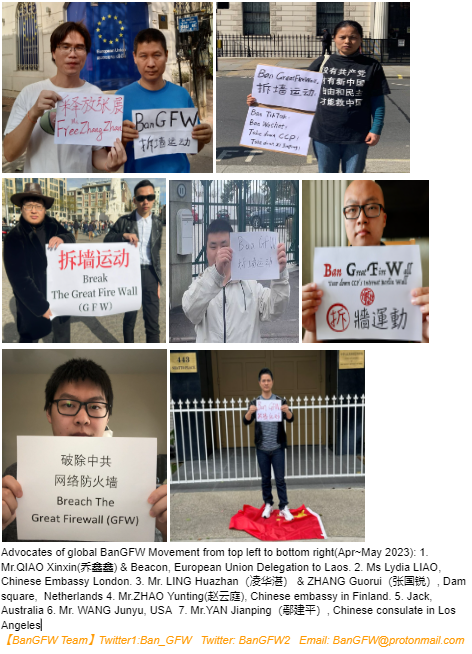

北京时间2023-05-11T18:37:39Z Advocates of Global Ban Great Firewall Movement 
80亿人拆墙运动在各国的铁粉代表 (2nd Version第2版 )
@Jwang312 @Lydia981402 @zhan42577 @hualing04177805 @ZHAOYUNTING000 @Haus_Jakob @like20127 

#BanGFW  #GreatFireWall #만리방화벽금지 #防火墙 #ベルリンの壁 #インタネット #禁止 https://t.co/84HnzcTu3g   北京时间2023-05-11T11:00:14Z https://t.co/PLp9wu2P9n   北京时间2023-05-11T10:18:29Z 【Need fame &amp;  money? You can also be a political star under help of BanGFW team】

We are hosting global #BanGFW Movement for 8 billion ppl to tear down CCP's Internet Berlin Wall #GreatFirewall , plz introduce daily life, views on CCP and GFW, we may retweet #ILoveBanGFW posts   北京时间2023-05-11T09:27:00Z China's Great Firewall: A Crime Punishable by Up to 10,000 Years in Prison （7mins）

#BanGFW #GreatFirewall #拆墙 
https://t.co/TW2T1Y4TlI   北京时间2023-05-11T01:28:05Z 美国之音时事大家谈上周结论称，很多硅谷公司都是中共防火墙帮凶。那么我们这些防火墙下最大的受害者，若到这些美国科技公司驻全球办公室抗议，甚至提起刑事控告及民事索赔，阻止其向CCP出口互联网审查技术，从而实现技术拆墙，可行性有多高？https://t.co/PLp9wu2P9n   