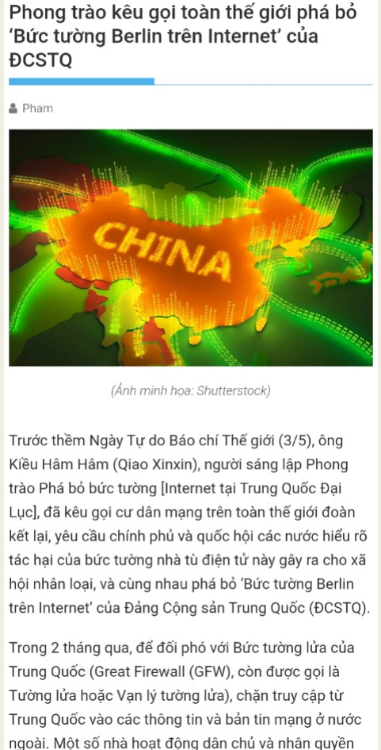

北京时间2023-05-09T12:37:03Z RT @Ban_GFW: #BanGFW team to recruit native-level content writers 
#拆墙运动 办公室招募母语级原创内容作家：英/俄/阿/西/日/韩/泰/印尼等各语种，必须英语流利且亲民主。#GreatFirewall http…   北京时间2023-05-09T12:36:49Z #BanGFW team to recruit native-level content writers in English/French/Russian/Spanish/Arabic/Japanese/Korean.
#拆墙运动 招募母语级原创内容笔杆子：英/俄/阿/西/日/韩/泰/印尼等各语种，必须英语流利且亲民主。#GreatFirewall https://t.co/w9Sl8MO2Gh   北京时间2023-05-09T11:10:26Z 【S. Korea Prof: #BanGFW movement can help end CCP regime】

Prof. Jeong, 66, a former journalist  &amp; a PhD of RUC in Beijing, published a China-related book. Millions of officials censor online speeches each day, Nazism exists in China now.
#만리방화벽금지
https://t.co/HG9owtAEhF   北京时间2023-05-09T01:26:00Z #BanGFW are featured on the report of Tibetan Service of Voice of America @VOANews. Great thanks!
#拆墙运动 获得了美国之音藏语部大力翻译报道，非常感谢！
https://t.co/VwSEqO3GlZ   北京时间2023-05-09T01:22:01Z #BanGFW are featured on the report of VietLuan, which is a prominent Vietnamese news outlets in Australia. Great thanks!
#拆墙运动 获得了澳洲的越南语大报Viet Luan的大力翻译报道，非常感谢！
https://t.co/lEM6G2otUp https://t.co/JqUEHUWkD4   