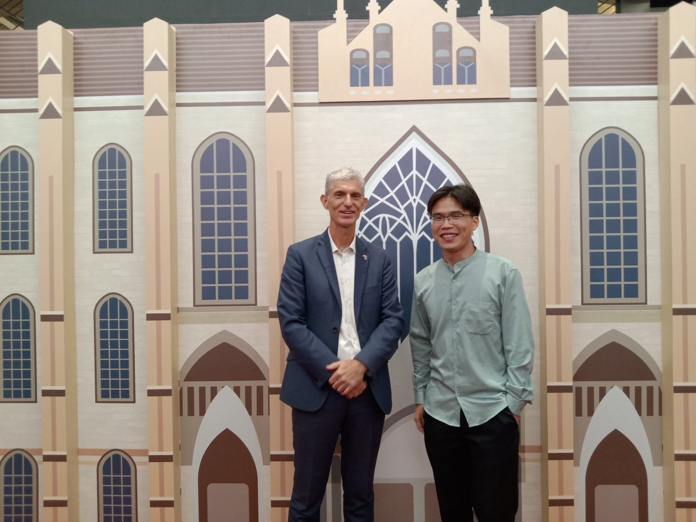
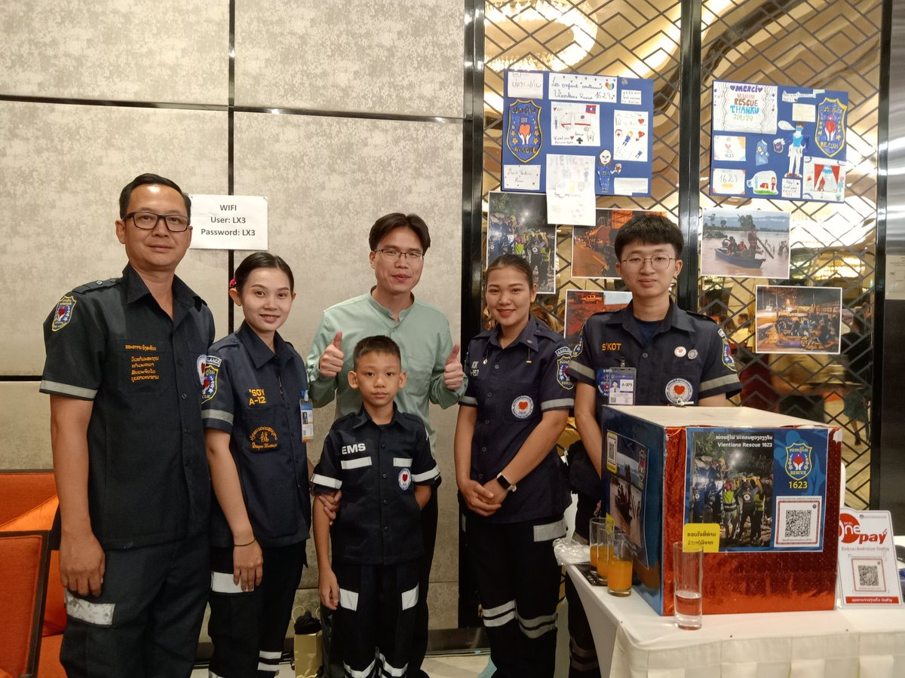
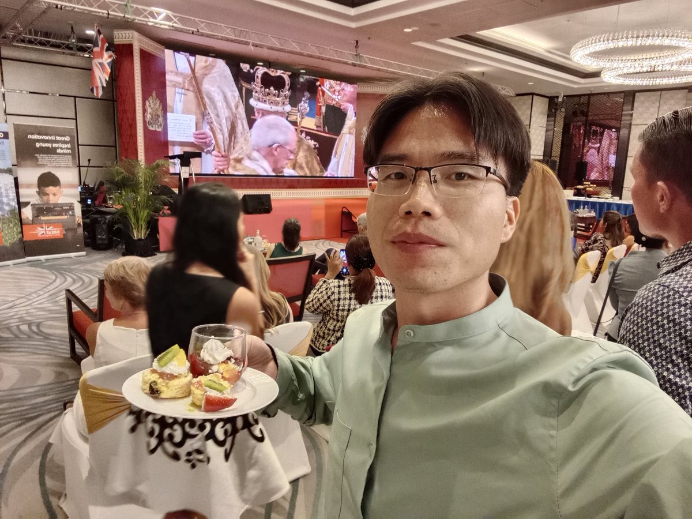
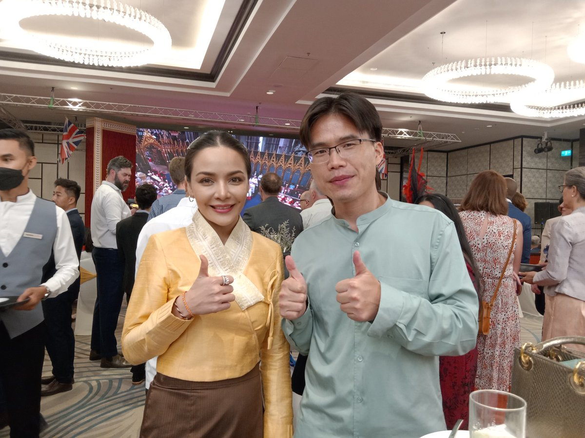
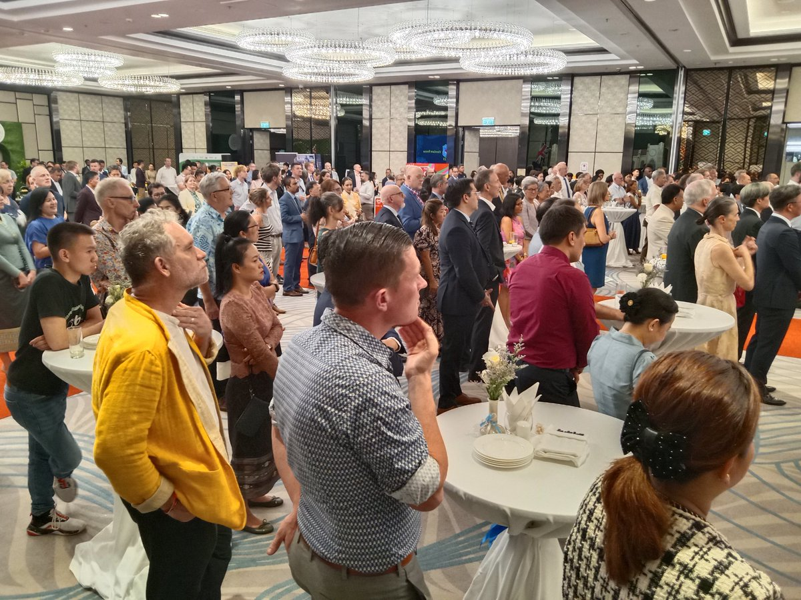
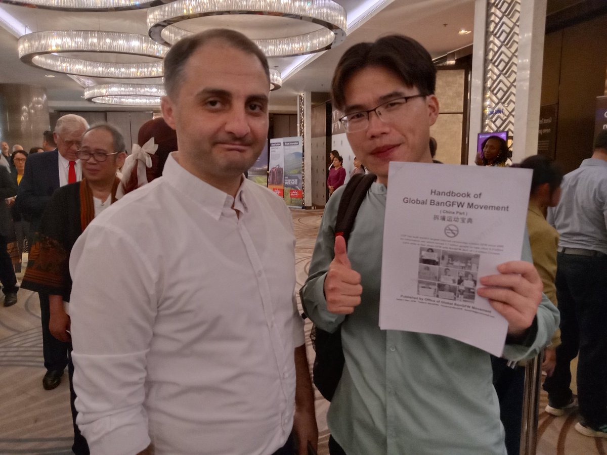
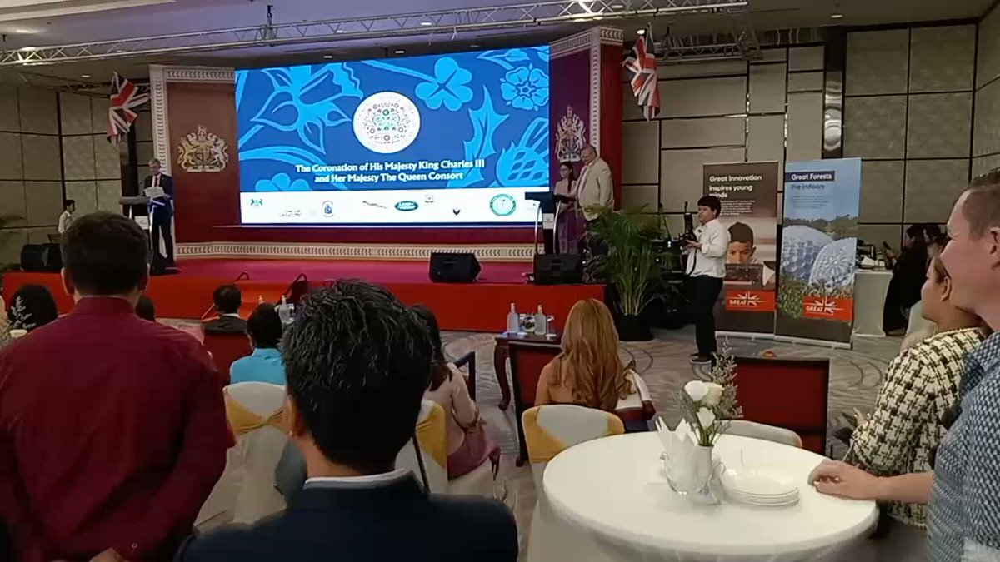

北京时间2023-05-06T20:35:18Z Tonight is an unsleeping night, with so many excellent guests from different sectors &amp; countries, we have witnessed coronation ceremony for new king Charles III. Thanks to British ambassador Mr.  @JohnPearson68 . Mr. Qiao Xinxin donated 50 $ to support local rescue team. #BanGFW https://t.co/Q3i3qEASO9   北京时间2023-05-06T19:17:15Z Mr. Qiao Xinxin: great thanks to delicious food of British Embassy in Vientiane, let's give best wishes to the the new King Charles III &amp; people of Britain and the 56 nations of the Commonwealth. https://t.co/lLz61nuGZQ   北京时间2023-05-06T17:51:31Z The British Embassy in Vientiane Capital are hosting ceremony to celebrate coronation of new king Charles III. Mr  Qiao Xinxin, the Initiator of #BanGFW team is also among its guests. The British ambassador says the last coronation ceremony was held 70 years ago. #拆墙运动 https://t.co/SFf1lyCGJv   