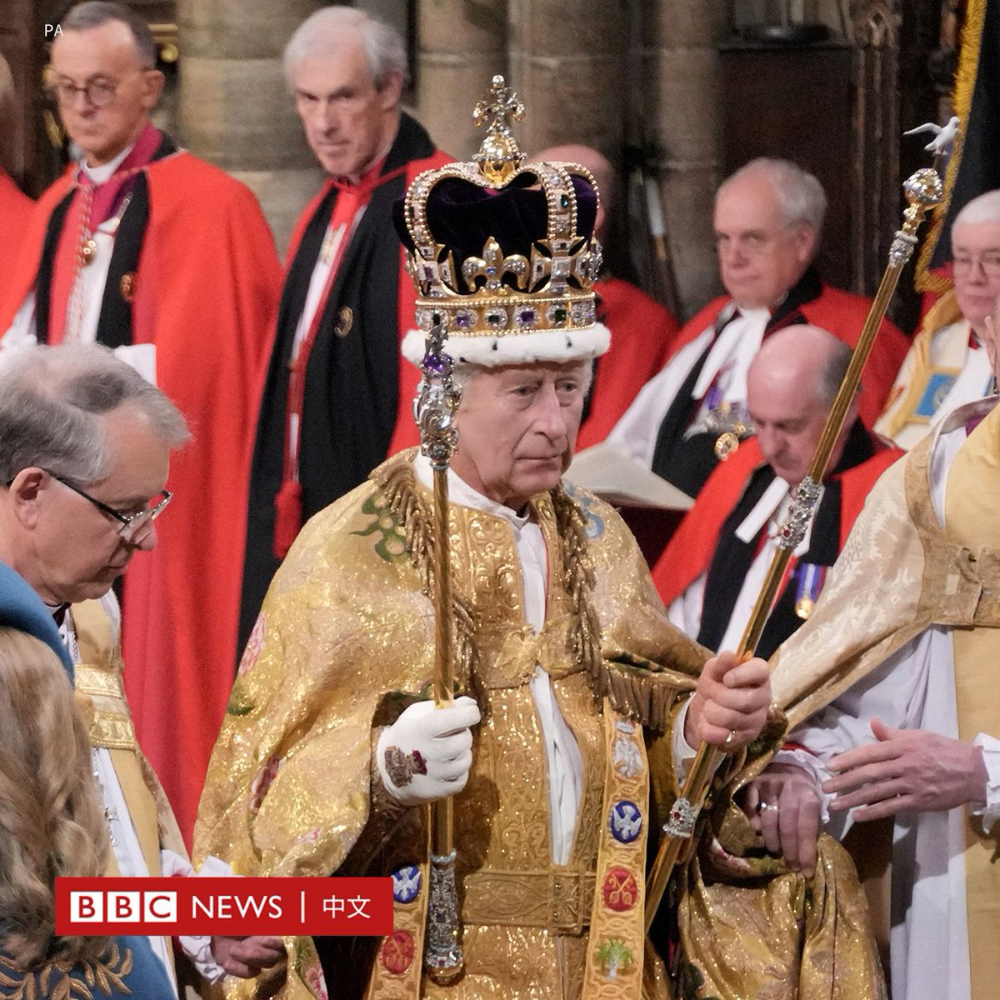
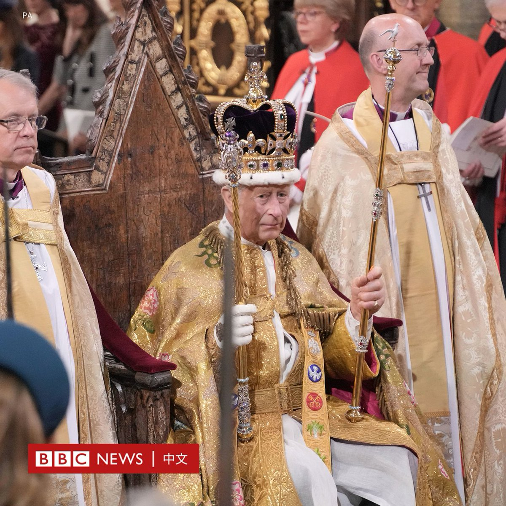

D英国广播公司BBC 北京时间 2023-05-06T19:30:57Z 1654810982777262086 英国国王查尔斯三世（King Charles III）正式戴上圣爱德华王冠（St Edward's Crown）。

这顶有360年历史的王冠以22K黄金铸造，高30多厘米（1英尺），重量足有2.23公斤（将近5磅），相当于两颗凤梨、一个大西瓜，或一瓶2公升瓶装水。
 
女王伊莉莎白二世（Queen Elizabeth II）1953年加冕时曾戴上圣爱德华王冠，此后70年来，王冠甚少离开伦敦塔（Tower of London）。
 
王冠上有444颗各式宝石，包括价值不菲的蓝宝石、红宝石、紫水晶和黄玉，但以浅蓝色和蓝绿色的海蓝宝石为主。
 
从前，王冠上的宝石是可以移除的，每逢加冕大典时才租用。直到20世纪，宝石才被永久镶嵌在王冠上。

了解更多圣爱德华王冠：https://t.co/6qIJ2ZGflG   