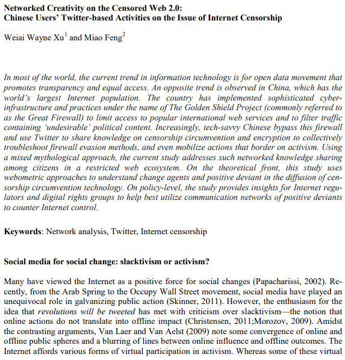
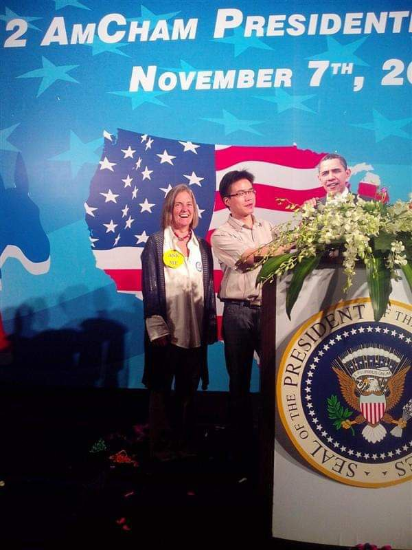

北京时间2023-05-04T11:12:16Z Korea Science Journal: how to use Twitter to challenge CCP's Great Firewall and make a big change in China?
 2015年韩国科学论文：如何在推特上挑战中共的互联网 #防火墙 并引领中国社会革命  
#BanGFW #BanGreatFirewall #ベルリンの壁 #インタネット #만리방화벽

https://t.co/XQsKjpUkwy https://t.co/6WVexSOsDD   北京时间2023-05-04T10:00:07Z 【Qiao Xinxin's &amp; president Barack Obama in Nov. 2012  乔鑫鑫：我曾为奥巴马总统大选站台】  

I knew little about pros and cons of Obama policies. But as a well-educated  US politician, he's gentle, polite, talkative, very popular among English learners at my 20s.  #BanGFW #拆墙 https://t.co/qqb498Vpiu   