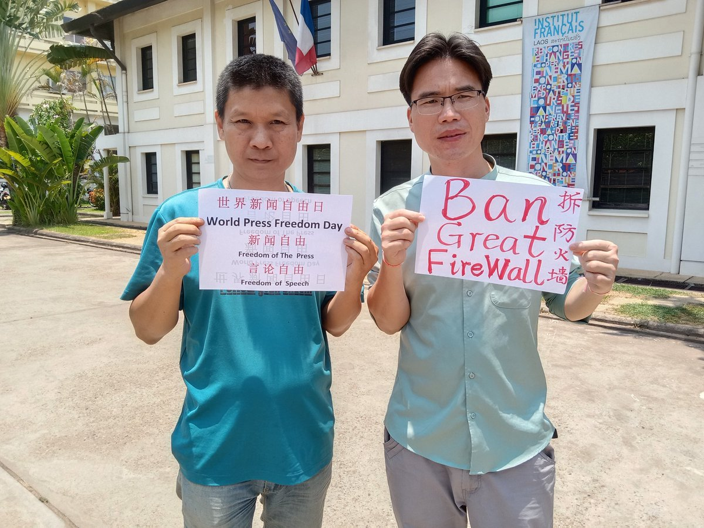
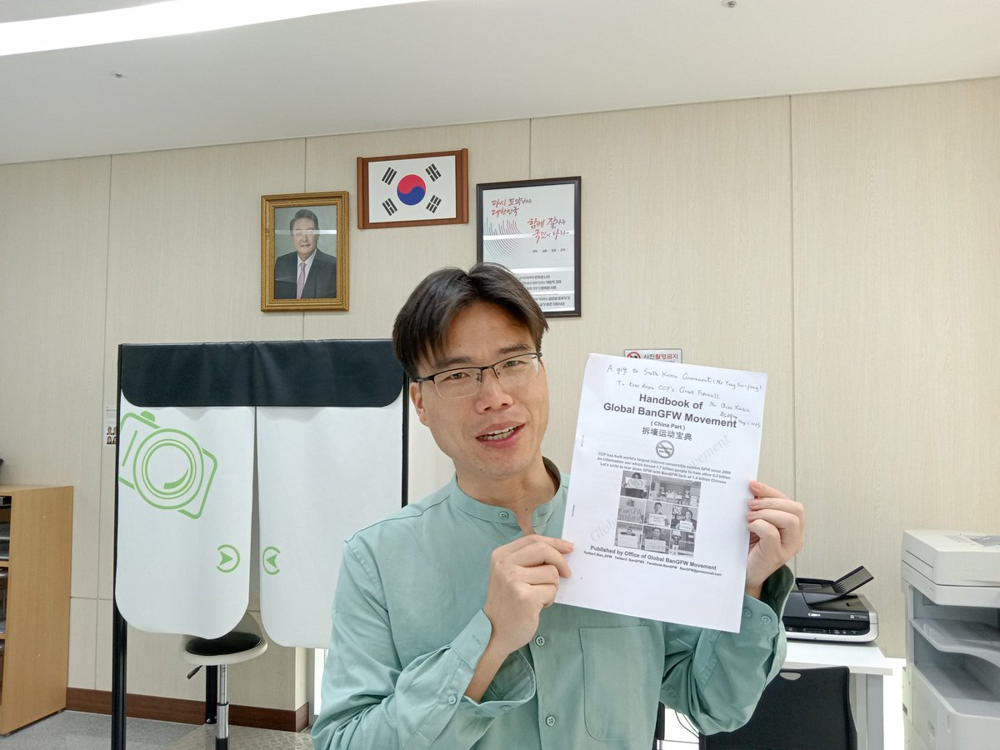
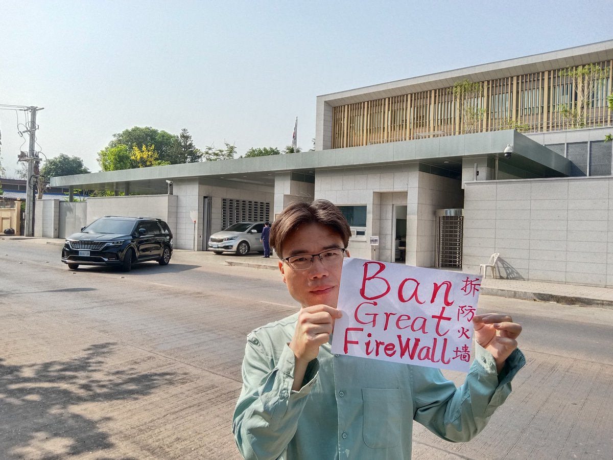
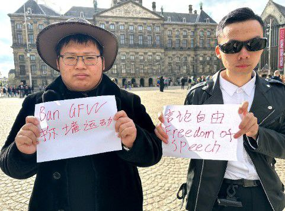
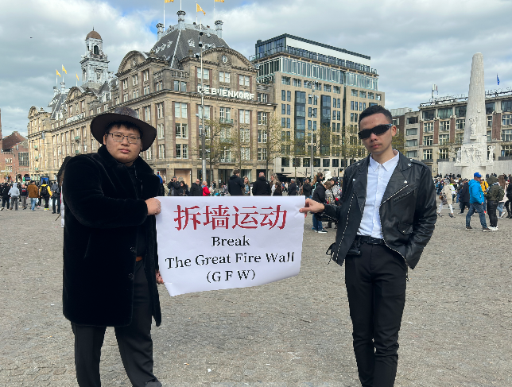
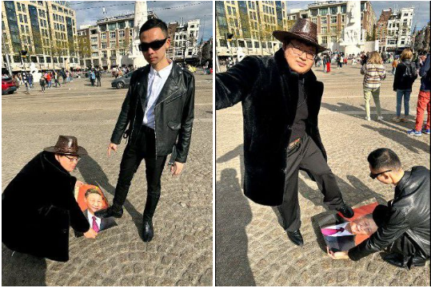
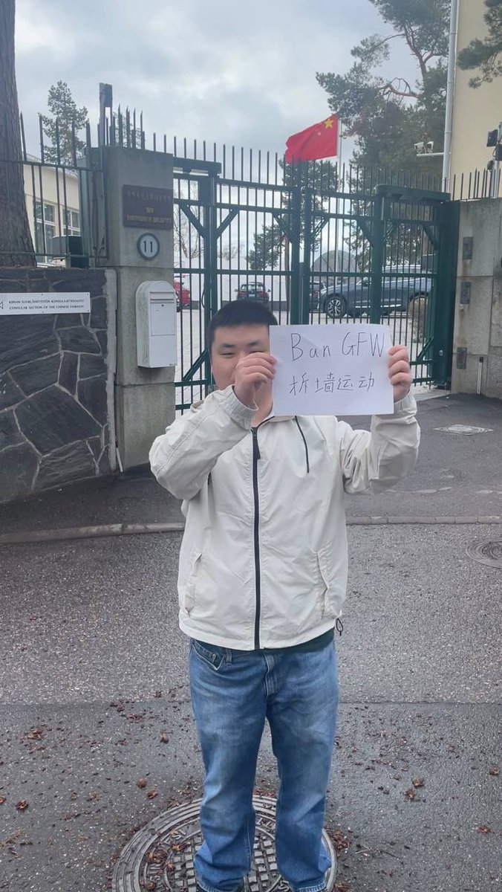

北京时间2023-05-03T22:40:20Z RT @Bsintash: On #WorldPressFreedomDay, my heart aches for my dad Qurban Mamut, a brave Uyghur journalist who has been wrongfully imprisone…   北京时间2023-05-03T22:04:51Z On World Press Freedom Day, we come to S. Korea Embassy, French Institute, Prime Minister Office of Laos, to ask them to impose sanctions on CCP's Great Firewall. We 1.4 billion Chinese need to talk with 7 million Lao &amp; the West by Facebook Twitter freely.
#BanGFW #WPFD2023 #拆墙 https://t.co/9HmoktEDSr   北京时间2023-05-03T20:45:29Z RT @benedictrogers: THREAD:

Today - 3 May - is #WorldPressFreedomDay

I've written this message in my own hand and from my heart for #Hong…   北京时间2023-05-03T17:52:43Z On the eve of World Press Freedom Day, 3 young Chinese @hualing04177805 , are protesting in  Netherlands, to demand free jailed reporters,  Zhang Zhan, Qurban Mamut &amp;
ban Great FireWall, which has caused endless conflicts between the West &amp; 1.4 billion Chinese. 
#BanGFW #WPFD2023 https://t.co/lzkRiQI4v1   北京时间2023-05-03T16:35:37Z RT @UN_Women: ❝Journalists face real danger in doing their jobs.❞

On #WorldPressFreedomDay, award-winning broadcast journalist @iamkarenda…   北京时间2023-05-03T00:35:24Z A young Chinese dissident @ZHAOYUNTING000  is protesting in front of Chinese Communist Party's embassy in Helsinki, to demand Ban GreatFireWall, which has blocked Google, Twitter, causing endless conflicts between the West &amp; 1.4 billion Chinese. @Ulkoministerio @niinisto
#BanGFW https://t.co/ZenTtHTazL   