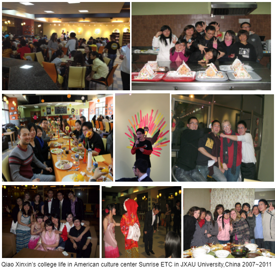

北京时间2023-05-02T21:23:15Z Qiao Xinxin's part-time job in American culture center of JXAU University, China from 2008~2011

We'll never forget the precious days, shared ideas, food, played games, went church, hiking, enjoyed festivals U.S. &amp; China. I'll invite them to open more US centers in China. #BanGFW https://t.co/Bti1KoXzn3   北京时间2023-05-02T13:54:41Z Great thanks! #BanGFW is featured in the report of Russian news provider Epoch Times. 
感谢《大纪元》俄语部对 #拆墙运动 的大力翻译报道 #BanGFW #BanGreatFirewall #互联网防火墙 #ベルリンの壁 #インタネット #만리방화벽

https://t.co/trz3tVOYaA   北京时间2023-05-02T13:49:54Z RT @BanGFW2: 感謝中華民國的國家通訊社“中央社”對 #拆牆運動 大力報導   
Great thanks! #BanGFW is featured in the report of Central News Agency, which's an government…   北京时间2023-05-02T13:33:36Z Great thanks! #BanGFW is featured in the report of Yonhap News Agency, which's biggest news provider in South Korea.
感谢韩国最大的新闻通讯社“韩联社”对 #拆墙运动 的大力报道
#BanGFW #BanGreatFirewall #互联网防火墙 #ベルリンの壁 #インタネット #만리방화벽   北京时间2023-05-02T13:11:06Z RT @BanGFW2: 感謝台灣四大主流報媒“聯合報”系旗下《經濟日報》對 #拆牆運動 的大力報導
Great thanks! #BanGFW is featured in the report of UDN news, which's one of the big 4 ne…   北京时间2023-05-02T13:11:02Z RT @BanGFW2: 感謝台灣4大主流報媒之一《自由時報》對 #拆牆運動 的大力報導  
Great thanks! #BanGFW is featured in the report of Liberty Times, which's one of the big 4 n…   北京时间2023-05-02T07:13:30Z Those companies related to Great Firewall are commiting huge crimes against 8 billion people. GFW is the No.1 source of world's conflicts. #BanGFW

https://t.co/lDmMirFtrO   