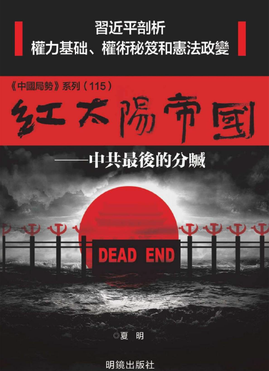
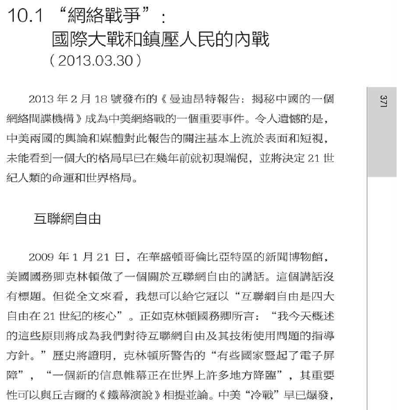
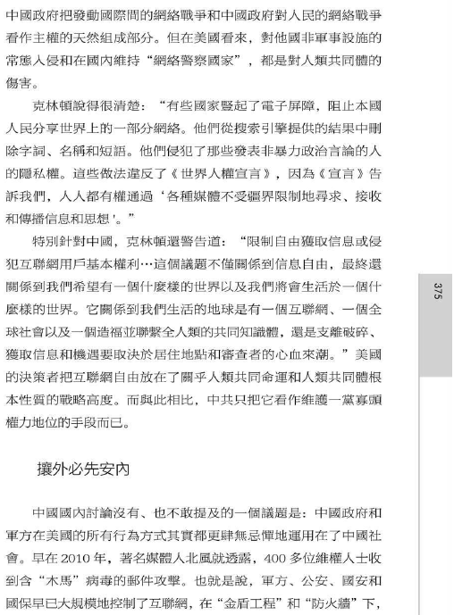
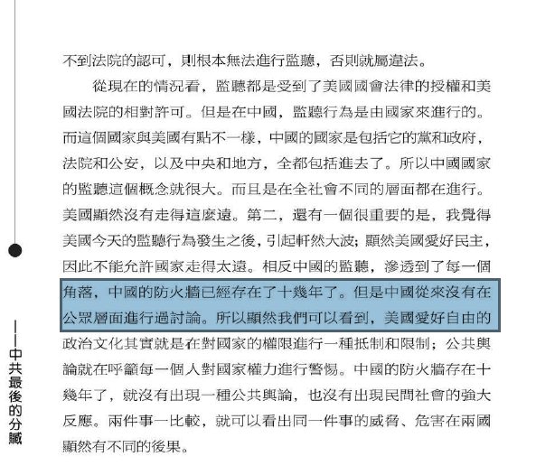

北京时间2023-05-01T22:37:29Z 【全球反中共差异：欧美日法办·亚非拉捞钱】

中共74年来造成了近亿人惨死，就包括乔鑫鑫1959年被饿死的爷爷。中共长期穷酸被痛骂，花巨价才进联合国，所谓复兴、崛起也只在2000年才开始。“亲中共”者本质只是爱钱，一旦没钱了又要坐牢，就全散了。但亚非拉驻京大使们会趁机敲诈中共。
#BanGFW #拆墙   北京时间2023-05-01T21:40:15Z 【感恩老挝：乔鑫鑫10年旅居生活】

我2013年底首次出国，误打误撞到老挝后，全程陆路独自游了泰柬越共70天。它是主权独立国，但95%地球人不知有老挝，大多温和亲切，很容易在万象面见大使、部长、总统们。我努力自学老挝文、佛修、做急救义工，2018年在灾区被老挝国会女主席接见。我在此形成了全球观   北京时间2023-05-01T10:38:44Z RT @VOAChinese: “全世界网民联合起来，拆除中共网络柏林墙！” 拆墙运动发起人谈中国媒体环境 https://t.co/AzYsN4heaU   北京时间2023-05-01T01:32:53Z RT @Ban_GFW: Qiao Xinxin: My life is blessed by your life. I really love our church members ❤️Very glad to share our handbook to ban #Great…   北京时间2023-05-01T00:12:45Z 【中共四处威胁民主人士· 为何还不敢跨国抓1个拆墙人？】

对于中共互联网防火墙，模糊的法律条文、警察罚单、外交部从不正面回应，就能充分看出其心虚，我们分分钟可抓现行犯。乔鑫鑫2个月前回中国时，从纽约城市大学教授夏明 @XiaBamboohermit 书里，了解到该墙至今健在是因为没国内外热议。#BanGFW https://t.co/BPLM28TRgB   