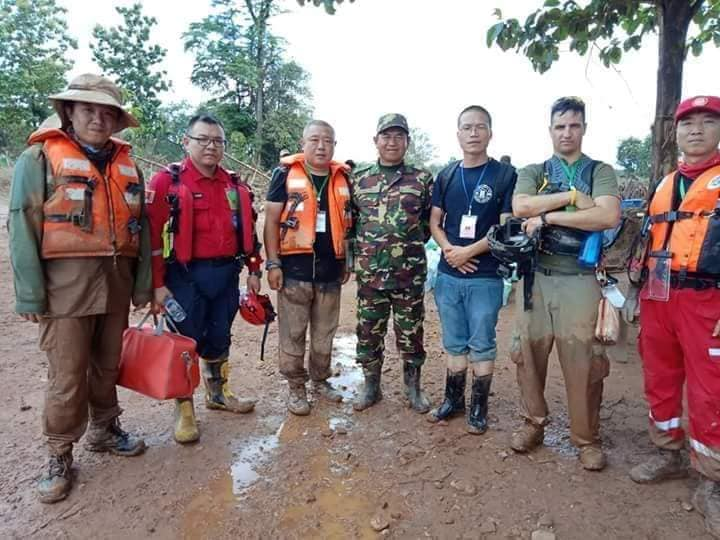
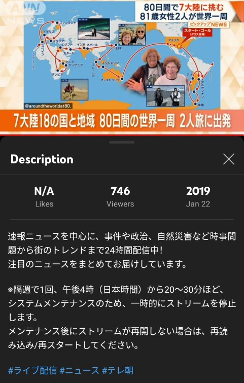
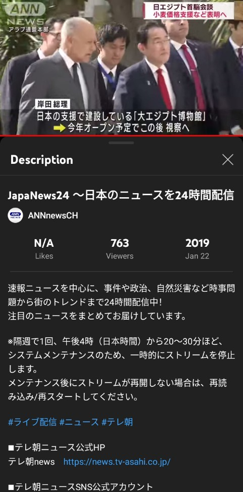
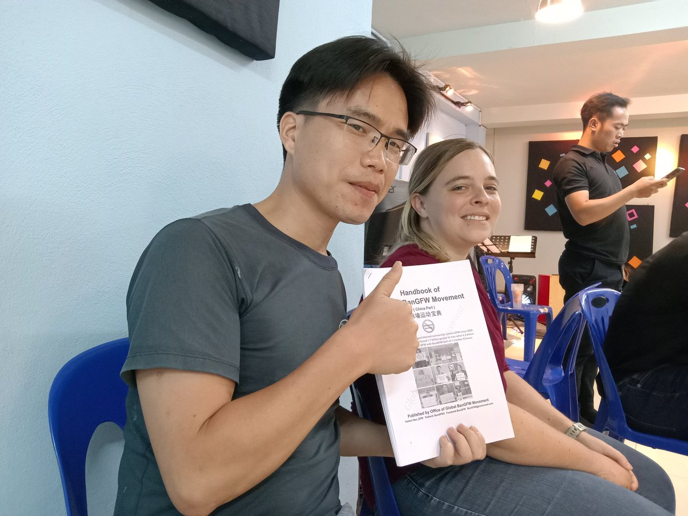
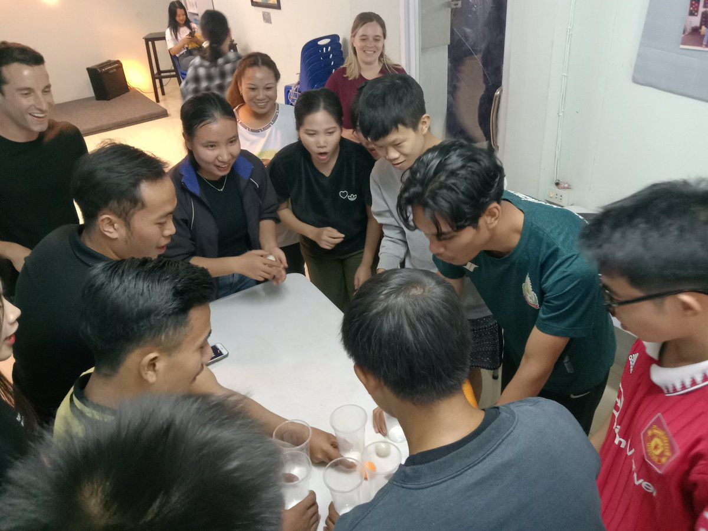

北京时间2023-05-01T22:19:44Z 【New trend to anti-CCP:  democratic nations law enforcement , poor nation aid diplomacy】

As an evil regime, Chinese Communist Party has killed millions of Chinese during 74 years, it has no moral superiority globally, those pro-CCP mainly ask more money, now CCP has no money. https://t.co/Qcclg7HxAE   北京时间2023-05-01T21:24:57Z 【Qiao Xinxin's 10 years in Laos】

I traveled in Laos on Dec.2013, also 1st time to go abroad. It has only 7 million ppl, easier to meet ambassadors, ministers. I tried hard to learn Lao, worked as a rescue volunteer, practiced Buddhism, then I got my global perspective. Thanks! https://t.co/9KekWnKGUt   北京时间2023-05-01T11:03:15Z https://t.co/19gxejr72r   北京时间2023-05-01T10:10:18Z 针对中共的互联网防火墙（GFW），快来聊聊每天你可以做哪些拆墙小事 #BanGFW
https://t.co/19gxejr72r   北京时间2023-05-01T09:43:25Z Qiao Xinxin: try to watch Japan TV news regularly to know what's happening in Asia esp. in Japan recently. It's now 7-day holiday Golden Week there.
乔鑫鑫：常看看日本电视，了解亚洲特别是日本时事热点。最近是日本人出国长游的“五一”黄金周 https://t.co/lhMBjqaBMt   北京时间2023-05-01T01:21:49Z 【A top legal scholar:  Chinese Communist Party dare not talk about Great Firewall officially】 

No law to regulate GFW clearly,  but police often  considers it as a big crime &amp; secretly arrest those using VPN  to bypass GFW to visit Google, Twitter, Youtube . #BanGFW #拆墙 https://t.co/ECDOft8dGw   北京时间2023-05-01T00:38:57Z Qiao Xinxin: My life is blessed by your life. I really love our church members ❤️Very glad to share our handbook to ban #GreatFirewall together with U.S. young teachers Michael &amp; Rachel. God bless 🙏
乔鑫鑫：感谢2名美国年轻教师及部分老挝本地青年了解「拆墙宝典」 https://t.co/vz4AzQ4zDc   