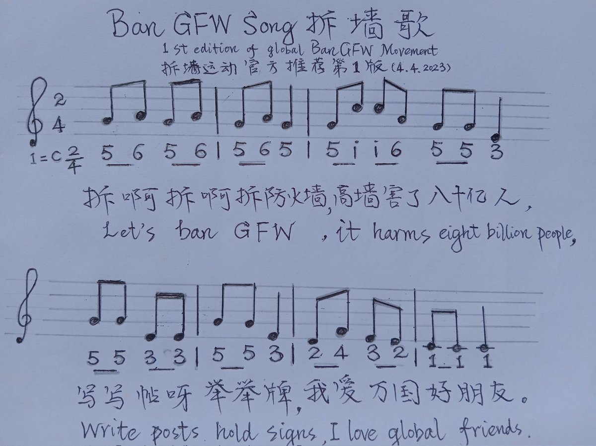
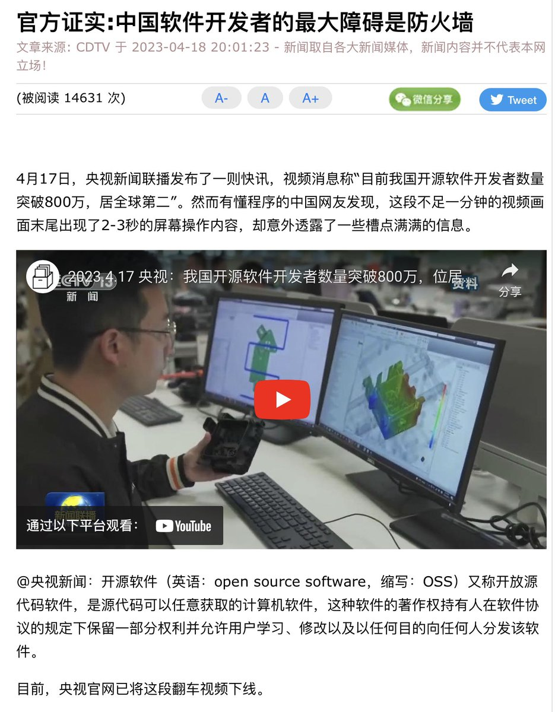
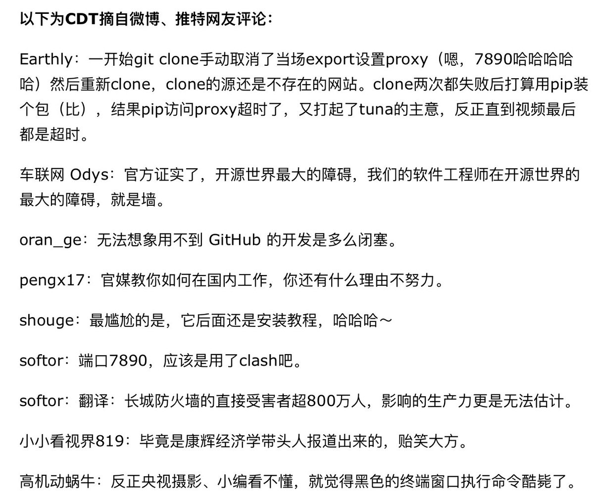

北京时间2023-04-27T20:32:15Z RT @HoloRsShard: @nytchinese 靠防火墙才能存活的政权🤮   北京时间2023-04-27T16:49:12Z RT @nytchinese: 中国的互联网审查众所周知，但一份报告量化了审查的程度，发现了超过6.6万条规则控制着人们通过搜索引擎获得的内容。
报告表明，中国的审查机制不仅变得更加普遍，而且更加隐蔽。各大搜索引擎已建立起算法，对政治敏感内容进行“硬审查”。其中审查最为认真的是…   北京时间2023-04-27T14:14:16Z 拆墙人尊重所有反中共的民运力量，也祝福中国共权党，但请多写些短小精悍的文案，把粉丝涨起来再说，长篇大论的东西不妨去投稿台湾的论文文库。#BanGFW   北京时间2023-04-27T13:18:25Z 老等着别人出头出力、自己却总在观望逃避的人，都会很快被习逼得无路可走，极端利己者的必然结局！拆墙运动欢迎80亿人来写帖举牌，主动争取中国的民主自由！#BanGFW   北京时间2023-04-27T11:19:00Z 一起录着玩30秒吧，发到YouTube Twitter Facebook TikTok上，背景音乐请搜索YouTube "找朋友 伴奏" https://t.co/OTb2ljm14n   北京时间2023-04-27T11:13:19Z Let's sing the #BanGFW Song together, very easy to learn but super powerful to anti the evil CCP. Lyrics are posted below.
让我们都来唱唱玩玩 #拆墙歌 ，翻唱了婴儿歌曲「找朋友」，非常简单易学，但能能强力震慑共匪。歌词曲谱在下方
#拆墙 https://t.co/Y2eLEt7f2X   北京时间2023-04-27T08:44:51Z 请王志安先生不必理会网络谣言，要自证清白很简单嘛！先做一期 #拆墙运动 视频节目，谈谈中共互联网防火墙的利弊。   北京时间2023-04-27T08:34:10Z RT @h5LPyKL7TP6jjop: 它们说过去我们遭外国人欺负，公园门口立着牌：华人与狗不得入内！
现在每天上网的中国人却不知道防火墙上是这几个字：华人与狗不得外出！   北京时间2023-04-27T08:32:26Z RT @h5LPyKL7TP6jjop: 官方证实:中国软件开发者的最大障碍是防火墙
网友：硬件芯片不行，软件又有防火墙，这就是两手都要抓，两手都要硬的结果！ https://t.co/KhRPXMHZD2   北京时间2023-04-27T08:31:31Z RT @gallantchou: 习近平下达指示成立网信办：“全社会共筑网络安全防线，加强数据安全防护”为的是巩固红色政权，防的不是外人而是自己人。
中共网络防火墙正在逐步面临崩溃，网信办成立是在加固岌岌可危的防火墙
丢掉幻想，自由和公权利永远是自己争取的，不做愚民做公民，加入…   