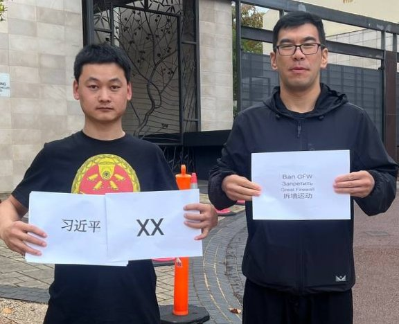
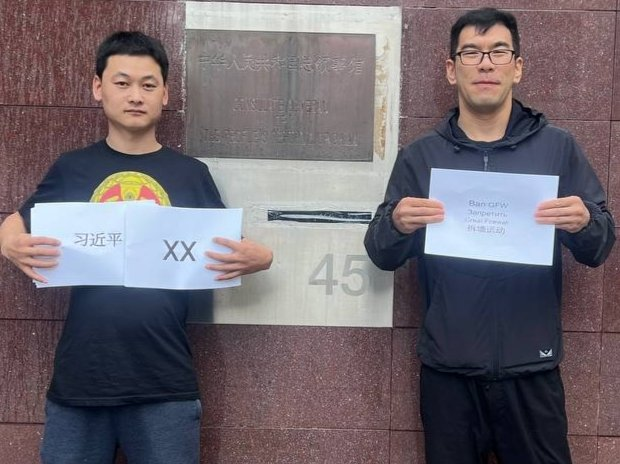
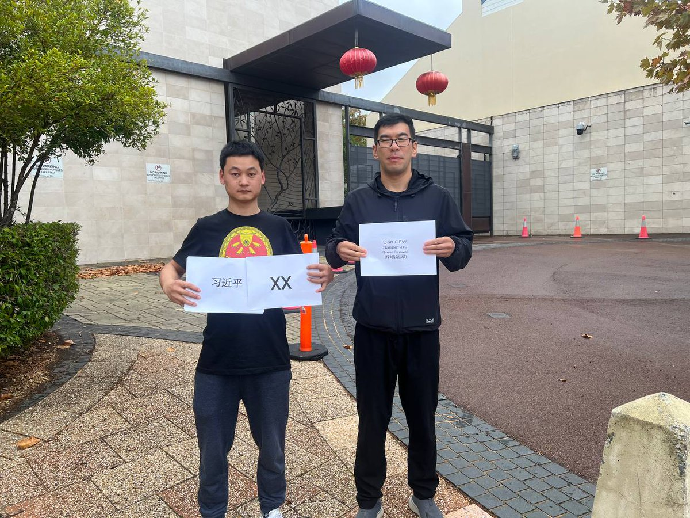
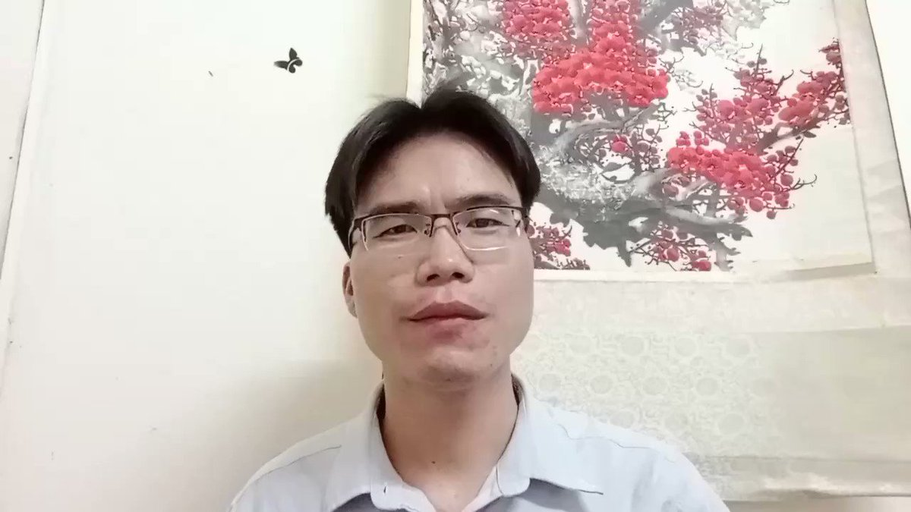
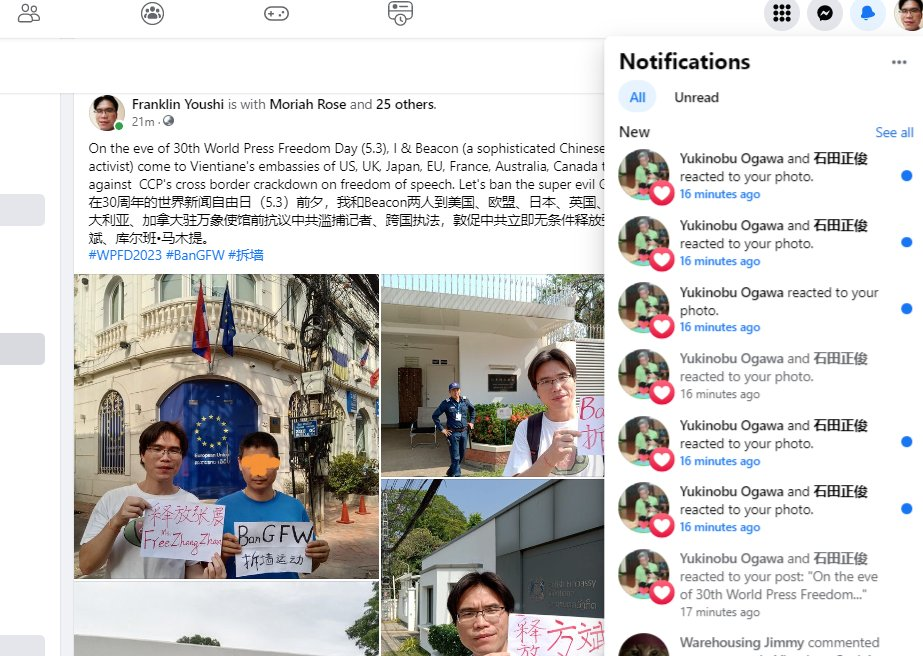
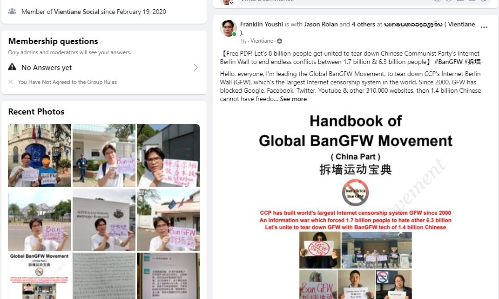

北京时间2023-04-25T19:51:07Z Mr.Mark Lou &amp; Mr. Richard Lue are protesting against Internet Berlin Wall in front of CCP's Consulate in Perth, Australia. Let's #BanGFW together to end CCP's global threats.
娄创和吕睿超在中共驻澳大利亚珀斯市总领事馆前抗议并要求拆除互联网防火墙，让17亿人自由登录Google YouTube. https://t.co/zcxDpNzxnx   北京时间2023-04-25T19:06:27Z 乔鑫鑫谈 #拆墙运动 的组织建设和资金募集：欢迎你复制已有的开源文案，在各国组建拆墙基金会、拆墙政党，公开透明地获得各种民主资金。
Qiao Xinxin shares his views on team management and funds raising. You're welcome to set up #BanGFW-related foundations, political parties.
#拆墙 https://t.co/zsoLX5PSXS   北京时间2023-04-25T00:56:18Z Any life threat from CCP is unacceptable, Mr. Qiao Xinxin has shared all his personal info and #BanGFW brochure in Vientiane's Facebook group &amp; asking for help from all old friends. 
乔鑫鑫不接受中共威胁，玩facebook超10年，学10国语混圈无数，正启动全球各国旧友在老泰拿签证和 #拆墙 https://t.co/oNvLQwRqZe   