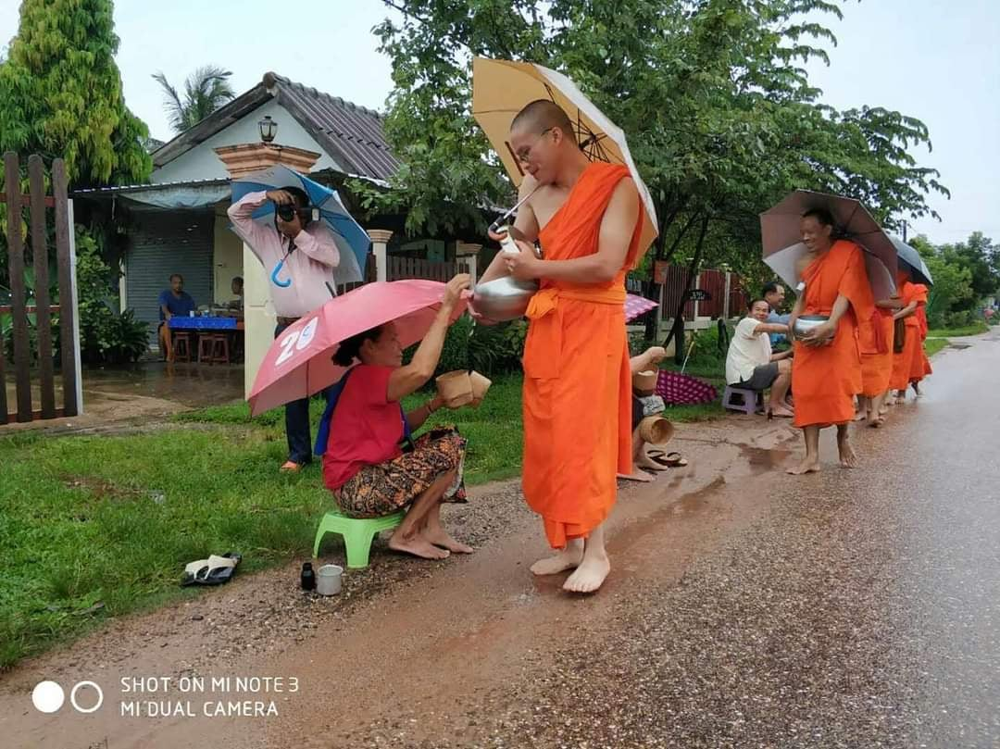
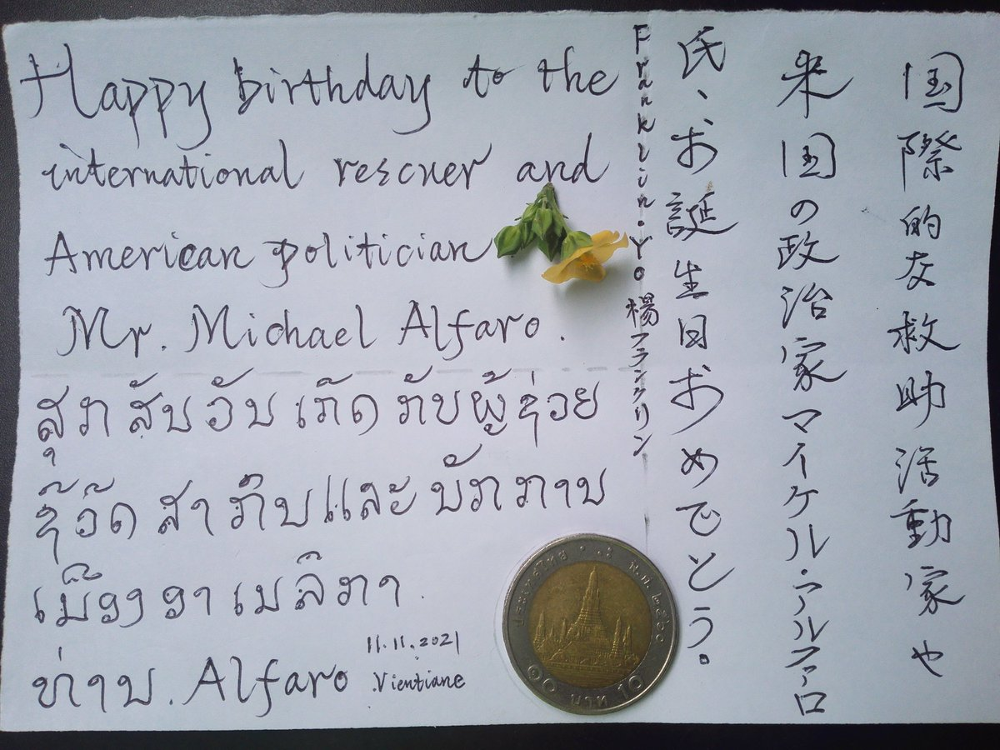
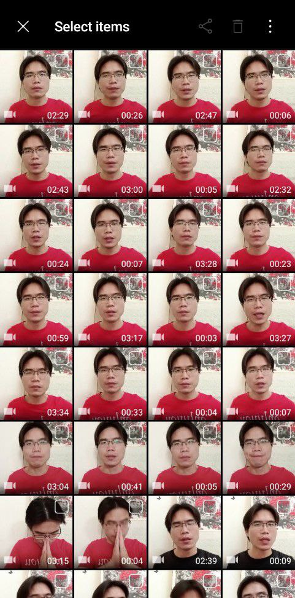

北京时间2023-04-22T15:45:52Z 【乔鑫鑫被中共人身威胁逾7天·为何还没被捕？】

乔已将所有个资公开，也就30周年世界新闻自由日接受美国之音采访，联合国总部将搞大庆，西方也正大力围剿中共海外势力。中共钱快烧光，去年5月东盟十国元首齐聚白宫，历史首次。泰老遭武汉病毒重创，老挝2年内更是本币币值跌去超过50%，将更依赖西方。 https://t.co/zBKGyAF5cA   北京时间2023-04-22T14:44:46Z RT @yly_michael: @qiaoxinxin88 辛苦您了，也要保重好自己🙏
水滴石穿、星火燎原，「中共」末日已不遠，我們一定會親眼見證極權暴政的灰飛煙滅，暗無天日的故土一定會再現陽光普照！   北京时间2023-04-22T13:40:14Z RT @qiaoxinxin88: 最近40天，每天拆墙工作节奏是17小时，绝不在家做饭，几天都不洗衣服，这才终于造成了当前的星火燎原之势。我可能会马上去坐牢，但坚信，在网络自由的世界，付出就会有回报。   北京时间2023-04-22T13:39:57Z 最近40天，每天拆墙工作节奏是17小时，绝不在家做饭，几天都不洗衣服，这才终于造成了当前的星火燎原之势。我可能会马上去坐牢，但坚信，在网络自由的世界，付出就会有回报。   北京时间2023-04-22T13:19:55Z 岁月不静好，但请不要低估俺精益求精的“反贼”精神 
I'll do my utmost to make more key points clear.

#BanGFW #拆墙 https://t.co/TVBivYBamD   北京时间2023-04-22T12:49:40Z RT @EndGFW2: 「乔鑫鑫：为何我要领导拆墙运动？」

原只想做小教书匠，但中共逼人太甚。各大语言圈里，中文圈互相仇视和封闭堪称世界之最，互联网防火墙是主犯。2月我回湖南时，美媒NPR和墙内仇美反日攻台形成巨大对比，纽约城市大学夏明教授 @XiaBamboohermit…   北京时间2023-04-22T01:59:00Z RT @EndGFW2: 「拆墙运动聊天会之乔鑫鑫专场」

时间：4月21日北京时间晚9点/ 洛杉矶时间早6点
内容：包括但不限于成长经历、旅居东南亚10年记、拆墙运动等等
https://t.co/kmaOprcH0G   