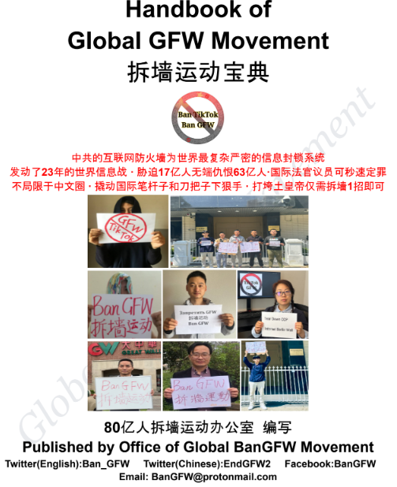
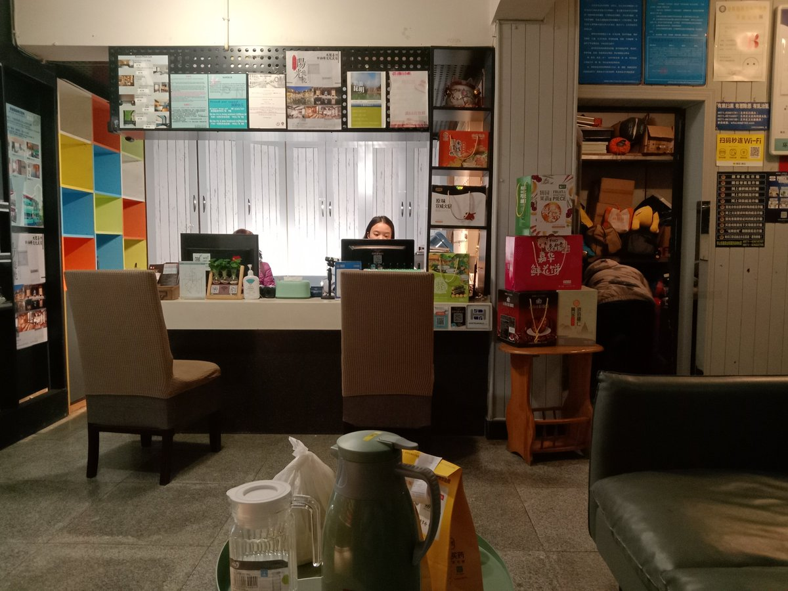
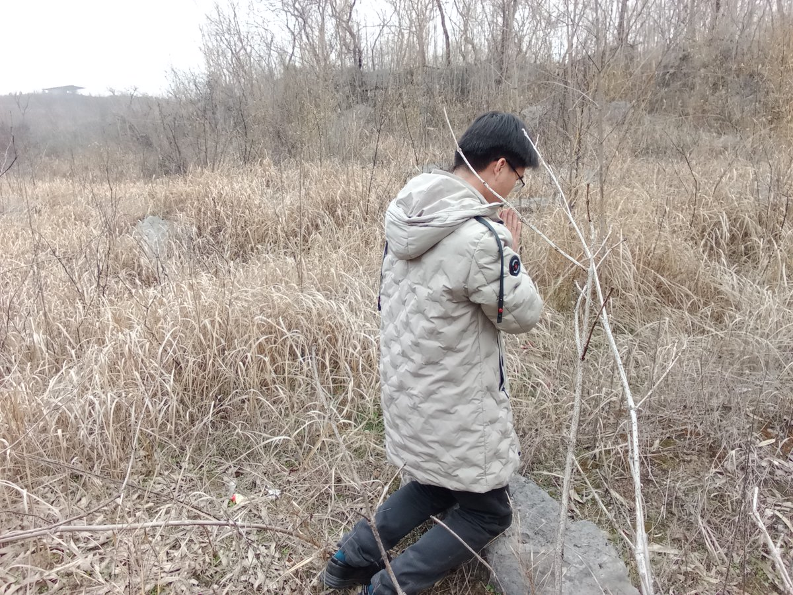
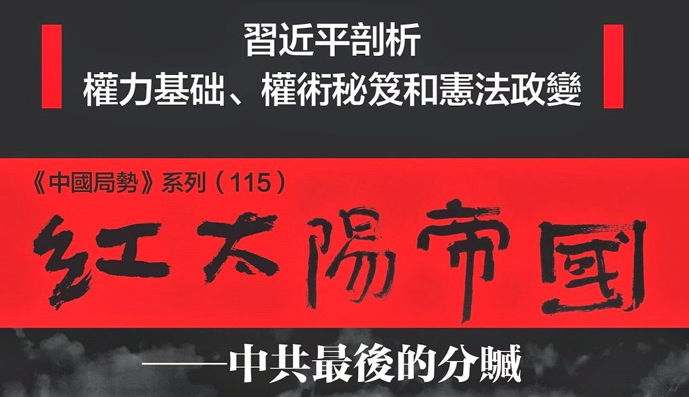
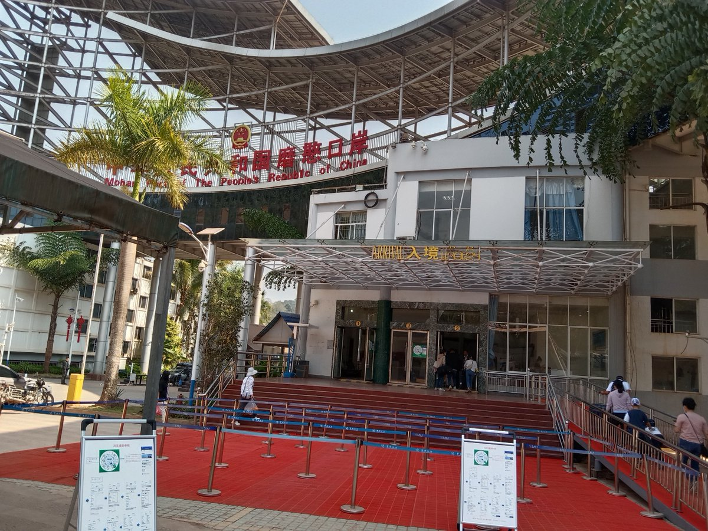

北京时间2023-04-20T22:10:50Z (6/6)作为第一要务的倡议。结果意外获得了许多支持，特别是已经做过一年多“放开防火墙”的王清鹏的支持。我每天17小时拆墙节奏，天天在外边吃饭，甚至好几天都不洗衣服。当看到宝典出炉、粉丝数据猛涨，我就觉得一切付出都值得！即便邪党今天就把俺秘密绑回中国，全球拆墙的火种只会更加熊熊燃烧。 https://t.co/iOpuPiz2OV   北京时间2023-04-20T22:10:49Z (5/6)还去昆明住了几天国际青旅，问及疫情三年怎么过来，是否曾参与过镇里官员选举，发现各省经济在全速崩溃，民怨已经难以完全压制。有70年大爷直说，共党快完蛋了。2月28号出国后，我又看到童逸在美国国会献计拆墙，3小时听证会我认真研究了2次，就在3月8号向各大中推大V发出了，海外民运应将拆墙 https://t.co/tXVk4i40T9   北京时间2023-04-20T22:10:47Z （4/6）我本身懂多语，看到的国际风景超出大多数人，为何不当主操盘手？去年发表了两篇海外白纸运动的长报道，今年也应到台前成新闻主角了！我这次回去农村老家特意住了一晚，翻老照片追忆自己青少年时光。还去1959年被活活饿死的爷爷的坟墓边祷告，这段暴政我一定去海外找CCP算账。我出国前几天， https://t.co/PA6PSCqocc   北京时间2023-04-20T22:10:46Z （3/6）我准备办美签填DS160表格，因没法查阅Facebook Gmail，多个栏目填写过程受阻。我正愁没书可读，结果发现手机里还残存纽约城市大学夏明教授的「红太阳帝国」，谈到了防火墙事宜，说墙有万般毒害，但因为没有发生国际政治事件而至今存在，我默默地在想，为何不主动创造历史，自己动手搞事？ https://t.co/TS4kpWqz2u   北京时间2023-04-20T22:10:44Z (2/6)我狠GFW，但它无形而且是国家机器刀枪保护下的巨大工程，一直也很无奈。我2020年1月出国后，犹豫很久，直到今年2月初才决定回国并待了20多天，坐中老铁路。因为没提前装VPN，回去后就只能下载百度、豆瓣、B站，我感觉处处被盯着，在豆瓣改个性签名为“中国社会95%财富被5%的人控制”，都不能过审。 https://t.co/qrXAa5c34y   北京时间2023-04-20T22:10:42Z 「乔鑫鑫搞拆墙运动灵感来源始末」

（1/6）中共防火墙封锁的31万个网站里，就有我两个.com独立时政新闻网站。一旦被封，第二天流量立马只剩下5%。我原来喜欢读的香港英文虎报，里面有大量商业广告，只有少数时政人权，近几年也被封。而我经常存放时政资料的Github网站竟也还是被封。#BanGFW #拆墙 https://t.co/zHxYD6Kt7v   北京时间2023-04-20T14:48:34Z RT @Ban_GFW: Mr. Qiao Xinxin is in Laos, have finished  written Declaration of No Committing Suicide, told VOA, once disappear in 48 hours…   北京时间2023-04-20T14:28:42Z RT @Ban_GFW: Mr. Qiao Xinxin, the initiator of global BanGFW Movement, is giving his 1st video speech to call on 8 billion people to tear d…   北京时间2023-04-20T13:56:30Z RT @EndGFW2: 拆墙运动发起人乔鑫鑫首次露面演讲：你今天写贴和举牌了吗？

乔1986年生于湖南祁东县，每天阅读英、日、泰、老文报纸，去年为自由亚洲电台特约记者，不接受共警跨国威胁，欢迎你来采访。建防火墙属于战争罪，让我们也帮美国人、日本人拆墙，去国际刑事法院起诉方滨…   