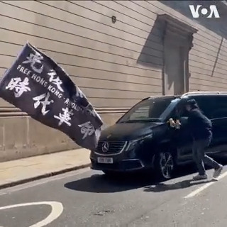

美国之音中文网 北京时间 2023-04-18T05:35:55Z 1648077856298405888 当地时间星期一(4月17日)中午，在香港财经事务及库务局局长许正宇出席伦敦金融城市政厅论坛后，有香港示威人士尝试阻拦两部怀疑载有许正宇及香港官员的黑色车辆。一名持伞男子两度推开示威者，令示威者受伤，有示威者尝试还击，其后该名男子进入附近中国银行大厦。报道：https://t.co/4B8ScyWnM0 https://t.co/wVSOIVOH3t   