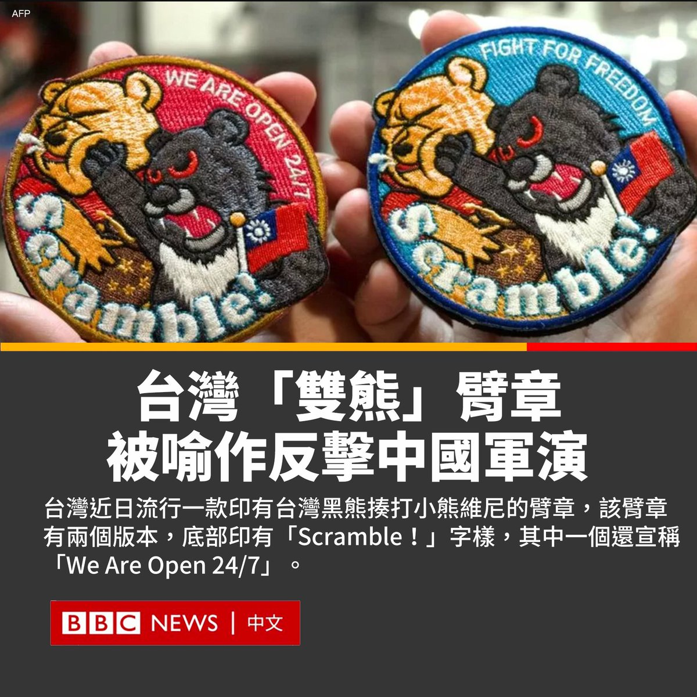

D英国广播公司BBC 北京时间 2023-04-12T10:46:42Z 1645981741033857027 台湾近日流行一款印有台湾黑熊揍打小熊维尼的臂章，而小熊维尼的原始卡通形象曾被一些人用来表达对中国国家主席习近平的不满，并在中国成为了一个政治敏感词。

中央社报导指，台湾国防部于4月9日发布了军机起飞前的检查照片，其中有飞行人员戴上该臂章。
(1/2) https://t.co/YW5sUiWdyj   