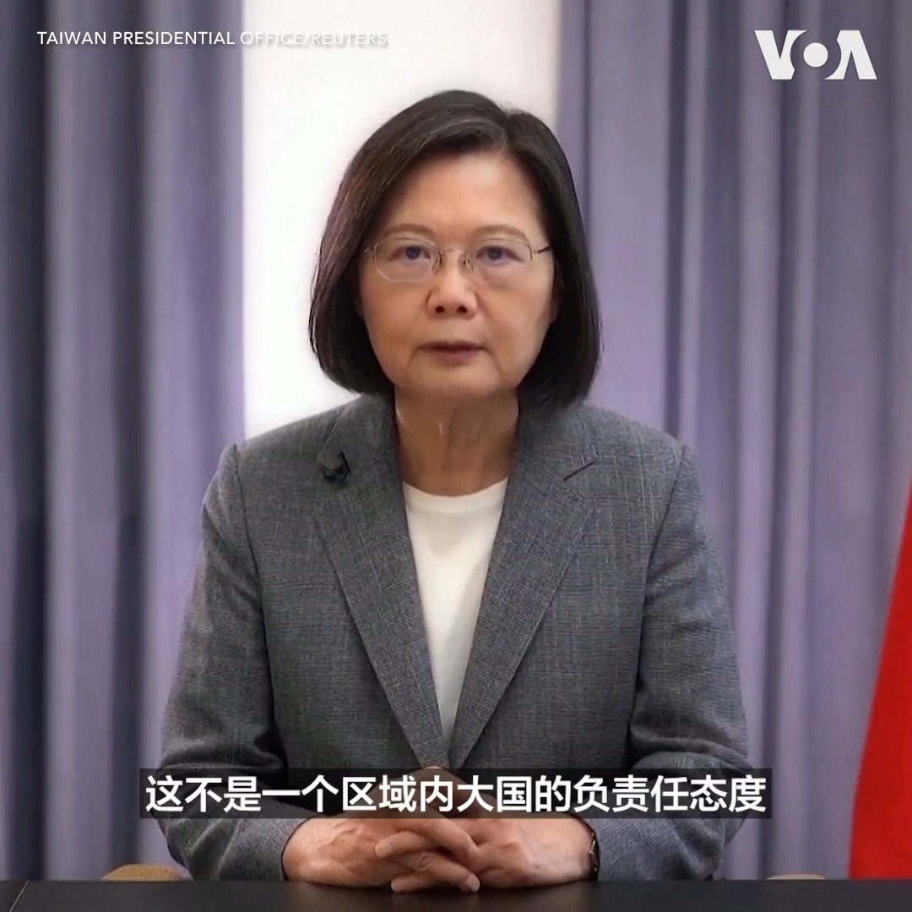

美国之音中文网 北京时间 2023-04-11T21:45:45Z 1645785209525395456 台湾总统蔡英文4月11日谴责北京当局连续三天在台湾海峡以及台湾周边地区进行大规模军演造成台海以及区域不稳定，并说这种行为“不是一个区域内大国的负责任态度”。蔡英文在洛杉矶会见美国众议院议长麦卡锡返回台北后，中国于4月8日开始了军演。报道：https://t.co/0Ne4UpCDbS https://t.co/ayecfaVwRT   