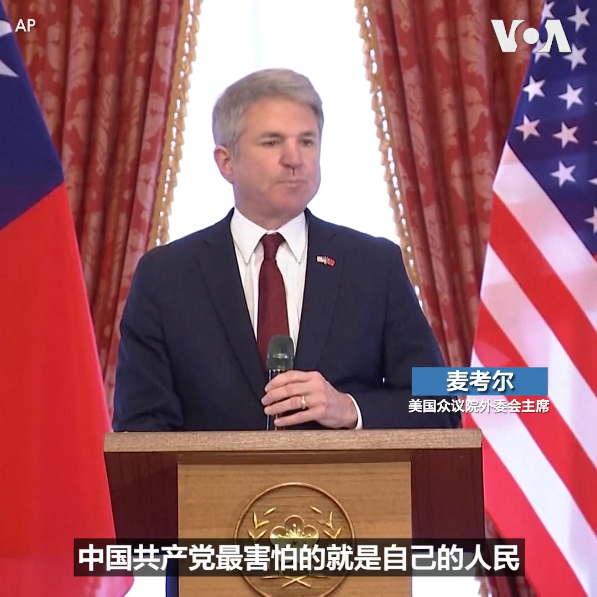

美国之音中文网 北京时间 2023-04-08T21:21:35Z 1644691964736962560 “台湾人民热爱民主、追求和平，更会善尽国际责任”，台湾总统蔡英文8日中午宴请美国国会众议院外交事务委员会主席麦考尔一行时表示。麦考尔重申了美国向台湾交付武器的承诺。麦考尔正率领国会代表团对台湾进行三天访问。蔡英文表示面对威权主义扩张，民主国家的合作很重要。 
https://t.co/KmrZEietxU https://t.co/1X3AdG51Nl   