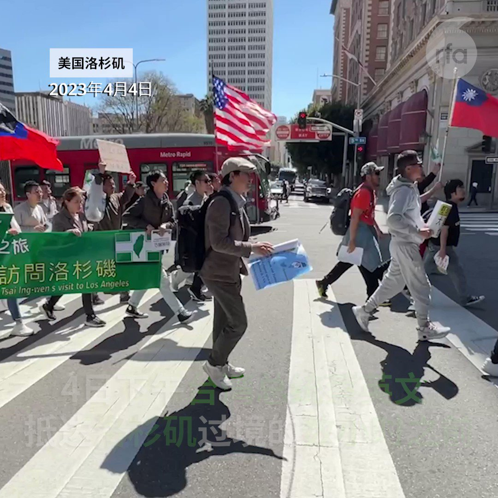

自由亚洲电台 北京时间 2023-04-05T10:38:45Z 1643443023253237760 【洛杉矶华人游行欢迎蔡英文到访】
4日下午在台湾总统 #蔡英文 抵达洛杉矶过境的数小时前，上百名当地华人民众游行欢迎她到访。不过他们不是来自当地台侨，而是来自 #中国大陆 的异议人士和民主人士。他们高呼“#守护台湾民主，欢迎蔡英文总统”等口号，引发关注。 https://t.co/zHoMjYdVxJ   