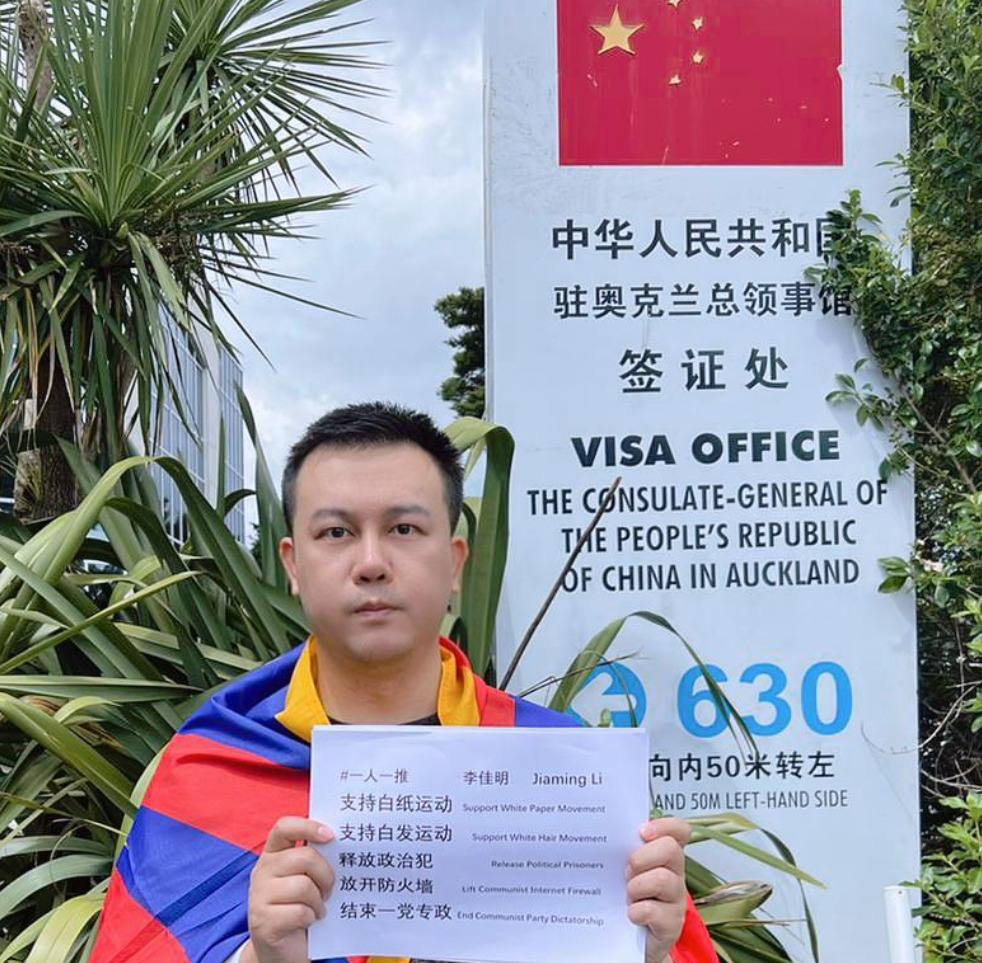
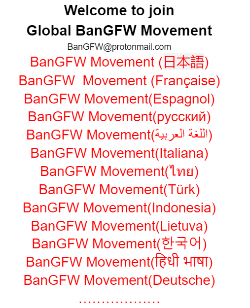
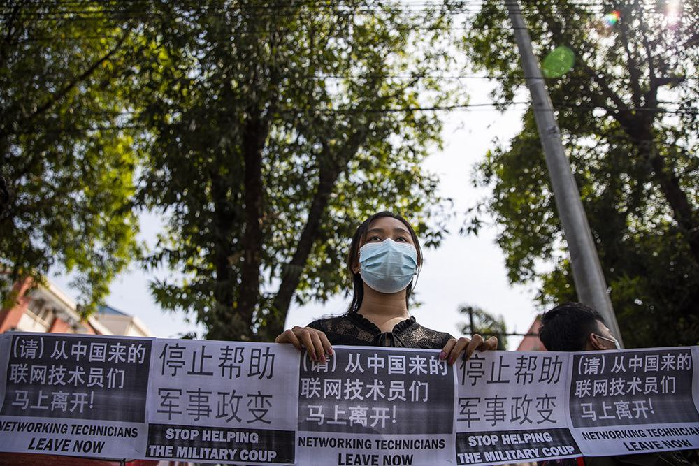

北京时间2023-04-02T15:08:08Z 【Brave man Leo are blaming CCP's Internet Berlin Wall (GFW) in New Zealand】 

Thanks for your great pic. GFW is world's largest Internet censorship system, has blocked Google, Twitter &amp; other 310,000 domains, is much more toxic than TikTok, Let's #BanTikTok #BanGFW #拆墙运动 https://t.co/c9JXz3CP78   北京时间2023-04-02T14:15:03Z Great thanks for you time and attention, hope we can vote for a 2nd time to collect more votes to free Mr. Ruan Xiaohuan! 
非常感谢各位战友抽空来支持释放 #阮晓寰(#编程随想)，如果可能，希望我们再搞1次投票，来帮助启蒙无数人防火墙等时政知识的大英雄早日出狱。   北京时间2023-04-02T14:00:05Z Now, we already have about 800 voters to condemn CCP's illegal arrest on prominent blog-writer and Internet security expert Mr. Ruan Xiaohuan, FREE Ruan Xiaohuan!
我们目前已有近800人来签名谴责中共非法关押 #拆墙运动 先锋 #阮晓寰 先生，资深网安专家和博客作者，赶紧释放 #编程随想 ！   北京时间2023-04-02T12:50:56Z We request you to open more branches of BanGFW to tear down world's largest Internet censorship system, which costs 6 billion $ yearly &amp; is 10,000 times more toxic than CCP's TikTok, force 1.4 billion Chinese to hate the West &amp; democracy.
#BanGFW #GreatFirewall #拆墙运动 https://t.co/cHH1xjF5Ug   北京时间2023-04-02T04:08:14Z 【A great shame that 8 billion people forget to protest against CCP Internet Berlin Wall】

We used 10 keywords in Chinese, English, Japanese, tried hard to search for protest signs against super evil #GreatFirewall in the past 23 years, ONLY about 5 pics. So let's #BanGFW now! https://t.co/OOCw4gvioM   北京时间2023-04-02T01:17:23Z RT @LennyBusker3: 1,4 miliardi di cinesi non ha accesso a Google
Youtube e altri 310.000 siti Web 
si limitano ad ascoltare la propaganda c…   