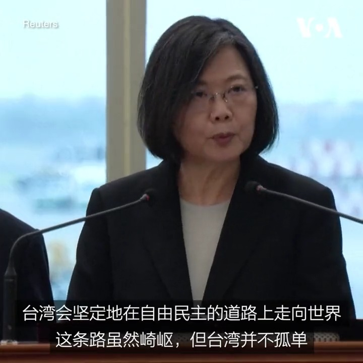

美国之音中文网 北京时间 2023-03-29T21:41:15Z 1641073035032645634 “带领台湾走向世界，也让世界走向台湾，是我们执政的重要目标”，台湾总统蔡英文3月29日在台北桃园国际机场作出上述表示。蔡英文当日开启为期10天9夜的“民主伙伴共荣之旅”。她在抵达中美洲建交国危地马拉和伯利兹之前将经停美国纽约。详细：https://t.co/fgeSV81tf9 https://t.co/0UslWErpS8   