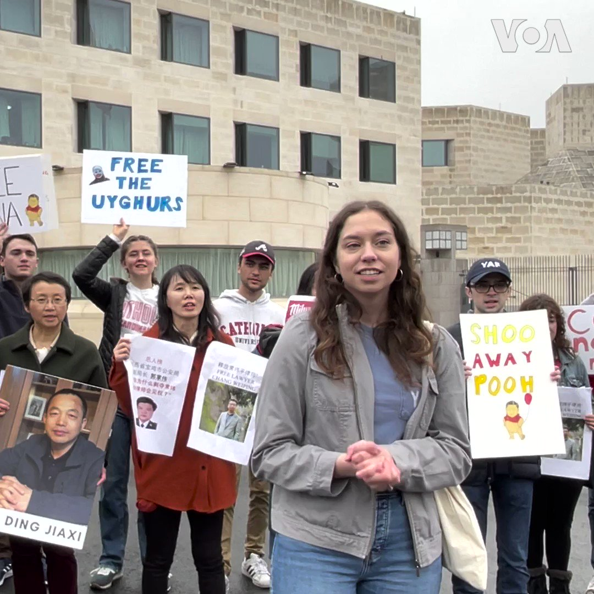

美国之音中文网 北京时间 2023-03-26T22:49:05Z 1640002940504031235 “习近平是挟持中国人民的嗜血独裁者“、“中共必须下台”，美国天主教大学保守派学生组织“美国青年争取自由”25日傍晚在中国驻美大使馆外发起抗议中共暴政的示威活动。数十名美国学生与中国民主人士站在一起，敦促中国政府释放逮捕的人权律师、宗教和异议人士，停止在新疆和香港的人权侵犯。 https://t.co/aOsejVN5u1   美国之音中文网 北京时间 2023-03-26T20:56:07Z 1639974512966893568 “我们不会和中国进行无意义的金钱外交竞逐”，台湾总统蔡英文26日在宣布终止与洪都拉斯的外交关系的讲话中指责中国近年来不断打压台湾的国际参与，加剧军事侵扰。此前洪都拉斯与中国建交。  

https://t.co/s6OMlmXXKZ https://t.co/AXQnfQrBkD   