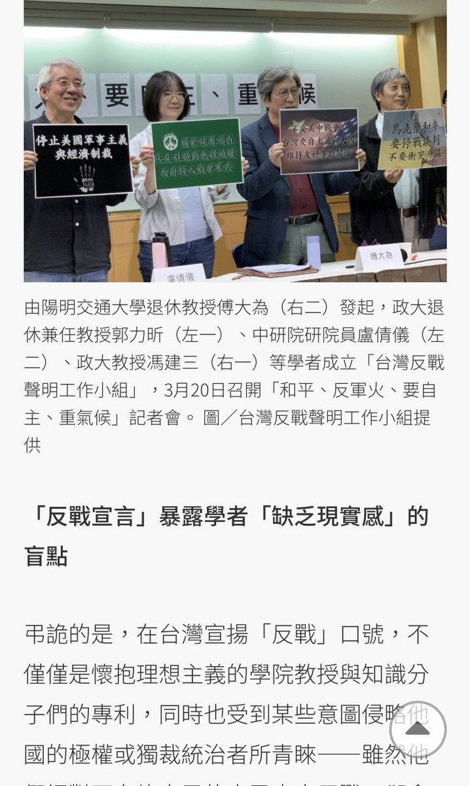

北京时间2023-03-25T22:23:29Z RT @ActivistLittle: Daily anti-coup revolutionary domestic strike by pro-democracy CDMer teachers from Sagaing University of Education as 7…   北京时间2023-03-25T19:57:31Z RT @Thinkming1: 写出你心中敬佩的女性。
我敬佩的女性：李清照，蔡英文，盛雪，高瑜，严歌苓。 https://t.co/d1QXj3wCIF   北京时间2023-03-25T14:56:30Z RT @EndGFW2: （投票）当前中国人生存环境急剧恶化，年轻人都直接饿死于街头，海内外反抗力量揭竿而起，信誉破产的红朝，你觉得还能有3年寿命吗？
全面拆墙或许有些难度，但如果今天起每人都能用上类似于Telegram但不用手机号绑定的加密通讯工具，红朝还能有3个月寿命吗？…   北京时间2023-03-25T14:10:03Z RT @realcaixia: 支持童屹女士！拆掉中共互联网防火墙—中共阻碍信息自由流通的互联网柏林墙—这是改善中国人权状况、推进宪政民主的基础。   北京时间2023-03-25T14:08:08Z RT @ak60809133: @realcaixia 有一说一，如果能拆墙，保守估计国内一年之内会增加5000万到一亿反贼……   北京时间2023-03-25T11:07:00Z RT @EndGFW2: 【拆墙运动国际版图首获1亿国际友人支持】

感谢越南版 #编程随想 Phamtayson新闻网报道了本 #拆墙运动 ，中越党国和儒家文化极相似！但中共武力威胁导致越南人穷困数十年，越共虽偶有关键词审查，但并没禁绝Google、Facebook、Twit…   北京时间2023-03-25T08:29:34Z RT @lelefarley: 中国特色社会主义AI：https://t.co/1zrg94ilp6 https://t.co/eIs5bdsvkZ   北京时间2023-03-25T08:13:28Z RT @kamiya_mamoru: 编程随想被捕，怎么可能少了我们爆破团呢？审判的法官既然已经出道，那么这次我们来全家户口整整齐齐。

⬇️详细⬇️
https://t.co/LRTyOg9E5Y   北京时间2023-03-25T08:04:14Z RT @EndGFW2: 【拆墙·翻墙·推墙---拆墙人用国际笔杆子和刀把子制裁土共】

“推墙”就是“打倒X党”，口号大难实施。翻墙是用技术建立VPN来绕防火墙，是与建墙同年诞生的大生意，但易被封禁和抓捕。 #拆墙运动 是治根，在社交网站打国际舆论战，并在各国议会和海牙国际刑…   北京时间2023-03-25T07:59:31Z RT @Ldl076ya: 拆除互联网防火墙--打破中共威胁的最高绝招 Most powerful way to combat CCP---tear down its In... https://t.co/hBTgmnp0JA 来自 @YouTube   北京时间2023-03-25T07:57:10Z 「请快来Change网站签名救 #阮晓寰」

今日编程随想的诞生是为了让我们的未来与后人不再需要下一个编程随想。成功不必在我，努力必不唐捐，只要受编程随想鼓舞的你我继续对抗中共极权，他就还没输... https://t.co/z84uMaSYiP via @Change   北京时间2023-03-25T07:49:21Z RT @zhiyuegongquan: 宪政:限制政府权力
法治:使政府守法
民主:票评公务员
言论自由:评价公共政策
自由:个体法无禁止即可为
别扯素质文化文明历史原罪搅浑水,别用谴责/完美受害人谬误,滑坡/循环谬误放烟雾
天赋人权合法权益不因认知思想道德言行经历而削减!
敌…   北京时间2023-03-25T07:17:04Z RT @xianglin8964: 我們應該怎麼評論這四位台灣學者？ https://t.co/VWXbudpPUZ   