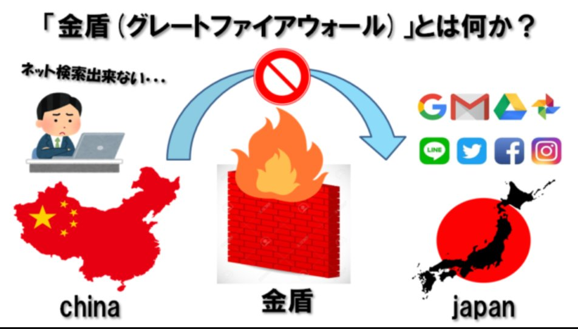

北京时间2023-03-24T22:01:41Z RT @wangqingpeng1: #恶人榜 义工在行动💪

让我们把作恶者曝光到阳光下。希望作恶者能认清形势，加入到建设民主中国的阵营中。

索爾仁尼琴：每個人，只有當他是運行機器的一個不被察覺的部件時，他才是有恃無恐的。但只要個人的責任一集中到他身上，光束直接照到他，他便…   北京时间2023-03-24T21:13:51Z 「假设中推圈半数人反对拆墙•拆墙先锋队就要熄火解散？」

半数精力转入英日印泰语国际圈！
中文推特圈仅约1000万活跃用户，分散于世界各国且不少处于流浪状态，不少还属衙差。不说英文圈，日文圈就有6倍于中推的用户数，日常良性互动极多，从上到下很反感CCP，影响力是中推十倍。#EndGFW #拆墙运动 https://t.co/EM3Y1G9MKa   北京时间2023-03-24T14:56:25Z #拆墙运动 人支持 #milkteaalliance #奶茶联盟 的东南亚反独裁反共党的抗议。

中共长期对缅甸军阀提供大量军火，威胁泰国民主派学生，操控印尼、马来穆斯林电视台，抓捕香港民运派，武力欺压台湾！请大家在新发的帖子里，多加注两个标签 #EndGFW #MilkTeaAlliance   北京时间2023-03-24T14:05:45Z RT @programthink: 每周转载：新疆棉花——从“人权争议”到“外交对抗”（外媒报道30多篇）
https://t.co/5KqmDuyHSm   北京时间2023-03-24T12:28:53Z 请你快来投票救救 #编程随想 大侠！百万人联名敦促中共放人，记得转发哦！

阮氏墙内活动十余年，为我们写了700多篇大作，获得了德国之声博客大奖，涉及时政历史、反网络追踪等等，开启了无数接轨世界的新灵感。编程大侠的被抓是我们时代的一大损失，秀出我们的愤怒，让国际社会施压中共放人！！   北京时间2023-03-24T10:30:15Z 美国国会听证会的气势是要废了共党的TikTok了

https://t.co/YjheQiYj6h   