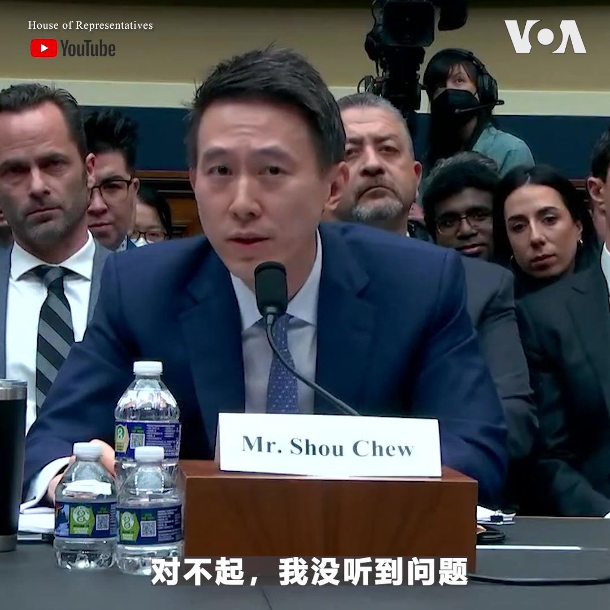

美国之音中文网 北京时间 2023-03-24T07:41:13Z 1639049694604148736 TikTok CEO 周受资周四出席美国国会听证会接受众院能源及商务委员会质询。会长将近六小时，火药味十足。虽然周受资不断淡化公司与字节跳动的关系，但议员们并不买帐。“欺骗是中共政治、情报和军事战略的基础。你反复用‘透明’这个字，但每次你说时，我听到的是‘欺骗’，”在场议员加里.帕尔默对周受资说。 https://t.co/fmxQauOivT   