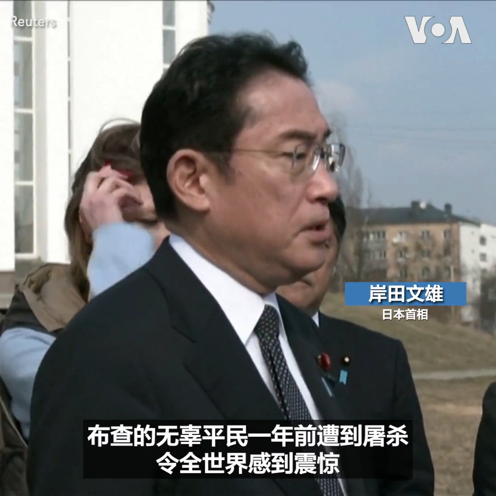

美国之音中文网 北京时间 2023-03-21T23:30:27Z 1638201411593814016 日本首相岸田文雄21日突访乌克兰，准备会晤乌克兰总统泽连斯基。他访问了基辅郊外的布查镇 Bucha，2022年俄罗斯入侵乌克兰后曾占领这一地区，涉嫌屠杀了多达400位平民。岸田文雄说这样的暴行令世界震惊，他对此感到“非常愤怒”。岸田文雄还到基辅的阵亡军人纪念墙敬献花圈。 
https://t.co/9vj1PVToWH https://t.co/1B3wAgEuWq   美国之音中文网 北京时间 2023-03-21T02:13:14Z 1637879989772099596 美国国务卿布林肯3月20日表示，习近平在国际刑事法庭对普京发出逮捕令几天后前往俄罗斯，表明“中国认为他们没有责任追究克里姆林宫在乌克兰犯下的暴行”。布林肯说，“世界不应被俄罗斯在中国或其他国家的支持下采取的战术所愚弄”，呼吁停火而不同时要求俄军撤出乌克兰基本上就是支持俄罗斯的征服行动。 https://t.co/95uL5IiIrA   