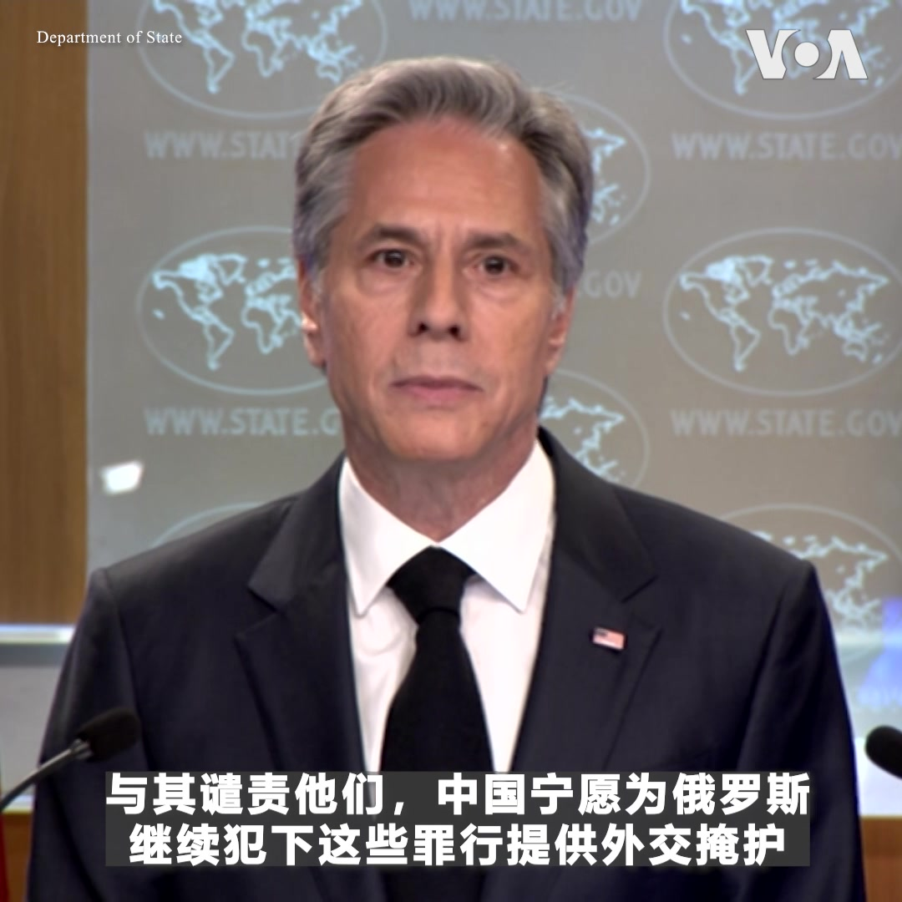

美国之音中文网 北京时间 2023-03-21T02:13:14Z 1637879989772099596 美国国务卿布林肯3月20日表示，习近平在国际刑事法庭对普京发出逮捕令几天后前往俄罗斯，表明“中国认为他们没有责任追究克里姆林宫在乌克兰犯下的暴行”。布林肯说，“世界不应被俄罗斯在中国或其他国家的支持下采取的战术所愚弄”，呼吁停火而不同时要求俄军撤出乌克兰基本上就是支持俄罗斯的征服行动。 https://t.co/95uL5IiIrA   