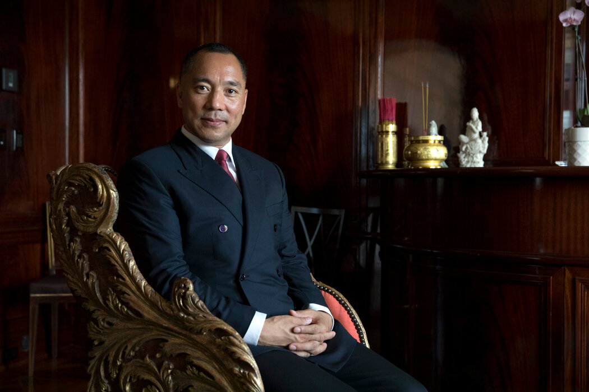

北京时间2023-03-17T14:08:52Z RT @HerlandMuseum: “妲己不是坏妖精，她是远古女祭司。”
“妲为一个女与初升地太阳，己为人的代称，可以理解为拂晓时刻、破晓时分出生的人，执掌拂晓的人，即驭阳之人”
“妲己是一个有政治头脑和才华的女性，还是一位艺术革新家”
“女性政治家被性化妖魔化现象此起彼伏，…   北京时间2023-03-17T13:05:14Z 「郭文贵反共重在裤裆里那点事」

郭文贵作为前体制内超级富豪，豪车游艇和洋人反共，对很多人有不少吸引力，但你很快就能发现，他侧重在中共高官床事。在关系中共命根子的事上没具体表现。靠嘴巴反共搞钱，还当上了几万人的大总统，国都没稳就天天玩豪华，这些“受害者”到底都是什么人？
#拆墙运动 https://t.co/Ck2gi90NAX   北京时间2023-03-17T11:48:32Z 「郭文贵骗法低劣却流行华人圈•俺这几年直接避谈郭」

4年前YouTube上看到郭总统，每天打鸡血骂CCP，表面上有些煽动力，像传销窝点。再搜了下，大媒体人盛雪 @ShengXue_ca
就有个对郭的长篇音频讲解，还对比了郭和赖昌星，就既不支持也不反对，不公开谈论就对了。
https://t.co/gzCwKP2NXO   北京时间2023-03-17T01:25:16Z RT @wangqingpeng1: 重要的事情说100遍啊100遍！！！（唐伯虎点秋香台词）
电报不要截图给对方，不管对方是谁！
看见截图一定要明白，你丫要被盗号了！！
截图！
截图！
截图！
记住截图等于盗号！
电报安全：
1、两步验证！
2、去掉关联邮箱！
3、去掉之前的…   