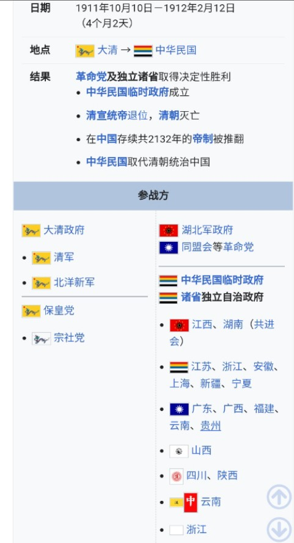

北京时间2023-03-15T22:46:33Z RT @maozexizhuxi001: @realcaixia 你好女士，我翻越长城防火墙来了！首先我对你这条倡议表示强烈认可和支持！让数亿无知农民睁开眼看看外面的世界，张大耳听听外面世界的声音极其重要！！！同时我再建议一条！联合全球有识之士共同举报一切共匪官媒的传话筒账号！…   北京时间2023-03-15T21:11:41Z 「向台湾泰国政治军事学者圈推拆墙」
#EndGFW #拆墙运动
俺区区小民，但通过自由亚洲电台工作，结识了台泰日学者，不太期待能立马表态支持，暗中转发投票就非常感谢了。昨天去拜访了中华民国立法院、行政院等约200个部会Facebook官网，今天Line推广，先把这潭水搅起来，引发热议先！

你今天拆墙了吗？ https://t.co/u4PKQI98GX   北京时间2023-03-15T17:48:54Z RT @qiaoxinxin88: 【快来投票：7天内获得10万人支持就去联合国告状】

中国的互联网愚民墙罪行滔天，23年来封了Google、Twitter等31万家网站，切断14亿中国人与66亿人的沟通，让我们花1秒钟投票，再向联合国、英法美等递交书面控诉材料，要求进行调查…   北京时间2023-03-15T17:48:10Z 【快来投票：7天内获得10万人支持就去联合国告状】

中国的互联网愚民墙罪行滔天，23年来封了Google、Twitter等31万家网站，切断14亿中国人与66亿人的沟通，让我们花1秒钟投票，再向联合国、英法美等递交书面控诉材料，要求进行调查和制裁，给中共巨大国际政治压力！请点击→https://t.co/BBaYcyXyxl   北京时间2023-03-15T12:31:03Z 「荷兰老王可参选未来的新中华总统」

推特上时不时看到老王，但互粉也就一周而已。老王在欧洲的中共使馆前文明手撕CCP，而且还用了中华民国国旗，此国际外交场合风餐露宿挑战中共按年计算了，想必荷兰文和英文报道已满天飞了，其勇敢、智谋、坚毅无人能及，加油、保重！
#一人一推 #拆墙运动   北京时间2023-03-15T11:41:46Z 「革命党推翻满清帝国•不到全国万分之一人主导」
#拆墙运动 #EndGFW
主导民主化大变革，并没等全部觉醒，无论你去看法、美还是台湾，多数人是历史看客，暴政末年，只要有万分之一人主导、1%的人协助、10%的人同情，事就成了。几万八旗子弟就入关掌控数亿汉人，1911倒台时也就几千湖北新军和数万外围。 https://t.co/iU6lNQk9qc   北京时间2023-03-15T10:57:32Z 「救国道路千万条•反共才有新希望」

无论是拆墙、白纸、关注政治犯，还是支持西藏、新疆独立运动等等，都是拯救中国的很好方式，对于那些爱说这没用那不行的，我一般不过多评论，因为所有人都在被迫害和迅速变穷苦，你有更好选择吗？清朝被革命党推翻，核心力量不到当时全国万分之一人口。   北京时间2023-03-15T10:10:35Z RT @wangqingpeng1: 2023.3.12 #一人一推 第25周 汇报人 鲜于桂娥
截止今天全球共有156位推友登记在册
中共应释放所有在押政治犯。用选票颠覆国家当权执政者，是民主国家人民的正当合法权利。期待有一天，中国土地上不再有颠覆或煽颠国家政权罪这类荒谬政治…   北京时间2023-03-15T10:08:56Z 「追查中共海外警局、支持藏人独立、新疆劳改都是美国近期核心议题」
#EndGFW
美国反共议程近期排满， 藏人独立运动已经持续几十上百年了，有无数上街铁粉，查封中共海外警局也喊了好几年了。拆墙更是个世纪大工程，需改变观念和利益重整，但大方向没错，自由网络和通畅呼吸同等重要，希望你也来游说。   北京时间2023-03-15T09:46:12Z 「美国要先审中共病毒再帮俺们拆墙？」
#EndGFW #拆墙运动

中共陷入全面内外交困，全世界清算中共病毒的呼声一直没停，各国都提出了天文级数字索赔案，三年了，也需要给世人一个交代。近期高喊公审中共病毒的消息已在美国霸屏，阻止我们签名的巨大黑手也许在此。那就先等等，继续场外凝聚拆墙共识。   