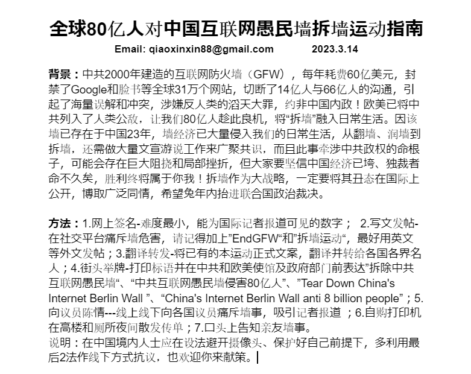
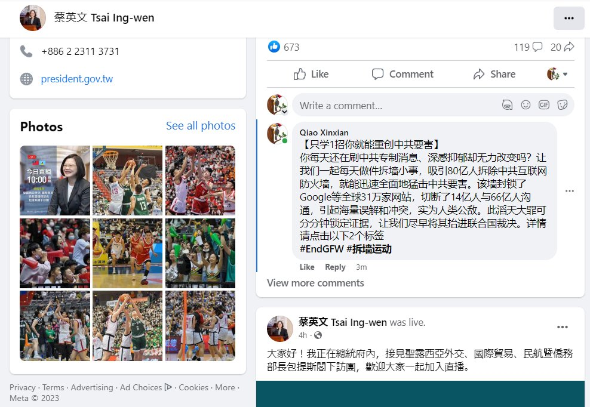
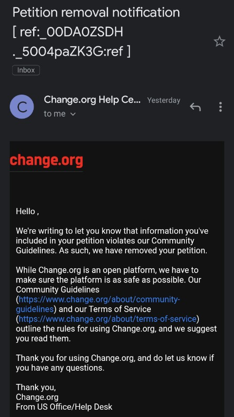

北京时间2023-03-14T19:58:29Z 我发起这个签名前，就查了些中英文资料后发现，这个墙看不见、摸不着，一开始要用两三百字控诉墙的危害，是有难度的。修改了好几个文案后，了解它主要危害后，才发现，用一个推特帖，也能讲清。用15字也能写个精简的街头抗议标语   北京时间2023-03-14T17:00:32Z 经过对标题再三斟酌，打算4小时后删除上述帖子，已经重发发帖并置顶了。因为觉得没有把“中国互联网防火墙”这一主语体现出来，不利于读者在2秒内锁定文本核心内容。   北京时间2023-03-14T16:54:09Z 【全球80亿人对中国互联网愚民墙拆墙运动指南】
#EndGFW #拆墙运动
你每天还在刷中共专制消息、深感抑郁却无力改变吗？让我们每天做件拆墙小事，吸引80亿人拆除中共互联网防火墙，就能猛击中共命门。该墙封锁了Google等全球31万家网站，切断了14亿人与66亿人沟通，引起海量误解和冲突，实为人类公敌。 https://t.co/GHfXdddHao   北京时间2023-03-14T15:41:02Z 命门。该墙封锁了Google等全球31万家网站，切断了14亿人与66亿人沟通，引起海量误解和冲突，实为人类公敌。此滔天大罪可分分钟锁定证据，让我们尽早将其抬进联合国裁决。详情请点击以下2个标签 #EndGFW #拆墙运动   北京时间2023-03-14T15:40:53Z 如果你不知如何写帖文，那就在推特、Facebook、Youtube上复制转发俺的文本，每天只花几秒钟，就能做1件拆墙小事：

【只学拆墙1招你就能速破中共威胁 · 此法值万亿美元】
你每天还在刷中共专制消息、深感抑郁却无力改变吗？让我们一起每天做件拆墙小事，吸引80亿人拆除中共互联网防火墙，就能迅速全面   北京时间2023-03-14T14:47:59Z 【你今天也拆墙了吗？俺去拜访了蔡英文总统】

刚在总统官网游说，希望2300万人能速知拆墙这个反共杀手锏，而且这能为国库省下数百亿美元军火采购费。接下来，先把中文圈各idea leader的主页先首发拜访一轮。你也不妨动动手指广泛转发分享，为中国社会进步事业增砖添瓦。
#EndGFW #拆墙运动 https://t.co/kd0SBjDWL2   北京时间2023-03-14T12:15:12Z 【中共互联网防火墙涉反人类重罪 ·为何能活23年？】
#拆墙运动 #EndGFW 

互联网诞生西方，本意是能从四面八方都传信息，墙核心技术并不由CCP掌握，若无部分国际政商家族默许，建墙是不可能，而最大受害者中国人却没集体反击，惨遭整体卖猪仔。当前中共称帝世界野心已吓尿了国际岁静们，拆墙良机来临。 https://t.co/qbQYcYq7Xa   北京时间2023-03-14T02:00:11Z 「拆墙运动真吓到中共了？请愿签名5天内第2次被Change系统删除！」
#EndGFW #拆墙运动
两次签名获得了将近200签名，但总有网友说签名页出多种状况，刚再被删帖，同样是说违背平台规则，具体不说。中共网警账号恶意举报，还是其他？但可以肯定，这次动了它命根！换白宫签名平台？增加线下渠道举牌？ https://t.co/GbcqSRqIJ4   