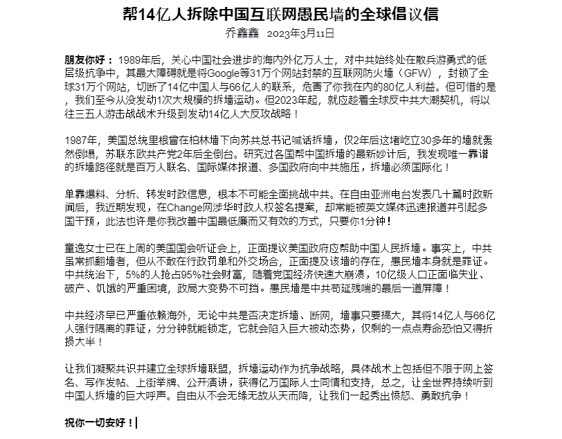
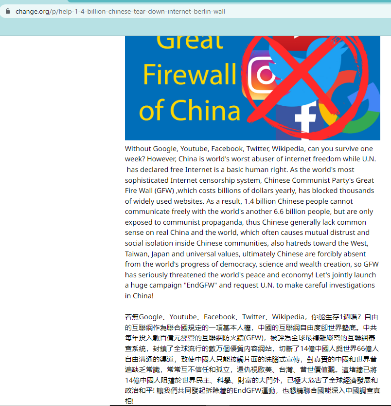
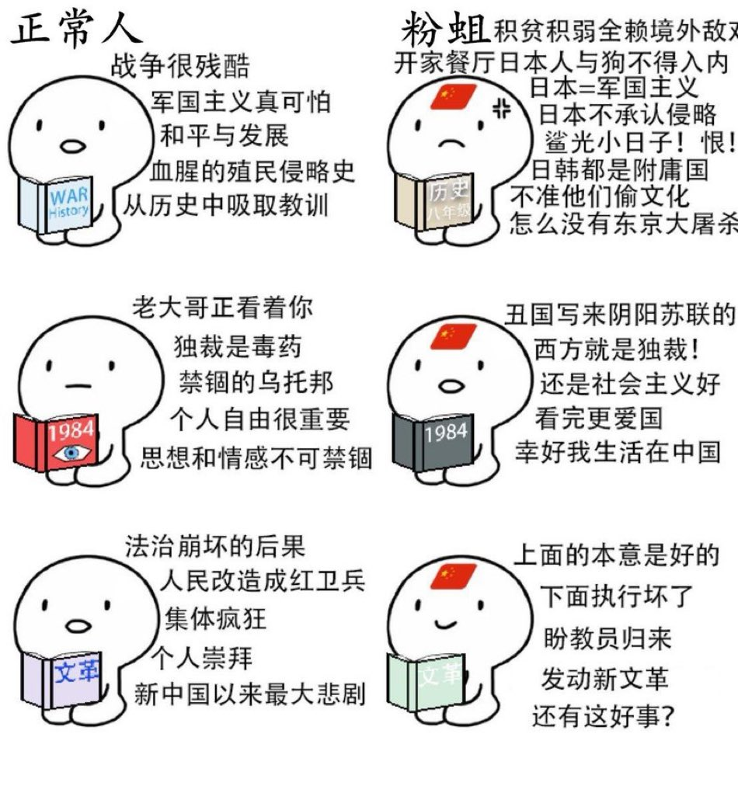

北京时间2023-03-11T23:12:22Z RT @realcaixia: 推倒習共互聯網防火牆，不僅是爭取14億人獲取信息自由、言論自由的基本權利，而且是揭露習共謊言洗腦，由民眾獨立思考、獨立做出判斷的基本前提和必須條件。
一旦推倒防火牆，就能釋放中國內部的民間活力，海內外和中國體制內外致力於自由民主的所有力量就能聯合…   北京时间2023-03-11T22:32:21Z 【帮14亿人拆除中国互联网愚民墙的倡议】
#EndGFW #拆封运动
中共自2000年打造互联网防火墙，每年花60亿美元禁了Google等全球31万家网站，强行将14亿人与66亿人隔离。该滔天罪证分分钟能得，应抬到联合国公审，我们应把三五人的游击战术，即刻起升至发动14亿人大反攻战略→ →https://t.co/XNCLXS5Rgq https://t.co/3Wd6hSRerS   北京时间2023-03-11T20:31:25Z 拆墙大战略应包括但不限于网上签名、街头举牌、使馆抗议

墙事绝非中国内政，因为它强行将14亿人与66亿人大隔离，这是滔天大罪，分分钟锁定罪证！即便西方那么岁静族，也不能容忍每天没Google、Youtube的日子，容易获得国际共情和对CCP大控诉。通俗点，把事捅大先，让各国听到我们的抗争！ #EndGFW https://t.co/NiZgQnUQpg   北京时间2023-03-11T17:25:23Z （4/4）中共自2000年起, 每年花400亿经营互联网防火墙(GFW), 为世界最严密复杂网络审查系统, 封死全球31万个网站,切断14亿人与66亿人自由通信，造成双方因虚假宣传而互相仇视，蓬佩奥只不是1亿人中共的公敌，愚民墙才是人类公敌！只要进入国际公审阶段，80亿人都是证人。请联合国和国际刑事法院调查！   北京时间2023-03-11T17:25:21Z (3/4）everyone of 8 billion people is a witness for the big crimes against humanity, we request U.N. and  International Criminal Court to make  immediate investigations, so as to tear down this evil wall!   北京时间2023-03-11T17:25:20Z (2/4)blocked Google Youtube and other 310,000 websites, causing 1.4 billion have no access to communicate with another 6.6 billion people freely and hatreds towards the latter. Mr Pompeo is Chinese people's real friend, while CCP's GFW is truely the common ennemy of mankind,   北京时间2023-03-11T17:25:19Z 8 billion people's Common Enemy of Mankind-China's Internet Berlin Wall
80亿人类公敌---中国互联网愚民墙
@mikepompeo @CAV_PA #EndGFW #拆墙运动
 (1/4)As world most sophisticated Internet censorship system Great Fire Wall (GFW) ,which costs 6 billion dollars yearly, since 2000, has https://t.co/nXheQJg7cL   北京时间2023-03-11T16:37:06Z 中共互联网愚民墙滔天大罪：把14亿人和66亿人强行隔离
#EndGFW #拆墙运动
世界独裁政权里，如越南、俄国、柬埔寨也有少数关键词封锁，但没谁每年花400亿元、封禁全球31万个网站，切断14亿人对外通信，此墙大小刑事罪名可上亿万条，对十亿级人口的隔离罪远超南非，CCP却还作为联合国5大国指点万国江山。 https://t.co/zJWnj0b3ex   北京时间2023-03-11T15:08:05Z 中共互联网愚民墙反人类罪可分秒内完成定罪证据

中国民运有各议题要人支持，比如少数民族、性少数派、女权、强拆维权等，但属于特定地域，调查取证也有难度。愚民墙将14亿人与66亿人隔离的大罪，80亿人都能感知并同情，却此前少有华人提及。只要推到国际法庭，法官不进中国，也能分秒内就完成取证！ https://t.co/3iPwIM0m1Y   北京时间2023-03-11T10:02:08Z 「全球签名帮14亿人拆除互联网愚民墙并自由访问Google YouTube」

只要几分钟，就能帮你从单凭三五人游击战转为发动14亿人大反攻，帮你早日安全地去中国旅游，欢迎你签名并转发！
#拆墙运动 #EndGFW
https://t.co/uexzrcSeUr   北京时间2023-03-11T09:40:30Z 拆墙是推动中国民主化各派利益之最大公约数
#愚民墙 #EndGFW
我看过中共统治下涉少数民族、港台澳独立、性取向、女权等各类的人权运动，了解过各派海外民主阵营的利益诉求差异，以及美日欧等民主国家政府对中共的态度，推墙都能引起广泛国际同情，符合你我80亿人利益，应该尽快全面挑战！ https://t.co/AKeH5u1ptu   北京时间2023-03-11T02:55:42Z （7/7）#EndGFW #拆墙运动 #愚民墙
此次拆墙运动牵涉80亿人利益，注定为载入史册的世纪工程。本签名也将陆续增加数十种语言版本，希望你能推荐各语种母语人士义务翻译推广拆墙文书。下面热烈欢迎你来签名并转发
https://t.co/uexzrcSeUr   北京时间2023-03-11T02:48:36Z 请愿标题去除了“CCP”重发帖，看Change这个所谓的NGO平台，是不是还要随意删俺帖，先保留下网页原图，以备日后当庭对质！ https://t.co/NLa0IEMJbm   北京时间2023-03-11T02:27:19Z Fuck, Change官网竟敢随意删帖，说我违背了他们的平台安全原则，我此前写文案时用词较精炼和理性，并没有火力全开地骂CCP，我也预感到它们可能怕惹这些事，这公司自称是家注册于旧金山的非营利机构，敢这么搞，看有什么办法拿捏它！
我再修改下措辞，发个类似请愿，看它是不是学会CCP那套审查风了！   北京时间2023-03-11T02:07:53Z 【拆墙运动请愿页面被Change网站删了】

我前两天就预感到有可能会出现这风险，毕竟一个普通的商业公司平台，不愿去背负巨大的派系纠纷和政治压力。但拆墙的事肯定不能停，还有什么替代性方案么？波罗的海3个小国，1989年曾动员了200万人手拉手结成675公里人链抗议苏联非法入侵 。
#EndGFW #拆墙运动 https://t.co/IWMZFX09xb   北京时间2023-03-11T01:13:55Z RT @FHtxWIgJMI3yoLO: 正常人与小粉红的思想对比👇 https://t.co/31p0jlyQjW   