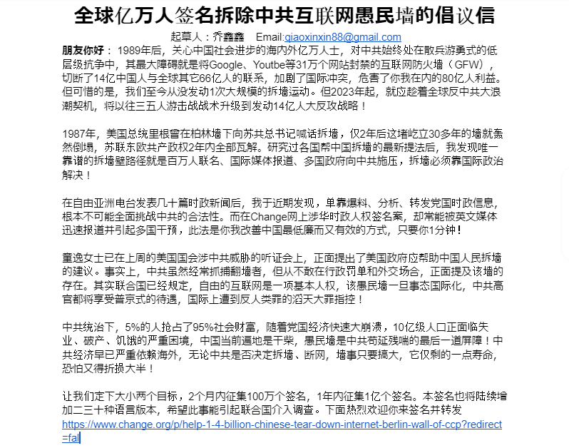
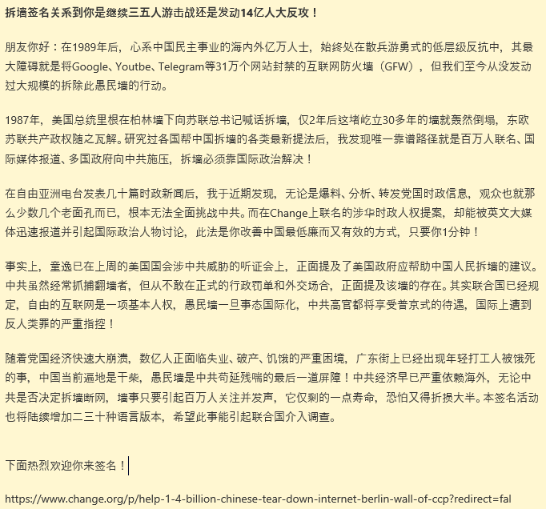
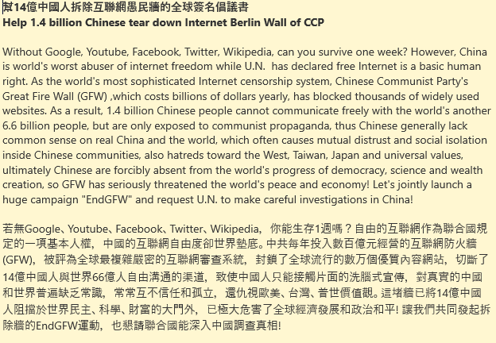

北京时间2023-03-10T22:44:59Z （6/7）愚民墙是中共苟延残喘的最后一道屏障！中共经济早已严重依赖海外，无论中共是否决定拆墙、断网，墙事只要搞大，它仅剩的一点寿命，恐怕又得折损大半！让我们定下大小两个目标，2个月内征集100万个签名，1年内征集1亿个签名。自由从不会无缘无故从天而降，请你一起秀出愤怒、勇敢抗争   北京时间2023-03-10T22:44:57Z （5/7）正面提及该墙的存在。其实联合国已规定，自由的互联网是一项基本人权，该愚民墙一旦事态国际化，中共高官将享受普京式待遇，国际上遭到反人类罪的滔天大罪指控！中共统治下，5%的人抢占95%社会财富，随着党国经济快速大崩溃，10亿级人口正面临失业、破产、饥饿的严重困境，政局大变势不可挡。   北京时间2023-03-10T22:44:56Z （4/7）涉华时政人权签名提案，却常能被英文媒体迅速报道并引起多国干预，此法是你我改善中国最低廉而又有效的方式，只要你1分钟！童逸女士已在上周的美国国会涉中共威胁的听证会上，正面提出了美国政府应帮助中国人民拆墙的建议。事实上，中共虽然经常抓捕翻墙者，但从不敢在行政罚单和外交场合，   北京时间2023-03-10T22:44:55Z （3/7）后全瓦解。研究过各国帮中国拆墙的最新妙计后，我发现唯一靠谱的拆墙路径就是百万人联名、国际媒体报道、多国政府向中共施压，拆墙必须摆到国际政坛公开审理！在自由亚洲电台发表几十篇时政新闻后，我于近期发现，单靠爆料、分析、转发时政信息，根本不可能全面挑战中共的合法性。而在Change网   北京时间2023-03-10T22:44:53Z （2/7）你我在内的80亿人利益。但可惜的是，我们至今从没发动1次大规模的拆墙运动。但2023年起，就应趁着全球反中共大潮契机，将以往三五人游击战战术升级到发动14亿人大反攻战略！1987年，美国总统里根曾在柏林墙下向苏共总书记喊话拆墙，仅2年后这堵屹立30多年的墙就轰然倒塌，苏联东欧共产政权2年   北京时间2023-03-10T22:44:52Z 【全球亿万人签名拆除中共互联网愚民墙的倡议信】
#EndGFW #拆墙运动
（1/7）朋友你好： 1989年后，关心中国社会进步的海内外亿万人士，对中共始终处在散兵游勇式低层级抗争中，其最大障碍就是将Google等31万个网站封禁的互联网防火墙（GFW），切断了14亿中国人与66亿人的联系，加剧了国际冲突，危害了   北京时间2023-03-10T22:12:41Z 郑重鸣谢：本提案的思路源于纽约城市大学夏明教授@XiaBamboohermit《红太阳帝国》，当时俺在墙内无VPN，翻阅后感悟很深。他书中提到了愚民墙的巨大危害，却还没能酿成国际政治事件。   北京时间2023-03-10T21:53:25Z 【全球亿万人签名拆除中共互联网愚民墙的公开信】

中共每年耗费400亿元的互联网防火墙，封禁了Google等全球31万个网站，该愚民墙犯下联合国的反人类罪，经百万人签名把墙事国际化，则将全面挑战中共政权。从2023年，让我们告别三五人游击战的战术，升级到发动14亿人大反攻的战略！
#EndGFW #拆墙运动 https://t.co/HdO8PjfNmh   北京时间2023-03-10T12:58:48Z 【拆墙签名关系到你是继续三五人游击战还是发动14亿人大反攻】
#EndGFW
1987年美国总统在柏林墙下向苏联喊话拆墙，仅2年后这堵屹立30多年的墙就倒塌，此后2年苏联东欧共产党全部倒台。中国拆墙的唯一靠谱路径就是百万人联名、国际媒体报道、多国向中共施压！欢迎点击签名→
https://t.co/ME9ORMQnkc https://t.co/o5c9dFRxTD   北京时间2023-03-10T01:27:19Z 为何技术上不可能推倒中共互联网防火墙？

以下是Quora上网络专家们的看法，说直白点，CCP掌握枪杆子，这堵墙在技术是世界最精密的互联网审查系统，这是集国家力量对抗个体。我以前做过不少散兵游勇式的对抗，自建新闻网站等等，但对拆墙的作用其实极小。愚民墙是政治问题！

https://t.co/09dhKv0iBc   北京时间2023-03-10T00:06:42Z 幫14億中國人拆除互聯網愚民牆的全球簽名倡議書，歡迎來簽名！
Welcome to sign the petition to help 1.4 billion Chinese tear down Internet Berlin Wall of CCP

#EndGFW  #柏林墙 #互联网防火墙
https://t.co/BPYyGNq8G7   北京时间2023-03-10T00:03:37Z My newest words to describe China's Internet censorship system GFW, which may help the Westerners to recognize its  massive threats to the world  in 10 seconds.

我最新版的讨墙檄文措词，希望能让西方读者10秒就能通过标题识别主要内容及愚民墙对各国的巨大危害。
#EndGFW https://t.co/bh57TjxsMa   