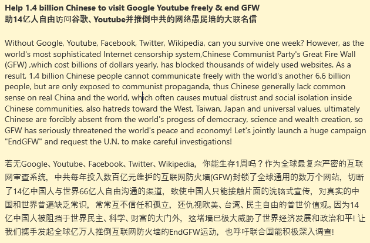

北京时间2023-03-09T22:09:09Z RT @BobFu4China: KOLB: It’s Time To Tear Down China’s Internet Firewall 到了推倒中共网络柏林墙的时候了https://t.co/lk6Xmsy5wu
We are closer to success tha…   北京时间2023-03-09T21:14:58Z 美国里根总统1987年在柏林墙下向苏联喊话，呼吁拆除隔离德国人30多年的140公里长高墙，2年后，柏林墙轰然倒塌，并迅速德国统一、东欧剧变、苏联解体。
#EndGFW
https://t.co/eDgjd0kcAu   北京时间2023-03-09T17:00:29Z 中共网警大把来袭，看来又做对了一件事，凡是账号不正常的，俺只能删除了！ https://t.co/LIPza3FwkY   北京时间2023-03-09T16:17:20Z RT @qiaoxinxin88: @wangqingpeng1 @Change 南非曾因这条罪，被联合国表决驱逐出去，联合国1945年之后而开除会员的事只有2起，另一起就是蒋介石政权被中共取代。GFW有滔天大罪，更可怕的是大多数中国人并不知道它的存在，网络高手3年前在新品葱说…   北京时间2023-03-09T15:27:08Z 重新调整后的讨墙檄文，你看好吗？

考虑到须扩增二三十种语言版本，字数得精简扼要！网络愚民墙的具体危害，在很多国家的主流媒体里有报道。任何一个外国人，稍微了解中国的话，都知道它的存在。对于常人来说，即便工资升3倍派驻中国，却没自由网络,他都会迟疑很久的！

#EndGFW https://t.co/LROTZRU6p6   北京时间2023-03-09T14:38:25Z 中国的网络愚民墙到底有多恐怖复杂？每年耗费400亿

最初2000年由方滨兴建成，每年维护费400个亿，防民之口程度成为世界之最！无论你西方对CCP多强硬，给中国民主派支持多大，中共都稳坐钓鱼台还反向讨伐。若墙一倒，可以想像中共还有几个月寿命！

#EndGFW #推倒网络愚民墙
https://t.co/xE2EpqkP3j   北京时间2023-03-09T04:24:56Z RT @qiaoxinxin88: @committeeonccp @LTGHRMcMaster @RepMoulton @CongressmanRaja @RepHaleyStevens Your committee only need to invest a tiny am…   北京时间2023-03-09T02:56:56Z 欢迎来联名签署“助14亿中国人自由访问Google、Youtube并终结互联网防火墙”, 陆续要增加日韩泰等20个语种。
Let's sign the petition "Help 1​.​4 billion Chinese to visit Google Youtube freely &amp; end GFW". Over 20 languages versions should be added later.
#EndGFW
https://t.co/MJznHKvkxB   北京时间2023-03-09T01:29:49Z 最新数据：中国互联网防火墙封锁了30多万个域名，其中1800个为全球流行的网站。

#EndGFW

https://t.co/LZ9pmm6XHn   北京时间2023-03-09T01:01:34Z 中国互联网防火墙问题必须国际政治解决

一进中国就用不了Google、Youtube, 很多国家百姓都知道GFW的邪恶性。有太多人都想挑战它，但即便全球顶级黑客也只能偶尔占据几分钟屏幕，因GFW是软硬件科技及政治法律多层手段建立和维护的，拿到国际政治舞台审判才能根治！
#EndGFW
https://t.co/jN7ycR95F6   北京时间2023-03-09T00:32:45Z CCP: surppress, control its people   