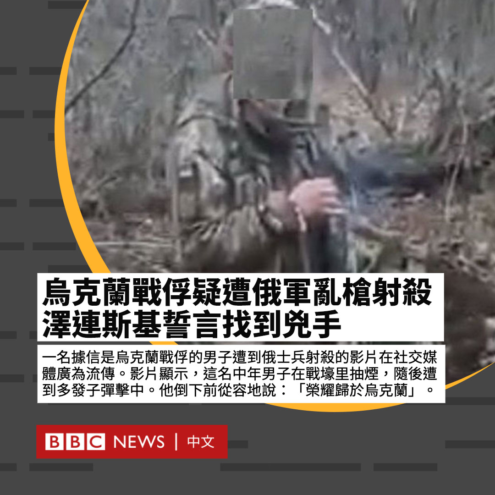

D英国广播公司BBC 北京时间 2023-03-07T20:21:27Z 1633080417447280645 在一名据信是乌克兰战俘的男子遭到俄罗斯士兵射杀的影片在社交媒体广为流传后，乌克兰总统泽连斯基誓言将找到凶手。

影片显示，这名中年男子在战壕里抽烟，随后遭乱枪射杀。他倒下前从容地说：“荣耀归于乌克兰”。

在片段中，可以听到其中一名据信是俄军士兵的枪手说“去死”并咒骂。(1/2) https://t.co/ho77SJeCFI   