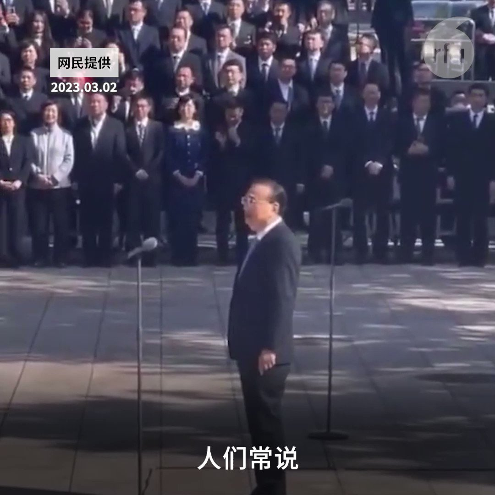

自由亚洲电台 北京时间 2023-03-06T20:18:33Z 1632717302314717184 【李克强告别国务院】
【感叹：人在干 天在看】
被喻为是改开以来最弱势的国务院总理李克强，日前在国务院内部发表告别讲话时，感叹道，今天阳光明媚，如沐春光。“人在干 天在看”。画面也引发网民热议，纷纷嘲讽“影射谁？”
#李克强 
#国务院
#总理
#人在干天在看 https://t.co/8T54jZRLYh   