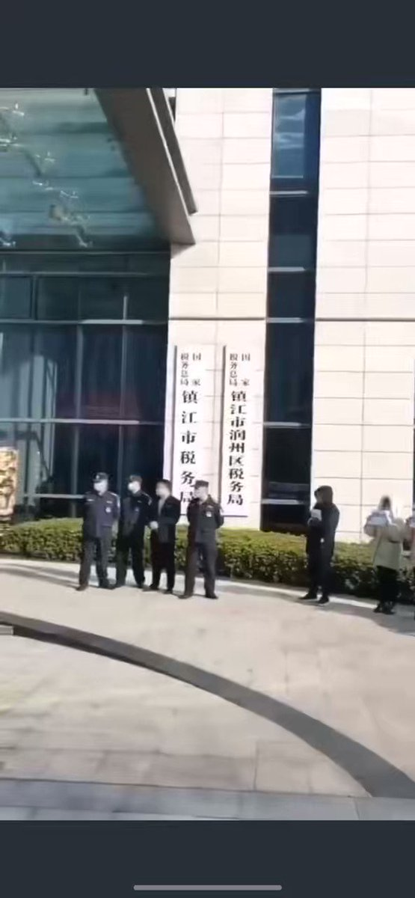

北京时间2023-03-01T18:33:01Z （3/3）造成14亿人普遍愚昧并盲目仇视外国。历史上，中共致数亿人被饿死、打死。中共不仅不能代表中国人民，国际社会应着手将中共代表团驱逐出联合国。美国作为世界第一强国，过去70年却坐视中共欺压奴役中国人民，这是一桩原罪，当前应顺应国际民主潮流加速打击中共，帮助中国人民早日终结共产恶梦。   北京时间2023-03-01T18:33:00Z （2/3）最富有的政府，疫情三年，竟没有发放一分钱的全民现金补贴，导致上亿人正在面临破产和饥饿威胁，各省电视台没一家认真提及该全民灾难。5%的人强占95%的社会财富，并且有可能滑向1%的人掌握99%财富。而且，中共花千亿元打造的网络防火墙，致使中国人无法访问Google、脸书、推特等数万个网站，   北京时间2023-03-01T18:32:59Z 美国为首的民主世界应将中共赶出联合国

（1/3）如果有赴美签证，我愿意手持中国公民身份证和护照在美国国会及联合国证实，14亿中国人，哪怕活了七八十年，从没有权利选举和罢免任何官员，中共政府官员从不公布个人财产，各级政府财务收支详情不向民众公布。作为世界 
https://t.co/Ytl29nuhdP   北京时间2023-03-01T17:54:49Z RT @xinwendiaocha: 江苏省镇江市税务局公务员们举白纸抗议欠薪！
真是天下奇闻，收税的沒钱发工资！看来地方财政问题很大！ https://t.co/G4ExBbAaIf   北京时间2023-03-01T08:24:57Z RT @wangqingpeng1: “中国人是中共的主要受害者”！

“作为中共问题特别委员会的领导人，我们将继续以两党合作的方式，保护美国免受中共构成的意识形态、经济和军事威胁，同时始终区分中共和中国人民，后者是他们（中共）的主要受害者。’’
麦克-加拉格尔议员 
2023…   北京时间2023-03-01T08:20:48Z 中国防火墙严重阻碍中国人民与各国的沟通，造成民众普遍缺乏社会和国际常识，应联合国际力量予以推翻。   