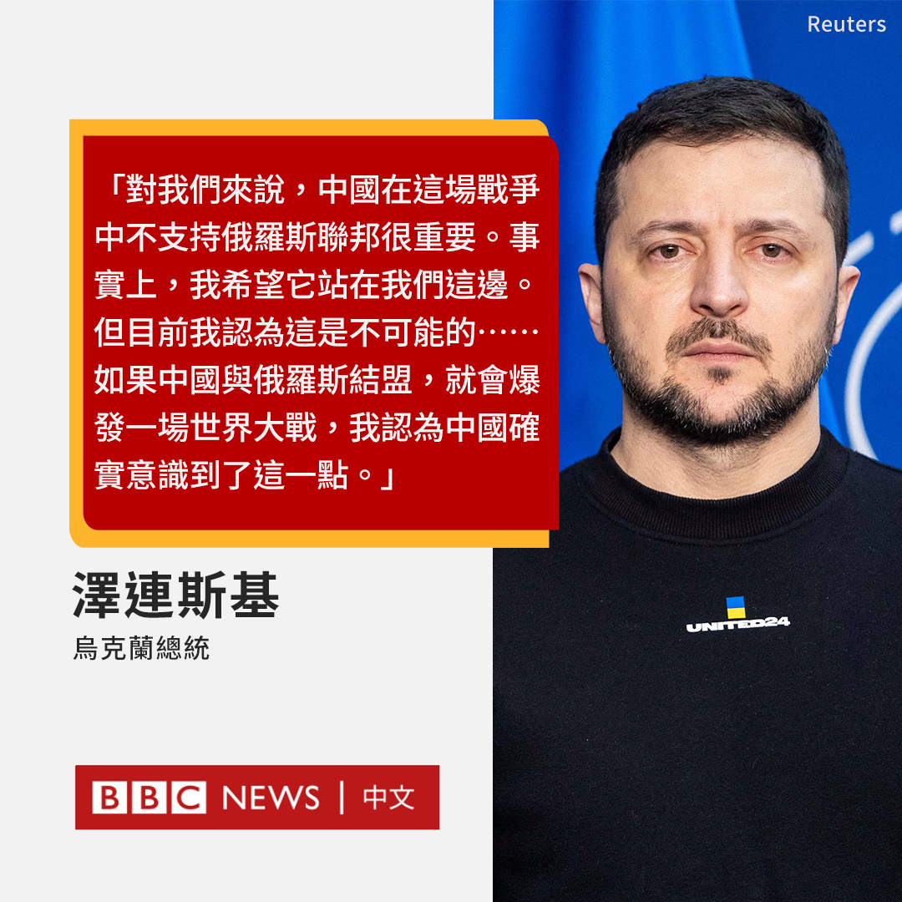

D英国广播公司BBC 北京时间 2023-02-21T09:54:26Z 1627849195628662785 乌克兰总统泽连斯基在接受媒体采访时警告，如果中国与俄罗斯结盟，就会“爆发一场世界大战”。他称，“中国确实意识到了这一点”。

“对我们来说，中国在这场战争中不支持俄罗斯联邦很重要。”泽连斯基对德国《世界报》（Die Welt）说。“事实上，我希望它站在我们这边。但目前我认为这是不可能的。”(1/2) https://t.co/aZwsIkaRQo   