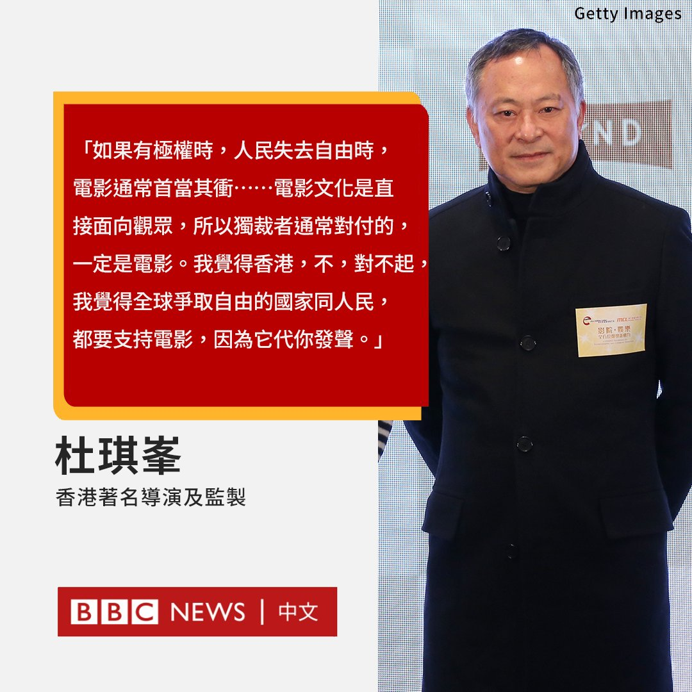

D英国广播公司BBC 北京时间 2023-02-17T11:01:06Z 1626416419024912385 第73届柏林影展于2月17日凌晨举行开幕礼，香港著名电影导演杜琪峯作为本届主竞赛单元评审之一，他会见传媒时指电影是“为人民发声”。

杜琪峯被问到电影的独特性及意义时，杜琪峯以广东话回答指，当人民失去自由，电影通常首当其冲，因为电影文化是直接面向观众，所以独裁者通常对付的一定是电影。 https://t.co/XPJd0JxOuk   