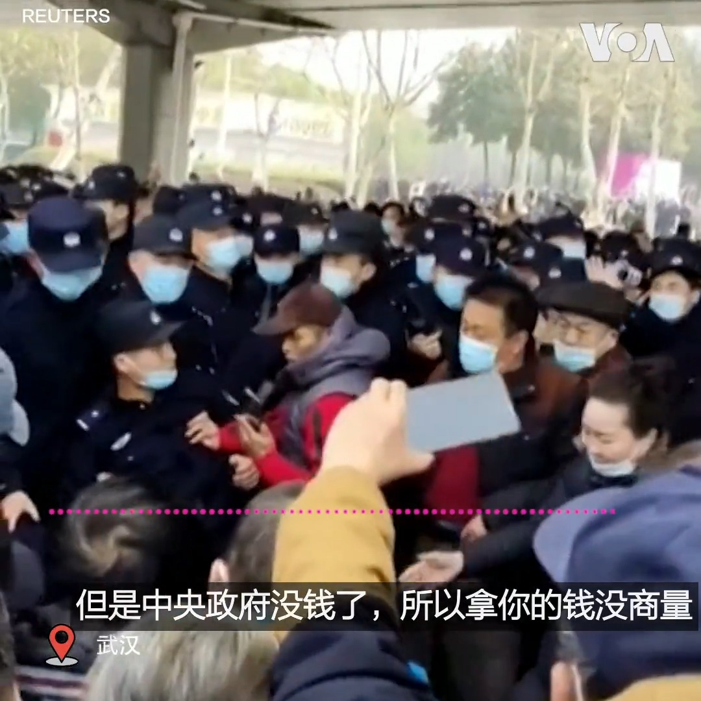

美国之音中文网 北京时间 2023-02-16T09:34:22Z 1626032203133071360 “老百姓不容易啊，‘三年自然灾害’我们没死，文化大革命我们没死，这次疫情我们没死。现在大连政府怎么派这么多警察来对付老百姓？”一位大连市民问。星期三中国医保改革引发的抗议延烧至这座北方城市。同日，武汉民众继续上街。退休人员万先生说，中山公园门口聚集了十多万民众，现场警察也在十万左右。 https://t.co/PZo09QhEzG   