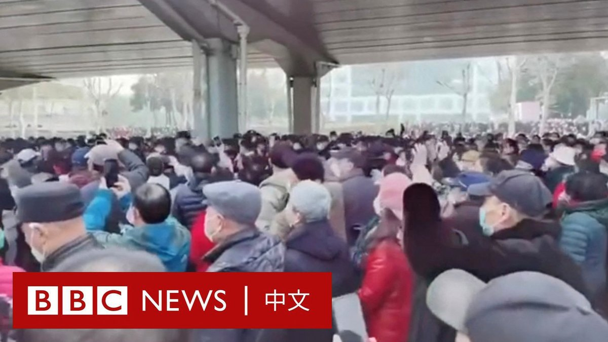

D英国广播公司BBC 北京时间 2023-02-15T23:13:50Z 1625876043344056321 中国中部的武汉市周三（2月15日）爆发大规模集会抗议，约有数百名老年人在中山公园大门附近聚集，反对当局推行的一项医疗保险改革计划。

抗议者指责新规导致每月直接划入个人账户的补贴资金减少。影片显示，大批身穿制服的警察被部署到现场。

武汉市政府没有回应BBC的置评请求。 https://t.co/ky1THhuynI   