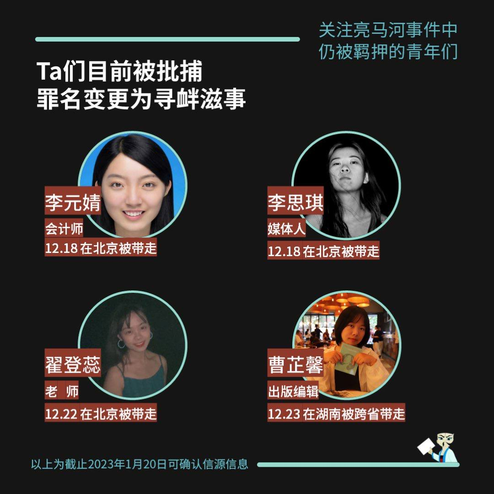

自由亚洲电台 北京时间 2023-01-24T05:48:20Z 1617640400092815361 #翟登蕊 因为在2022年11月27日参与北京 #亮马桥 举白纸行动，2022年12月22日遭北京警方抓捕，有消息指出，她已因涉嫌“寻衅滋事罪”批捕。翟登蕊的母亲是在一线协助抗疫的医生，没有想过自己善良、热情、勇敢的独生女儿会失去自由。
详见 https://t.co/NJBMKPe9ys https://t.co/Y0EKuBdMPe   