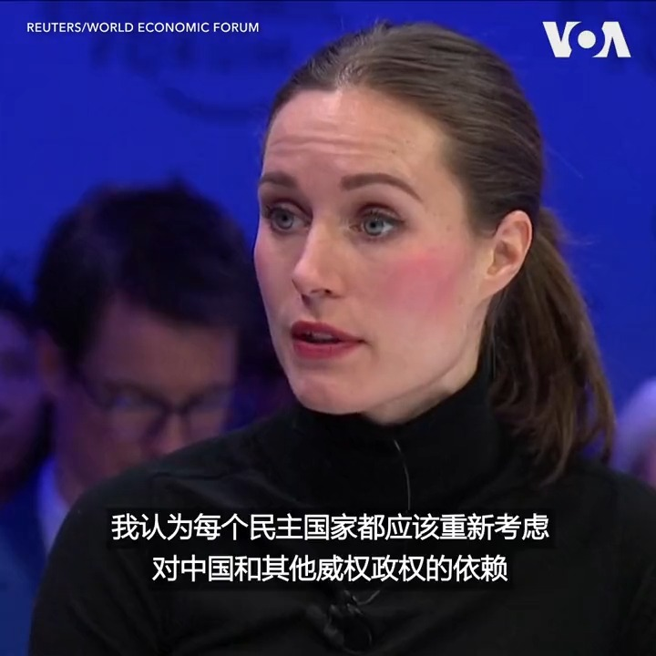

美国之音中文网 北京时间 2023-01-18T01:20:28Z 1615398663500464143 芬兰总理马林1月17日在达沃斯世界经济论坛上表示，如果有必要，芬兰将在俄乌战争中支持乌克兰，哪怕是5年、10年甚至15年。此外，马林还呼吁民主国家重新考虑对中国等威权政权的依赖，她说，大家需确保在自然资源、芯片等领域有不同的获取途径。 https://t.co/Yq0aroSnNJ   