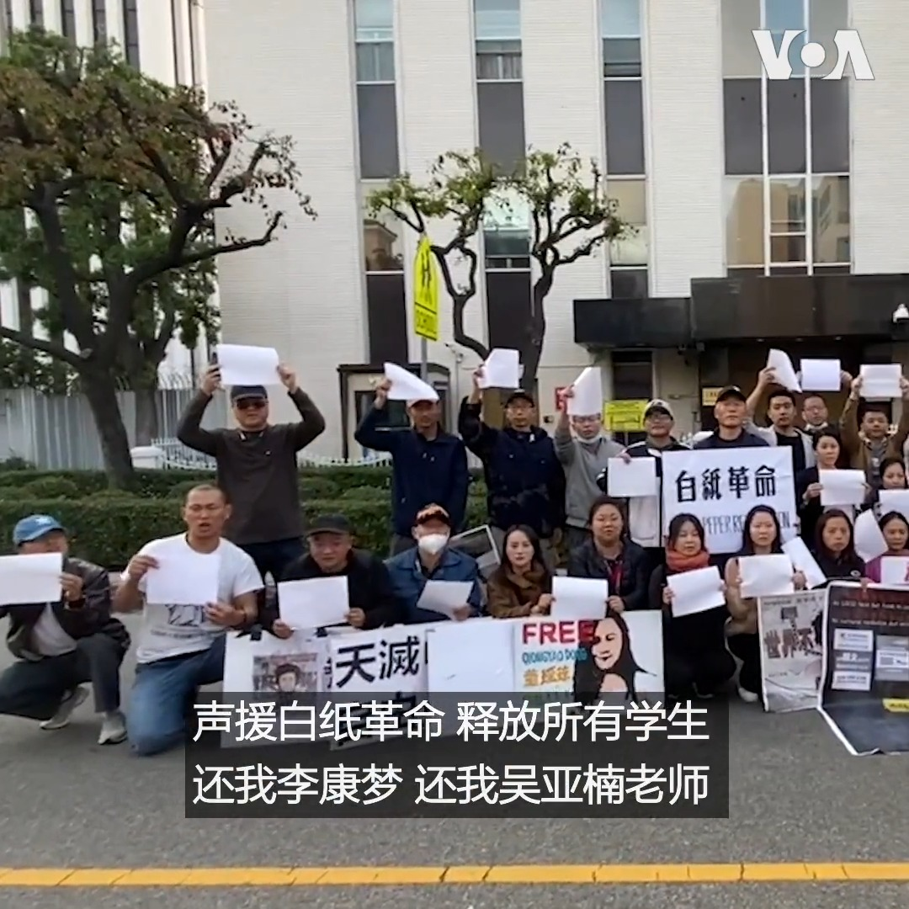

美国之音中文网 北京时间 2023-01-09T08:50:54Z 1612250528800706563 1月7日，美国洛杉矶中领馆前，一群当地华人说，他们拒绝遗忘：拒绝遗忘新疆大火、四通桥勇士、白纸革命失踪者、北京放松疫情管控后，被肆虐病毒折磨的百姓…… 抗议者岳美珍说：“成千上亿的中国人民会做你们坚持的后盾。我们会跟随你们的声音。我们会举起你们的白纸。” https://t.co/y6wcCcGiRF   