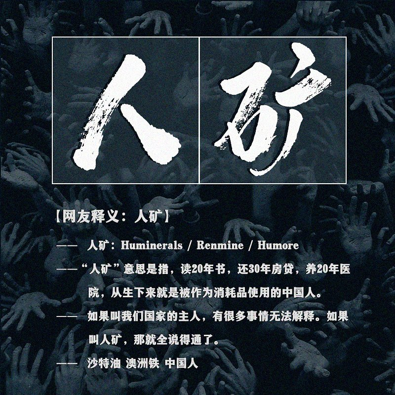

自由亚洲电台 北京时间 2023-01-06T08:28:00Z 1611157599386275843 继“躺平”“润”之后，#人矿 火了！
一度冲上微博热搜榜，但旋即被404。
人矿，最早出现在1984年《人民日报》，意指人是一种“资源”。现在被网友调侃自己被他人支配，用后即弃的人生。
从“韭菜”到“人矿”，中国人对自我命运的悲观再升级。韭菜割完还会长出来，而“人矿”耗完只剩矿渣。
你怎么看待这个词？ https://t.co/ZJPPVeHdVR   