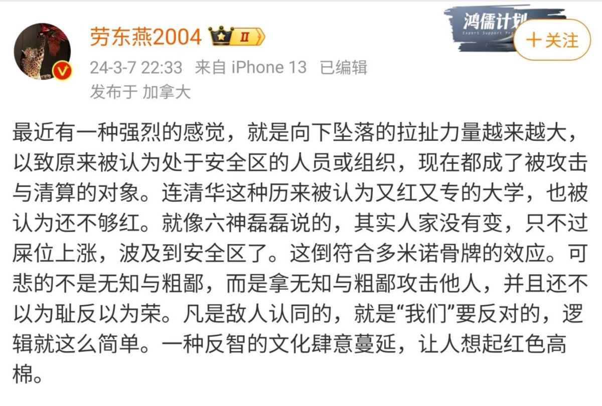
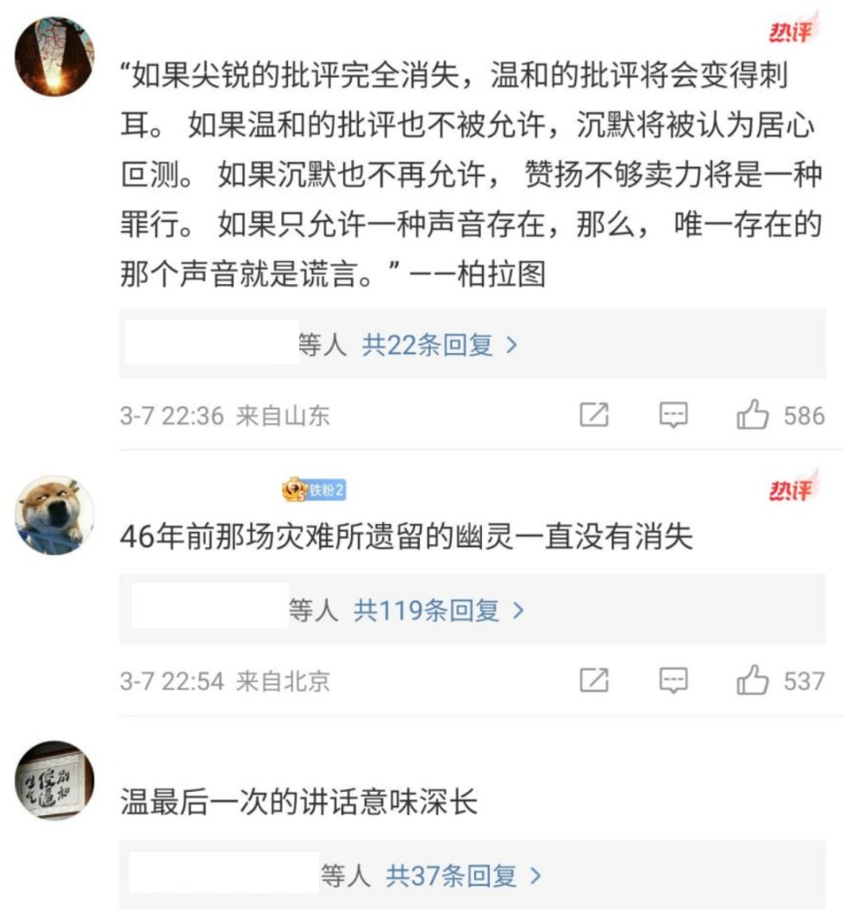
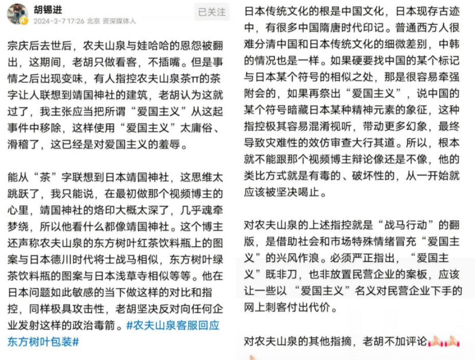
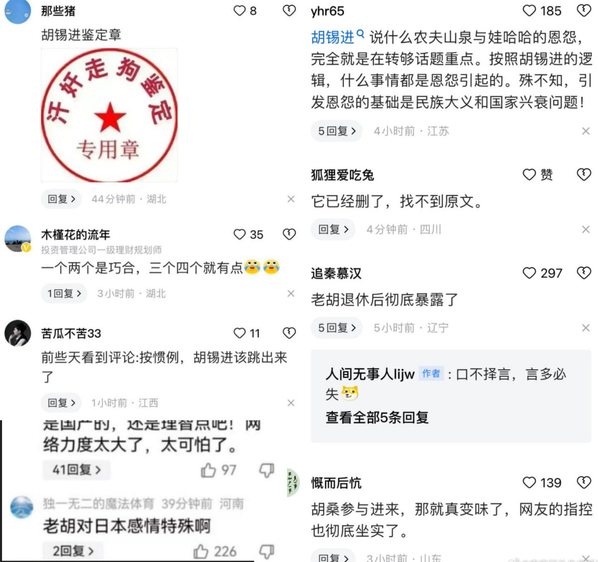
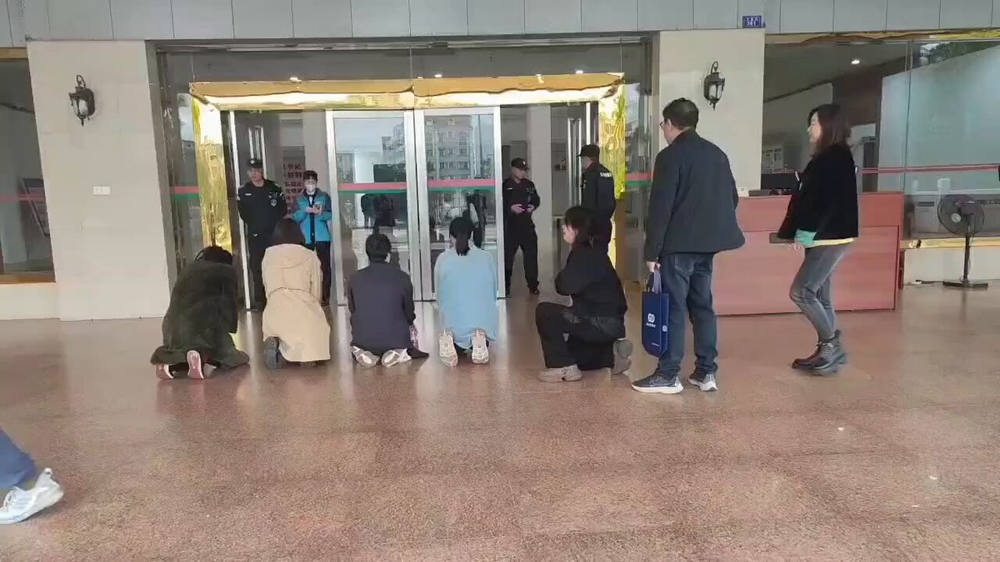
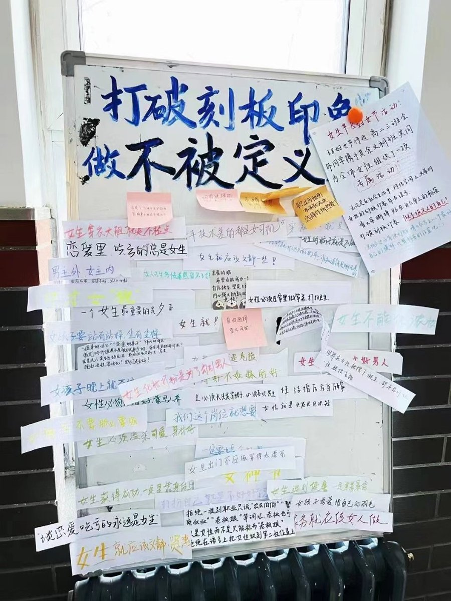
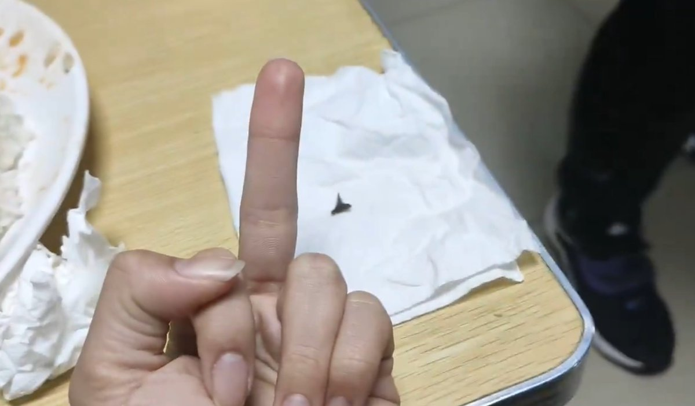
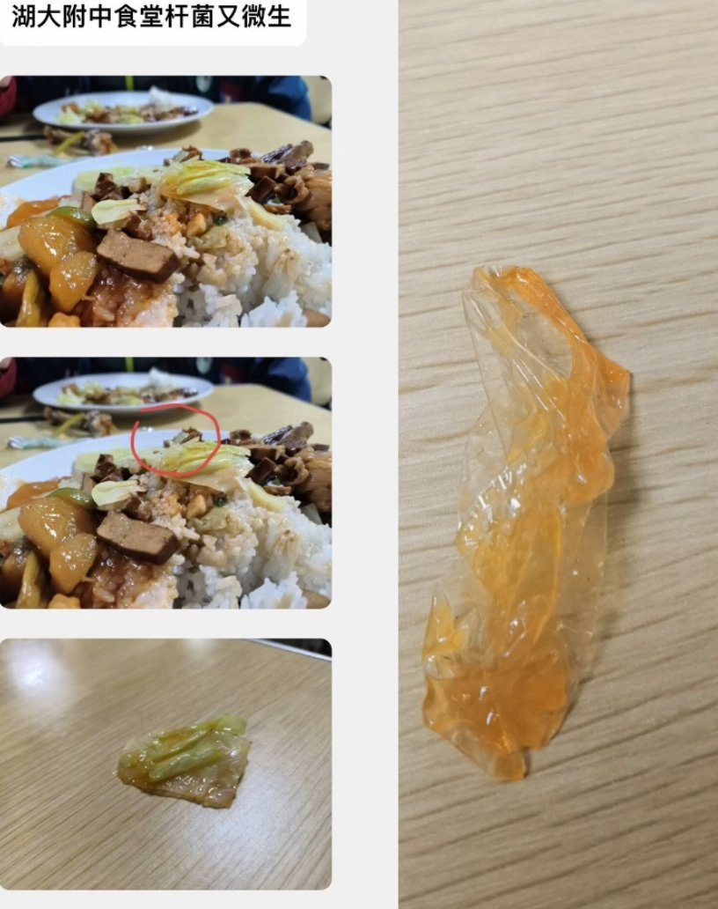

A李老师不是你老师 北京时间 2024-03-08 20:15:26 1766075251073401030 3月7日晚，清华大学法学院教授劳东燕发文感叹近期事件：一种反智的文化肆意蔓延，让人想起红色高棉。 https://t.co/oMZzw6lZPT   A李老师不是你老师 北京时间 2024-03-08 20:20:49 1766076605154136280 想了解红色高棉的朋友可以看 
https://t.co/0nAVCSN9lu   A李老师不是你老师 北京时间 2024-03-08 20:51:05 1766084223998284221 “势不可挡”
3月7日，胡锡退就近期“农夫山泉”事件发文，他称这样使用“爱国主义”太庸俗滑稽了，这是对爱国主义的侮辱。“老胡坚决反对向任何企业发射这样的政治毒箭”
 该文发布后，胡锡进遭到大量网友出征，一些网友甚至将胡锡进称为汉奸。截至目前发文时，该文章已被删除。 https://t.co/0HxStaKVgz   A李老师不是你老师 北京时间 2024-03-08 21:36:28 1766095645113274610 3月8日 (发布) ，广西东兴。一些市民因房产问题，下跪求见市长。
 一名参与维权的男子大声喊道“这是不是人民的国，让不让老百姓活了，东兴的市长这么牛逼吗？见一面都这么难吗？” https://t.co/p4gfZFxR7n   A李老师不是你老师 北京时间 2024-03-08 22:10:36 1766104231948275927 3月7日，山东济宁。政府强征尚兰村耕地修路，当地村民不同意政府每亩地补偿1.6万元的方案，施工方便带人强行施工。
期间村民和施工方发生了争执和推搡，事后，村民们轮流站岗看守粮田。 https://t.co/FiI7dtXyze   A李老师不是你老师 北京时间 2024-03-08 23:29:55 1766124192959766635 近日，上海杨浦区。海洋渔业有限公司拖欠员工社保，员工前往该公司股东企业―上海水产集团有限公司楼下维权。 https://t.co/Klo3AA5nEx   A李老师不是你老师 北京时间 2024-03-08 23:48:47 1766128941469950390 3月8日，呼和浩特第二中学 https://t.co/sRrmbDdzUE   A李老师不是你老师 北京时间 2024-03-08 06:08:32 1765862122523591114 一直到今天，依然每天都有人在不断因为我在被喝茶。   A李老师不是你老师 北京时间 2024-03-08 00:02:29 1765770001967890637 万联网在3月1日报道，近日，包头市玉仑钢铁贸易有限责任公司以收取冬储资源订货为由，收受多家贸易商预付款，但未交款至钢厂订货，现无法正常交货。据市场消息传闻，目前涉案资金达一个多亿。
 此外，四川钢贸也出现暴雷风险，水钢在成都的代理商宝恩嘉创今年出现大额亏损。据悉，本次冬储该公司累计预收了客户2万吨的货款，该批冬储资源约定3月底交货，但该公司实际库存只有1万吨左右。现差客户1万的货，直接损失约4000万左右。
 用行业著名企业家的话说，钢铁行业进入了冰河期。近年来房地产行业下行、疫情扰动、美元走强等因素冲击，导致钢价运行重心逐渐下移，因此去年至今，钢贸市场面临钢架下跌、销量下行、资金周转困难等危机，市场陆续集中爆出了一批进入破产清算的钢贸企业。给大家的资金安全再度敲响警钟。   A李老师不是你老师 北京时间 2024-03-08 00:06:18 1765770961163329591 行业内博主讲述钢贸圈爆雷 https://t.co/YlN4xUYvIy   A李老师不是你老师 北京时间 2024-03-08 00:15:11 1765773196001767808 湖北大学附中学生投稿
自去年11月以来，湖北大学附属中学的食堂频频发生食品安全问题。学生们从学校饭菜中累计吃出过塑料保鲜膜、手套、断木签等，更有甚者在学校的饭中吃出了一颗钉子。
有同学向校园墙投食堂的食品安全问题，遭到了校领导的威胁与施压，而校园墙也迫于压力删除了部分帖子。之前有学生在校园墙上发帖鼓励其他学生在市长热线上积极反应食堂问题，结果今早查阅时帖子惨遭删除。
学生们表示，学校的态度已经令我们学生忍无可忍，学校的食品安全问题已经上升到威胁学生身体健康的程度了。   