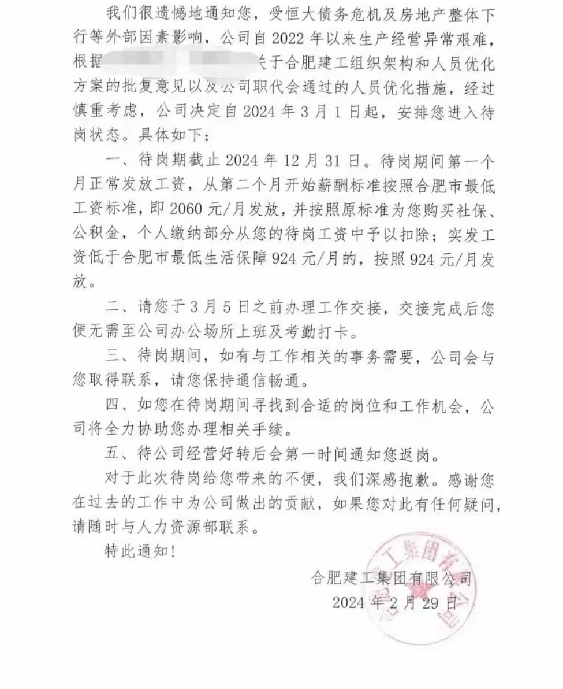

A李老师不是你老师 北京时间 2024-03-02T00:26:01Z 1763601595315462470 2月29日，网传一则待岗通知显示
合肥建工集团宣布因受恒大债务危机和房地产整体下滑等外部隐私影响，自3月1日起，安排员工进入待岗状态，待岗日期截止2024年12月31日。
待岗期间从第二个月开始只发放合肥市最低工资。扣除社保、公积金后实发工资低于合肥市最低生活保障924元/月的，按照924元/月发放。 https://t.co/cCgy9sVha2   A李老师不是你老师 北京时间 2024-03-02T00:03:05Z 1763595826733969452 RT @yanni_vision: #纳瓦尔尼葬礼
他的妻子尤莉娅的告别(大意）：感谢26年在一起的欢乐日子，是的，哪怕是过去三年，你在监狱，依然能带给笑声。为了爱，为了你始终支持我，为了你总为我着想。我会努力保持这种乐观/快乐，不知道能不能做得到，但我会努力。我们总有一天会再…   A李老师不是你老师 北京时间 2024-03-02T00:09:01Z 1763597320493433045 据消息源透露，截止今晚10点左右，还有超过30名学生分布在当地三家医院中治疗，其余学生已经出院回家。
死亡人数有上升。   