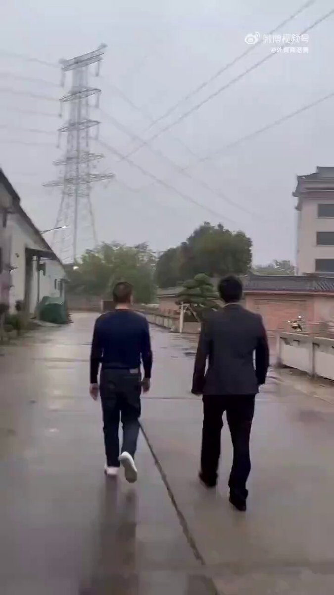
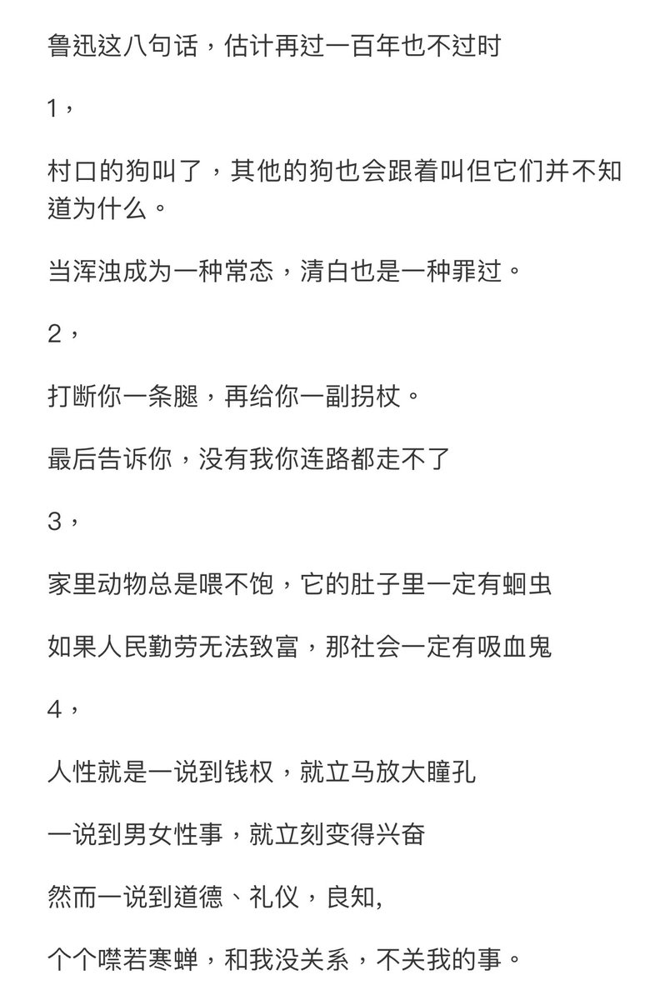
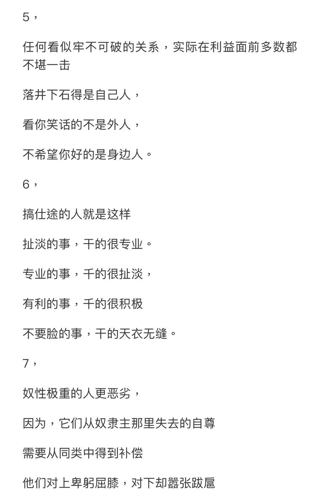
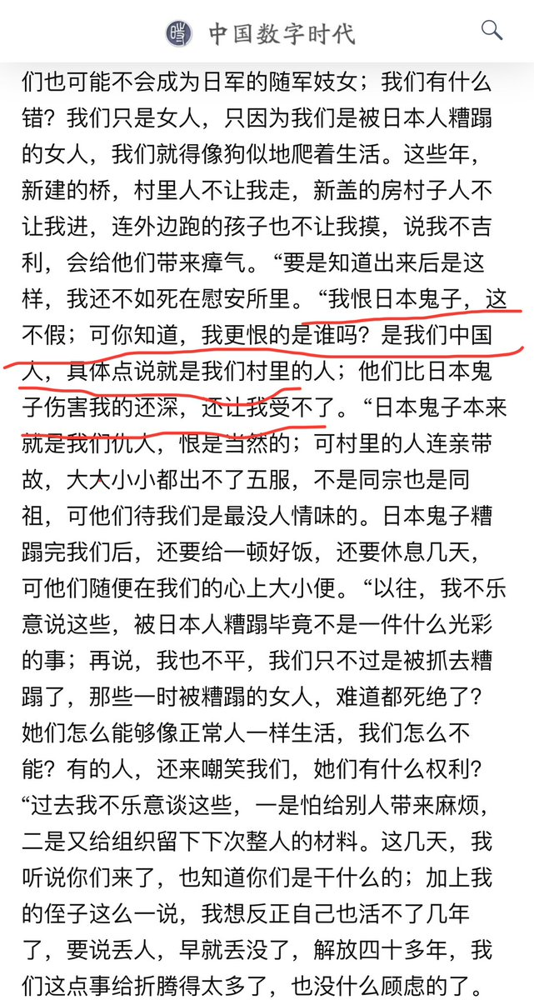
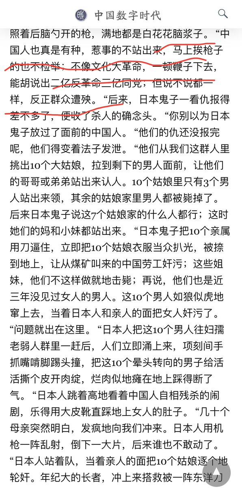
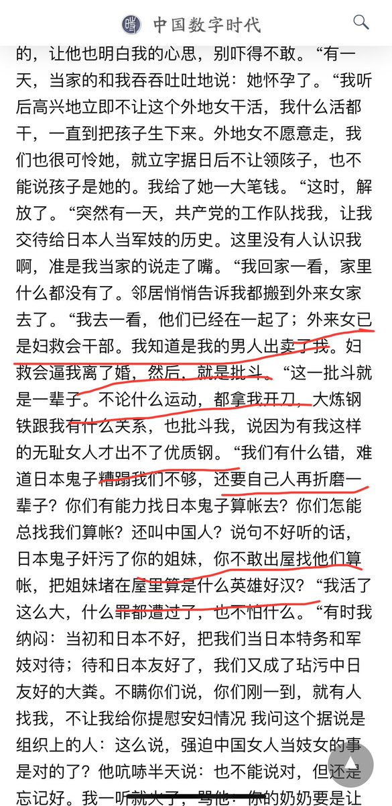

Ivy未央 北京时间 2024-03-02T14:32:00Z 1763814493925093655 我们与世界的距离不是经济与物质的距离，而是思维与价值观的巨大鸿沟：
全世界适用的逻辑学和普世价值被我们拒之门外，一百多年过去了愚昧对文明的仇恨和抵制，一如既往
这个视频想到了易中天的这段话
 https://t.co/ror0nHuSD7   Ivy未央 北京时间 2024-03-02T14:19:22Z 1763811317662556619 中共以共产的名义抢去地主富农的土地，结果，中共成了最大的地主，中共的小官们都是土皇帝，公仆比主人有钱有权有势？还有天理吗？ https://t.co/kuYozMJqK8   Ivy未央 北京时间 2024-03-02T07:25:54Z 1763707265008169312 五四运动时，学生们愤怒的把曹宅烧掉，因为当时曹汝霖被全国骂成“汉奸卖国贼”，虽然大家也说不清他卖了啥，但是爱国情绪已经被挑逗起来了。当时政府妥协，曹汝霖辞职。曹汝霖弃政从商，转入实业界，甚至醉心慈善事业，搜一搜就知道。1937年抗战爆发后，日本人多方拉拢他出任伪职，他多次拒绝。
而参与火烧赵家楼的爱国青年学生梅思平，在日本侵华后，成了真正的汉奸。
视频里这位爱国车主，如果哪天中日战争，他会不会成为像梅思平一样的真汉奸？   Ivy未央 北京时间 2024-03-02T10:54:52Z 1763759853481160864 对从未见过的人恨之入骨；
对从未做过的事引以为傲；
对吹捧出来的神纳头就拜；
对画而未得的饼感恩戴德。

当代网络拍案惊奇之“四愚” https://t.co/lccpD5krk2   Ivy未央 北京时间 2024-03-02T11:09:18Z 1763763484246884733 我恨日本人，但我更恨中国人——一中国慰安妇回忆录
大家对这篇文章怎么看？ https://t.co/P44d4noGtV   