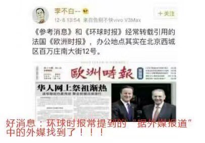

Petrichor 北京时间 2024-03-02T00:32:42Z 1763603279605342660 很多大外宣都是假的，骗中共宣传部，吃空饷的。我表姐前年寻着所谓的“传媒集团”地址，到那里才知道是一杂货小店。哪有什么办公室？杂货店还不是“传媒集团董事长”本人的，她是用了杂货店的地址。该集团没有报纸、杂志、电视台、电台，只有一个微信公众号，转发一些新华社和日人民报的文章。自称在北京还有办事处，负责人名字和董事长名字有一字之差，内情人透露，那是她退休的哥哥，从事的与新闻八杆子打不着的行业。大外宣每年几十亿，不用不白用。用于也白用，没人看他们狗屁文章。   