自由亚洲电台 北京时间 2024-03-02T07:52:13Z 1763713884886552784 #中国新词
【#以刑化债】 中国贵州少数民族女企业家 #马艺珈伊 为贵州六盘水水城区承建10个政府项目，追讨政府拖欠2.3亿工程款8年未果。区政府提出以1200万元化解所有债务被拒，2023年底将其及律师团队10余人以涉嫌 #寻衅滋事 罪名刑事拘留。 
欢迎评论，小编将择犀利点评更新词卡。 https://t.co/m9Xwuv6JDJ 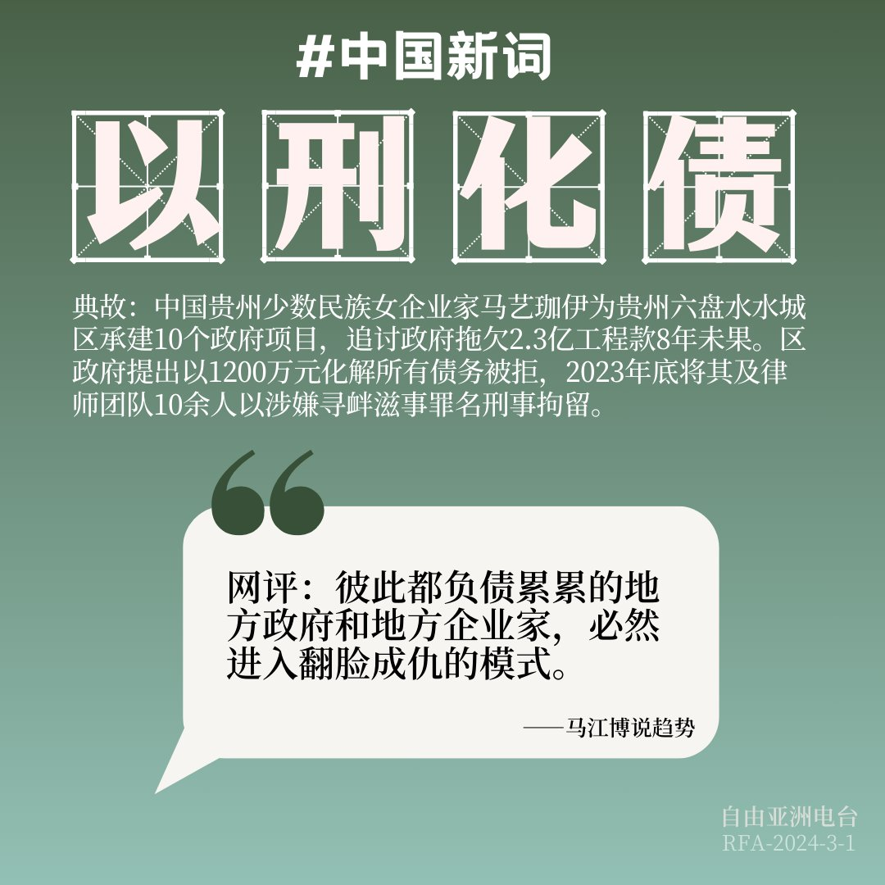  自由亚洲电台 北京时间 2024-03-02T07:54:46Z 1763714526698942734 RT @RFA_Chinese: 【乐乐法利：抖音“有毒” 会让人上瘾】
【李忠宪：独裁国家借 #TikTok 侵蚀文化思想 影响巨大】
为何看似中立的短影音平台 #抖音，会对民主政治和普世价值造成威胁。而民主国家又该如何建构理论和法律，正面迎战资讯科技革命带来的挑战。
htt…   自由亚洲电台 北京时间 2024-03-02T07:56:06Z 1763714862885068804 RT @RFA_Chinese: 在2023财年， 2.4万名中国人走线来到美国。而之前的10年，只有不到1.5万名中国移民被抓到非法越过南部边境。李凯和妻子还有两个儿子是这支走线大军中的一员。
李凯一家人逃离中国是因为宗教因素。观察人士说，因为宗教原因 #走线 美国的中国 #…   自由亚洲电台 北京时间 2024-03-02T10:33:08Z 1763754384352067846 RT @RFA_Chinese: 【诚征 #敏感日】
中国当局的“敏感日”是越来越多了，往往与重大历史事件、政治运动或纪念日有关。其间，当局会加强监控和限制以实现维稳。 
请问您知道哪些敏感日？我们将收集网友列举的日期，制作年度“#敏感日”日历，再看看365天里“#不敏感日”还…   自由亚洲电台 北京时间 2024-03-02T10:43:38Z 1763757023756435506 收缩还是扩张？中国两个 #制造业采购经理指数 再次背离
https://t.co/ypxm0iLZYk https://t.co/wh7YtQCDql 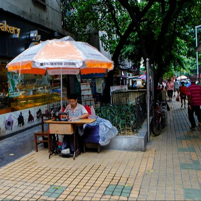  自由亚洲电台 北京时间 2024-03-02T10:45:58Z 1763757611869188384 专栏 | #夜话中南海：辞职并非“主动”　#秦刚 被重罚还是轻处尚无定论
https://t.co/SWiRxE69UV https://t.co/wYwOzId60U 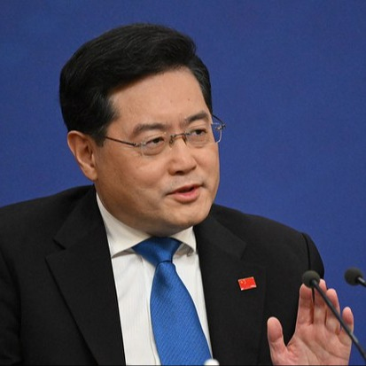  自由亚洲电台 北京时间 2024-03-02T10:55:43Z 1763760067092844620 【#变态辣椒：尊奉党的清真"庙"】
云南一座建于14世纪的历史性建筑 — 纳家营清真寺 — 其尖塔穹顶去年遭强拆，随之换来的是中式塔楼风格的瓦砖飞檐，寺前更树有“听党话”、“感党恩”、“跟党走”三块大字标语牌。 这一整改是中国国家主席习近平对穆斯林、基督徒和西藏佛教徒宗教活动场所进行所谓“中国化”的最新案例。   自由亚洲电台 北京时间 2024-03-02T11:02:50Z 1763761857142354096 专栏 | #周末茶馆：比比 #养娃成本 和人均GDP，中国养娃几乎世界最贵 https://t.co/17KUOdBFqb 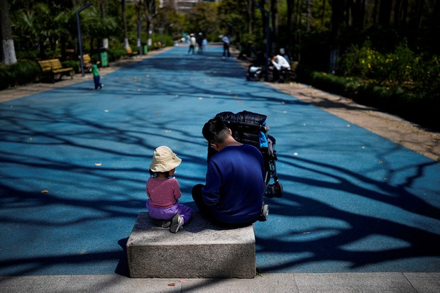  自由亚洲电台 北京时间 2024-03-02T11:06:12Z 1763762702885978519 【评论 | #余杰：习近平真的以为“#风景这边独好”？】
“迷恋专制政治的习近平不可能放过对所有经济领域的控制。因为在其控制之外的经济生活，本身就构成了对极权统治的巨大威胁。” https://t.co/8Se5J61WBb https://t.co/5gT1hjRs6y 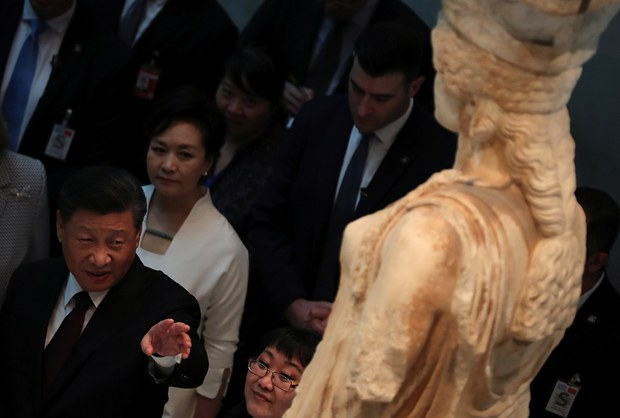  自由亚洲电台 北京时间 2024-03-02T11:09:51Z 1763763623116345706 评论 | 胡平 @HuPing1：热烈推荐 #李明华 新著《八十年代的一束思想之光——&lt;青年论坛&gt;纪事》  https://t.co/Tdry9qTc9j https://t.co/9VN0yLLNHg 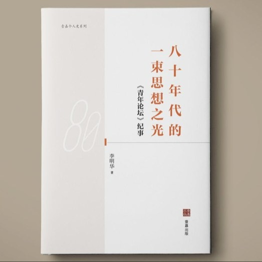  自由亚洲电台 北京时间 2024-03-02T11:14:44Z 1763764852743602186 【专栏 | #周嘉有话说：美国的 #捐赠文化】 
最近，纽约爱因斯坦医学院退休教授露丝·戈特斯曼，将其已故丈夫留给她的一笔巨资---10亿美金，捐给了这家医学院。院方当即宣布，将免除该院所有学生的学费，而这家医学院每年的学费至少6万美元。#周孝正  https://t.co/LydcE88z6o https://t.co/7zG3hG5CH9 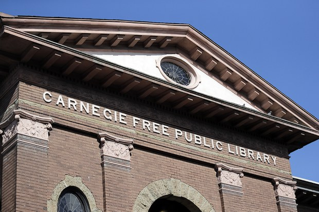  自由亚洲电台 北京时间 2024-03-02T04:26:01Z 1763661994564243637 中国全国人大、政协"两会"将于下周在北京登场。中共领导人习近平独揽大权之际，如何应对经济下滑以及军方和外交系统可能的人事变动，成为外界关注中国"#两会"的热点。
https://t.co/bWLZJv9koS https://t.co/XxBiumljRk 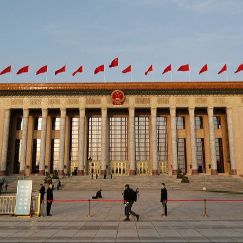  自由亚洲电台 北京时间 2024-03-02T04:56:04Z 1763669557841916241 【俄罗斯开棺悼念反对派领袖, 中国的纳瓦利内在哪?】
数千 #俄罗斯 民众不顾当局警告，上街告别狱中逝世的反对派领袖, 高呼“#纳瓦利内”，“你不怕，我们也不怕”，“没有普京的俄罗斯”等口号。《纽约时报》发文，将李老师，任志强，高智晟和 #刘晓波 等喻为中国的纳瓦利内。然而有网民指出，刘晓波去世时，他的名字在中国都不为人所知。
中国和俄罗斯之间的差距有多远？ 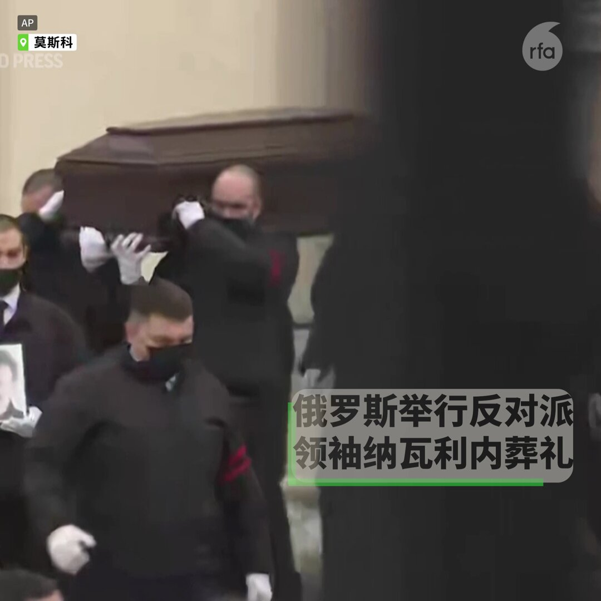  自由亚洲电台 北京时间 2024-03-02T05:42:55Z 1763681349179703372 【为何中国版纳瓦利内难以出现？】
自由之家中港台地区研究主任王亚秋认为：#纳瓦利内 曾建立反腐败基金会，调查腐败的俄罗斯官员；公开竞选过市长和总统；透过YouTube频道发表政治理念，获数百万粉丝。入狱后还继续透过律师与外界沟通，向公众展示他坚不可摧的精神。  这些在共产党严密管控和渗透的中国社会都不可能发生 https://t.co/s4KTawIiKY   自由亚洲电台 北京时间 2024-03-02T02:26:39Z 1763631956623777843 全国 #两会 还要 #做核酸，但不知道要做几次，要不要 #闭环管理？
https://t.co/744ycs1nPr   自由亚洲电台 北京时间 2024-03-02T03:38:50Z 1763650119113867301 上海 #安洵 公司有大量资讯疑遭外泄。相关文件显示，网络黑客能把在国际社交平台X（前推特）上活跃的用户"落地"，获取网民的个人信息。截至目前，多位使用X的大V已披露消息，有关注者被中国警方请去"喝茶"。那么，中国 #翻墙 网民是否要担心自己的身份安全呢？https://t.co/i8G86Y0N0B https://t.co/hV9hFLjJWE 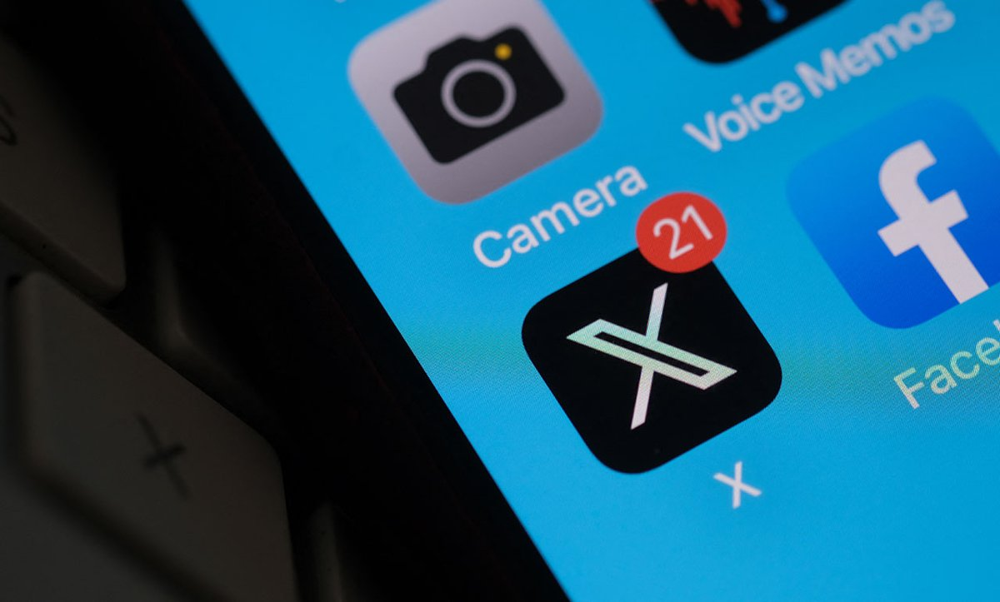  自由亚洲电台 北京时间 2024-03-02T00:32:30Z 1763603228120474047 中国百大房企1-2月销售额同比腰斩　还会大跌？
https://t.co/nEVweCxPeB https://t.co/7PRidOZO0b 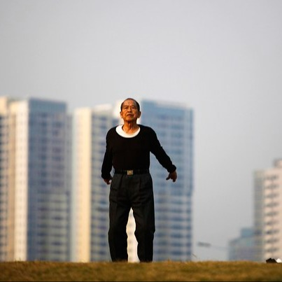  自由亚洲电台 北京时间 2024-03-02T00:46:29Z 1763606748701815177 澳大利亚华侨领袖兼前自由党候选人 #杨怡生（Sunny Duong），因准备或策划协助中国干涉当地政策的行为，被判囚2年零9个月，成为《#反外国干预法》在2018年制定后的首例。
https://t.co/Fw5bjOtzm4 https://t.co/vd6IVqPcAJ   自由亚洲电台 北京时间 2024-03-02T01:45:46Z 1763621666339332541 #两会 召开前夕，浙江异议作家 #昝爱宗 不堪政保警察以及社区民警骚扰，发表《声明》连串质问：
“‘两会’与自己有什么关系？自己既非人大代表，也非政协委员，也不是拆迁户、上访户，为什么杭州市公安政保不肯放松维稳监控？”
“自己的手机为何不能随意关机？非得接听对方打来的电话不可？为何自己不能随意离开杭州？自己到底犯了哪一条法律法规，必须‘配合’政保警察做笔录的要求？”
https://t.co/Gw0yGJaLgO 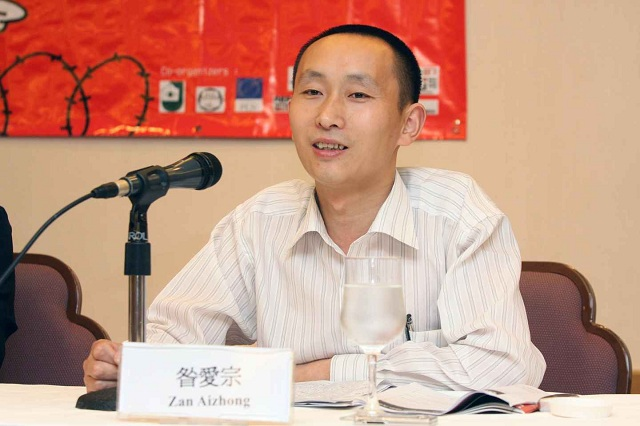  自由亚洲电台 北京时间 2024-03-02T02:12:50Z 1763628478530806193 近日，台湾的立法院国民党团计划推出将中国 #大陆配偶入籍年限 从六年缩短为四年的提案。 #民众党 表态支持并将提修法草案，此举被视为立法院“#蓝白合”携手闯关的第一项法案。https://t.co/71G1mlSrlU https://t.co/cmc8NH8aO9   