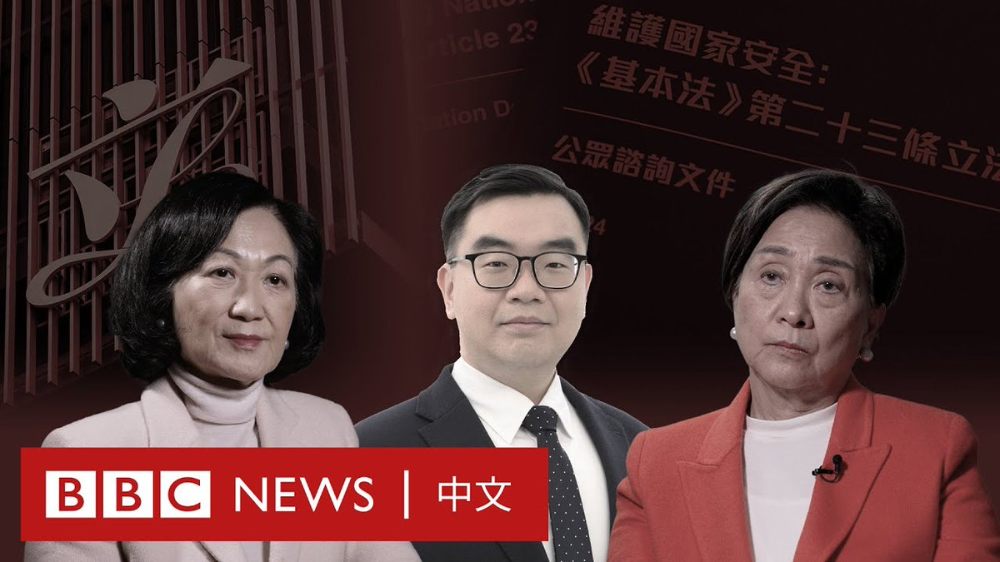
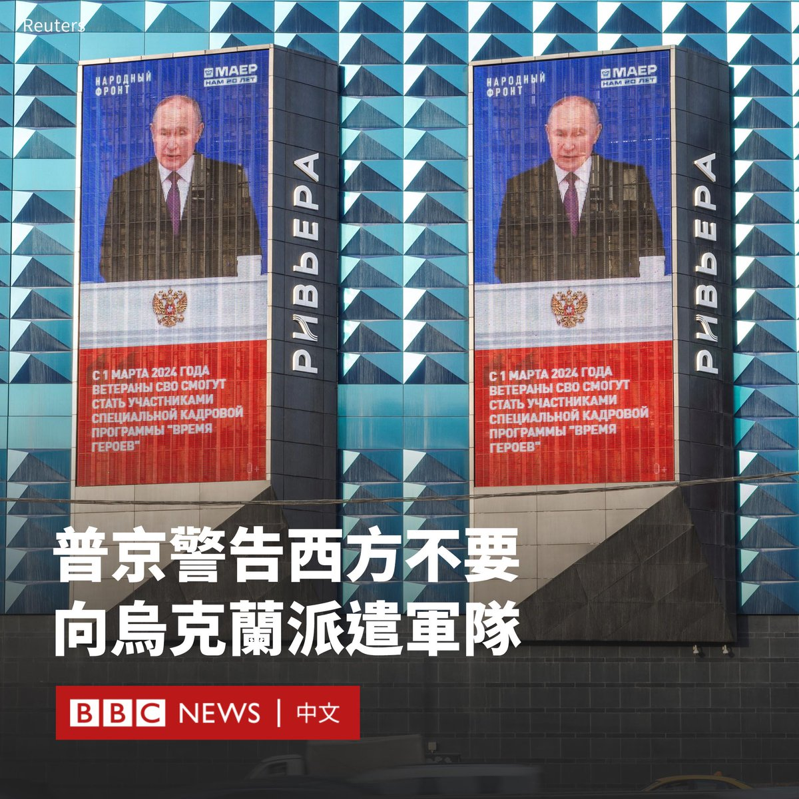
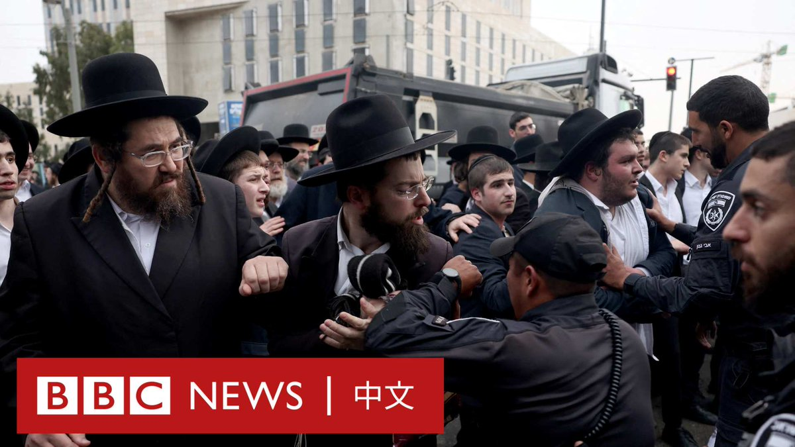

D英国广播公司BBC 北京时间 2024-03-01T21:29:45Z 1763557239011598758 同样是《基本法》第23条的立法咨询，相隔21年后香港的社会气氛和舆论有强烈的反差。

2003年，香港政府曾尝试推动有关维护国家安全的《基本法》第23条立法，引发了数十万人上街抗议，是香港主权移交以来最大规模的游行。 当时有亲北京的立法会议员倒戈，政府最终搁置立法。主导立法的时任保安局局长叶刘淑仪辞职。

在21年后，BBC中文在香港街头随机访问市民，发现不少人对该话题三缄其口。当年主导咨询工作的叶刘淑仪和曾表达反对意见的刘慧卿，向BBC中文谈及他们对两次立法工作的观察和感受。   D英国广播公司BBC 北京时间 2024-03-01T12:02:37Z 1763414516174368786 中国汽车业正面临喜忧参半的消息。在汽车产业经历了三年的高速增长后，中国电动汽车加速“出海”，抢占国际市场，但这些机遇期的增长效应正在放缓，新能源车涌现“降价潮”。https://t.co/uRPacDK3mv   D英国广播公司BBC 北京时间 2024-03-01T14:00:36Z 1763444204431347725 俄罗斯总统普京（Vladimir Putin）警告西方国家不要向乌克兰派遣军队，称否则后果将是“悲剧性的”。

在年度国情咨文演讲中，普京指责西方试图将俄罗斯拖入军备竞赛。他同时表示，由于瑞典和芬兰加入北约，俄罗斯需要加强西部边境的防御。

他称是西方“挑起”了乌克兰冲突，并且“继续毫无顾忌地撒谎，声称俄罗斯打算攻击欧洲”。

普京似乎在回应法国总统马克龙（Emmanuel Macron）早前说“不排除”会向乌克兰派遣北约地面部队的言论时称， “可能的干预者的后果将是……悲惨的”。

“我们也有可以打击他们境内目标的武器。”他说。“所有这一切都有可能引发一场使用核武器和毁灭文明的冲突。难道他们不明白这一点吗？”

包括美国、德国和英国在内的几个北约国家否认了向乌克兰派遣地面部队的可能性。

美国批评了普京关于核战争可能性的言论。美国国务院发言人马修·米勒（Matthew Miller）说，“一个核武国家的领导人不应该这样说话。”他说，美国没有看到莫斯科计划使用核武器的证据。

普京还夸耀了俄罗斯的尖端武器，如高超音速飞机和无人潜航器，并称俄罗斯的战略核力量处于“全面备战状态”。

他还表示“绝大多数”俄罗斯人支持他入侵乌克兰的决定，并称俄罗斯人民现在团结一致，反对他所称的西方削弱俄罗斯的企图。   D英国广播公司BBC 北京时间 2024-03-01T09:14:28Z 1763372198184776005 加沙战争迫使以色列社会不得不面对一个长期存在的争议，即谁要在军队服役。一直以来，极端正统派犹太人（哈雷迪犹太人）因需研究犹太教教义而可免于兵役。但现在许多以色列人认为这一豁免应当终止。

在以色列最高法院就此事进行审理时，双方走上街头抗议。 https://t.co/TFnWxCuARx   