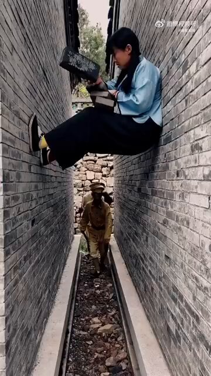
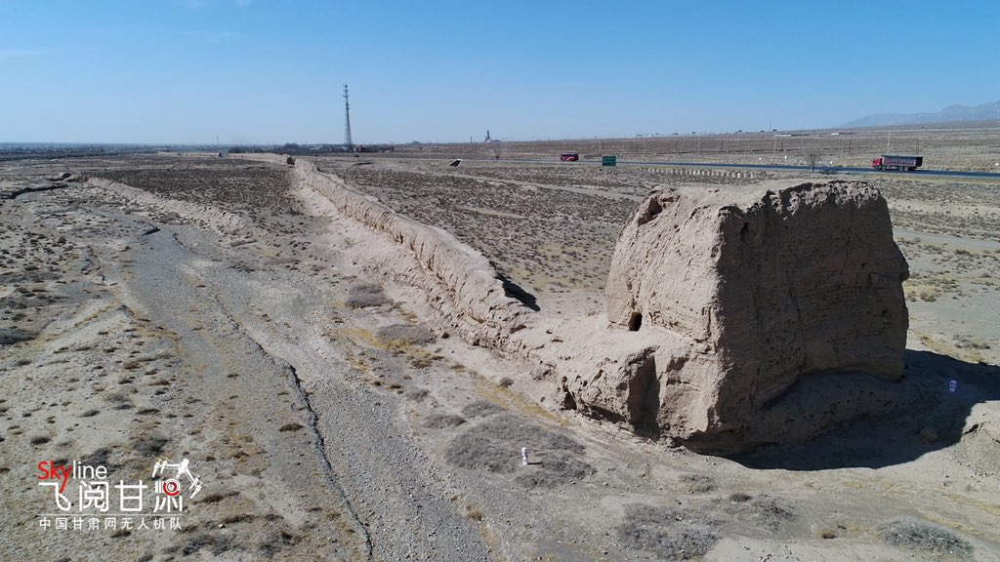
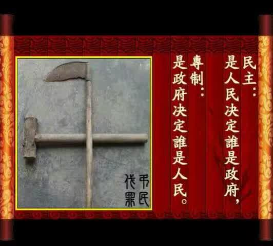
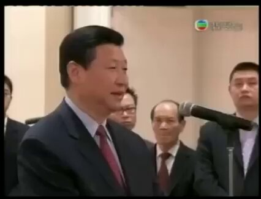
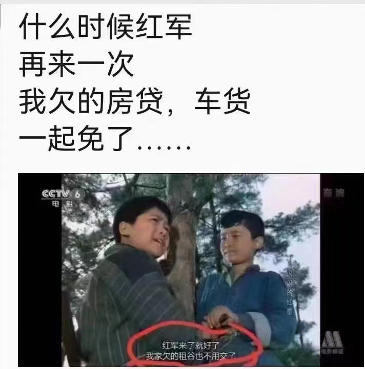

Petrichor 北京时间 2024-03-01T11:14:45Z 1763402467797025074 “对于学问，应以狗屁视之？”据说，这是一个伟人说过的话。
 
有人说，对待儿童的态度体现着一个民族的良心，对待知识分子的态度标志着一个民族的文明程度。

翻翻毛选就会发现中专师范毕业的毛泽东说过许多贬低高级知识分子的话，例如，“高贵者最愚蠢，卑贱者最聪明”。 “智慧都是从群众那里来的。我历来讲，知识分子是最无知识的。这是讲得透底。知识分子把尾巴一翘，比孙行者的尾巴还长。孙行者七十二变，最后把尾巴变成个旗杆，那么长。知识分子翘起尾巴来可不得了呀！“老子就是不算天下第一，也算天下第二”。“工人、农民算什么呀？你们就是‘阿斗’，又不认得几个字”。但是，大局问题，不是知识分子决定的，最后是劳动者决定的。”“你看谁人知识高呀？还是那些不大识字的人，他们知识高。”（《打退资产阶级右派的进攻》，一九五七年七月九日，毛泽东在上海干部会议上的讲话）
在1958年3月的成都会议上，毛泽东作了五份讲话提纲。在3月22日的第四份讲话提纲中，毛泽东写到：“对于资产阶级教授们的学问，应以狗屁视之，等于乌有，鄙视，藐视，蔑视，等于对西方世界的力量和学问应当鄙视藐视蔑视一样。”
 
毛泽东这么说的，更是这么做的。建政后发动了一次有一次知识分子的思想改造运动，批胡适、批胡风、让知识分子失去“自由之思想、独立之人格”。57年的反右运动更是让上百万知识分子过上囚犯般的生活，文革十年让无数臭老九下乡劳动改造。   Petrichor 北京时间 2024-03-01T12:07:59Z 1763415863976182248 某大人物到农村去视察，见到村头一面墙上写着标语：“投案自首是犯罪”。高官大怒，对陪同的当地干部说：“有你们这么谎谬的标语吗？”但是， 这位高官继续顺墙转弯走，发现还有“分子的唯一出路”半句话。一句话分成两句读意思大不一样。高官有些尴尬，后悔批评做早了。
 
        上述误会是由于物体的拐角挡住了人的视线。然而，我们思维中也有很多这样的拐角，影响我们正确的判断，特别是当我们判断别人是怎么想的时候，判断往往是错的。生活中，一些人自以为聪明， 拿着自己的尺子度量别人， 甚至把别人的好意当作别有用心， 很可怕。   Petrichor 北京时间 2024-03-01T12:10:36Z 1763416525199819183 台湾国民党前主席吴伯雄曾主动“曝光”，他妈“跟三个台湾的县长睡过觉”，而且认为那是他妈的“福气”。此事记载《吴伯雄——一个台湾政治家和他的政治生涯》一文。
 
吴伯雄爸爸当过两届桃园县县长，吴伯雄本人也当过桃园县县长，吴伯雄的大舅林为恭当过苗栗县县长。林为恭兄妹是“外祖母床上带大的”。
 
母亲在子女心目中永远是神圣不可冒犯的。吴伯雄的“笑话”虽然在玩概念置换和欲擒故纵的游戏，还是让人听起来非常的不舒服。
 
吴伯雄的“笑话”是吹他家的县长多， 他 “笑话” 的意境上远不如魏晋时期阮籍的笑话，阮籍的笑话是当着皇帝和群臣开的，弄不好就要掉脑袋。
 
所有面临改朝换代的年代，政治都是非常非常的黑暗。魏晋时期就是这样的年代，司马氏的专制和强权如洪水般肆虐，却居然还大肆宣扬礼法，推行“以孝治天下”。竹林七贤之一的阮籍竟然拿当时最敏感的政治问题­——“礼法”开玩笑，而且是当着司马昭的面开：厅堂之上，有人议论城里有一人把他妈杀了，阮籍说：‘嘻！杀父乃可，至杀母乎！’在场人全都怪其失言。司马昭动怒曰：‘杀父，天下之极恶，而何以为可乎？’ 阮籍说：‘禽兽知母而不知父，杀父禽兽之类也。杀母，禽兽之不如。’阮籍真是胆大，司马氏集团正在推行“以孝治天下”，他居然敢放言“杀父乃可”。一句“禽兽不如”，终使皇上和众臣悦服。阮籍开了一个雷人的、国家级的大玩笑！但是，司马昭竟然听不出阮籍其实是在嘲笑虚伪的礼法，嘲笑那个空谈礼法而实则禽兽横行的时代，更嘲笑了谋朝篡位却要“以孝治天下”的强权政治集团。   Petrichor 北京时间 2024-03-01T13:12:21Z 1763432062021738730 鬼子特别傻，而我们特别聪明。
要不是美国原子弹，我们抗战得干18年。

 https://t.co/pK30h8bPGr   Petrichor 北京时间 2024-03-01T06:47:51Z 1763335299269091357 據報道，加拿大國家病毒實驗室邱香果研究員與中國解放軍合作研究戰爭病毒，現在成為加拿大國會討論的熱點話題，反對黨領袖指責執政黨總理小土豆包庇叛國者等等。

自由黨政府星期三在多方要求下，終于公開包括加拿大安全情報局(CSIS)的報告及涉事的百多份文件。CSIS的報告顯示，當時在溫尼伯國家微生物實驗室工作的邱香果夫妇，與中國官員秘密會面、提供機密科學信息、被查問關系密切時否認其事，又否認從中獲益。＂兩人違反多項規章，與中國官員關系密切；但更糟糕的是，自由黨試圖刪掉文件部分內容，以掩飾他們保護國家安全不力的缺失。”   Petrichor 北京时间 2024-03-01T09:39:53Z 1763378593025970651 皮大衣和羊毛被子，加工过程。 https://t.co/WEcfilKmFi   Petrichor 北京时间 2024-03-01T09:47:38Z 1763380545742946742 一女博士游名山，躲雨，遇一老道。
 
老道给其相面: “夫人贵人贵相，夫妻皆事业有成，家财殷富，有房产数处，驾宝马奔驰；儿女双全，学业优秀，……”。
 
女博士回答道： “先生，您错了，我年已35，虽具博士学位，迄今尚为讲师，买不起房，驾不起车，还没男朋友，何谈结婚，生儿育女？”
 
“知识改变命运”，老道摇头叹息。   Petrichor 北京时间 2024-03-01T09:49:53Z 1763381108735930876 图1-2是秘鲁的Pucllana金字塔，是利马文化顶盛时期（公元450至650年间）用土砖修建的祭祀中心，规模宏大。

图3-4是中国的万里长城，大部分地方是土垒的墙。 https://t.co/L82zYV9KeN   Petrichor 北京时间 2024-03-01T09:50:38Z 1763381298649841907 这两人中，谁更君子？谁更流氓？ https://t.co/Za8ygVnyhc   Petrichor 北京时间 2024-03-01T09:52:34Z 1763381784064954418 民主，就是把人当人。
科学，就是把事当事。 https://t.co/UnCCmFWZBF   Petrichor 北京时间 2024-03-01T09:59:40Z 1763383573644452303 多少年前看了这个视频，就有如下感觉：1. 此人文化水平不高，最多初中肄业。无稿讲话，处词用字，非常反映一个人的文化水平和读书多少。
2. 思想狭隘，对西方国家有成见，不能正确判断形势，难以搞改革开放，会与发达国家搞对立。 https://t.co/FiUi4j4fWY   Petrichor 北京时间 2024-03-01T10:03:37Z 1763384565383504158 这两个中国妈妈怎么这样糊涂呢？没底线了？这两个男孩和他们爸爸如何看她们？ https://t.co/GjmXFsq1Y9   Petrichor 北京时间 2024-03-01T00:14:53Z 1763236408381043167 光把一切债免了，还不行，对官员和富人要打土豪分财产，另加划分成分，做贫下中农光荣，做反对官僚、地主、资本家可耻，镇压掉他们。不忘初心，继续革命，建立一个新中国。穷人、光棍、流氓无产阶级、青年学生，起来啊，参加红军，打进城去，你们会有一切。

不要觉得荒唐，起初他们就是这么干的。 https://t.co/9qWDZOqS14   